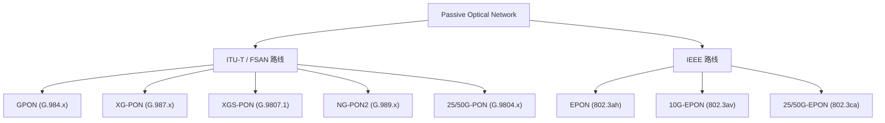
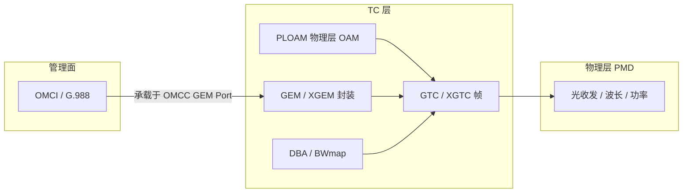

# PON 全景与标准对照

> 本篇建立整个知识库的「坐标系」：把各代 PON 技术、对应的 ITU-T / IEEE 标准号、速率、波长和关键差异放在一张地图上，后续所有章节都以此为参照。

## 1. 两条技术路线

PON 在标准化层面分为两大阵营：

- **ITU-T / FSAN 路线**：以 GEM 封装 + GTC 帧 + OMCI 管理为核心，运营商市场主流。
- **IEEE 路线**：以原生以太网帧 + MPCP（多点控制协议）+ OAM 管理为核心。

本知识库**重点覆盖 ITU 路线的 GPON 与 XGS-PON**，EPON 仅作对照。

## 2. 标准对照表（ITU 路线）

| 技术 | 核心标准 | 下行速率 | 上行速率 | 下行波长 | 上行波长 | 备注 |
|------|----------|----------|----------|----------|----------|------|
| GPON | ITU-T G.984.1~.4 | 2.488 Gbit/s | 1.244 Gbit/s | 1490 nm | 1310 nm | 最广泛部署 |
| XG-PON (NG-PON1) | ITU-T G.987.1~.4 | 9.953 Gbit/s | 2.488 Gbit/s | 1577 nm | 1270 nm | 非对称 10G |
| XGS-PON | ITU-T G.9807.1 | 9.953 Gbit/s | 9.953 Gbit/s | 1577 nm | 1270 nm | 对称 10G，主流升级路径 |
| NG-PON2 | ITU-T G.989.1~.3 | 4×10 Gbit/s (TWDM) | 4×10/2.5 Gbit/s | 1596–1603 nm | 1524–1544 nm | 多波长可调谐 |
| 25/50G-PON | ITU-T G.9804.1~.3 | 25 / 50 Gbit/s | 多档 | — | — | 新一代高速 |

> XG-PON 与 XGS-PON 的 TC 层（G.987.3 与 G.9807.1 Annex C）高度同源；二者最大差异在上行速率（2.5G vs 10G 对称）。本库以 XGS-PON 为主、XG-PON 写差异。

## 3. 标准对照表（IEEE 路线，对照用）

| 技术 | 标准 | 速率 | 管理 | 多址 |
|------|------|------|------|------|
| EPON | IEEE 802.3ah | 1 Gbit/s 对称 | OAM | MPCP（GATE / REPORT） |
| 10G-EPON | IEEE 802.3av | 10G 对称 / 10G-1G 非对称 | OAM | MPCP |
| 25/50G-EPON | IEEE 802.3ca | 25 / 50 Gbit/s | OAM | MPCP |

EPON 用 **LLID（Logical Link ID）** 区分逻辑链路、用 **MPCP GATE/REPORT** 做带宽授权，概念上对应 ITU 路线的 Alloc-ID 与 DBA BWmap。详见 [epon-10gepon/overview.md](../01-protocol-stack/epon-10gepon/overview.md)。

## 4. 关键概念映射（ITU vs IEEE）

| 功能 | ITU (GPON/XGS-PON) | IEEE (EPON) |
|------|--------------------|-------------|
| 逻辑链路标识 | GEM Port-ID / Alloc-ID | LLID |
| 上行带宽授权 | BWmap（DBA 生成） | GATE 消息 |
| 上行缓存上报 | DBRu / Status Report | REPORT 消息 |
| 设备管理 | OMCI（G.988） | OAM（802.3 Clause 57） |
| 测距 | Ranging（Ranging_Time PLOAM） | MPCP discovery / RTT |
| 封装 | GEM / XGEM | 原生 Ethernet |

## 5. 协议分层速记（ITU 路线）

- **PMD 层**：光器件、波长计划、功率预算（G.984.2 / G.9807.1 PMD 章节）。
- **TC 层**：帧结构、GEM/XGEM 封装、PLOAM 信令、DBA。
- **管理面**：OMCI 跑在专用的 OMCC GEM Port 上，对 ONU 做白盒化配置。

## 延伸阅读

- [协议栈总览](../01-protocol-stack/README.md)
- [GPON 激活状态机 ⭐](../01-protocol-stack/gpon-g984/activation-state-machine.md)
- [术语表](glossary.md)

## 来源

- **公有标准**：ITU-T G.984.1（GPON 总体）、G.987.1（XG-PON）、G.9807.1（XGS-PON）、G.989.1（NG-PON2）、G.9804.1（高速 PON）；IEEE 802.3ah / 802.3av / 802.3ca。速率/波长为各标准 PMD 章节的标称值。
- 本页为综述性「地图」，具体条款引用见各专题章节。
