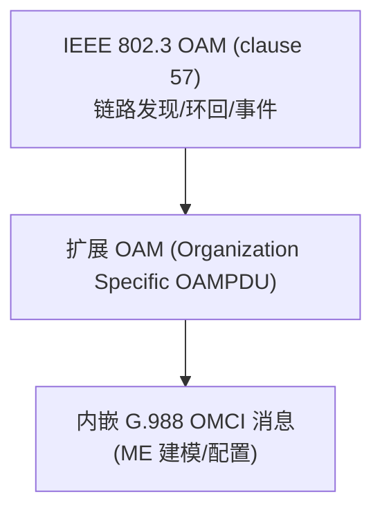

# EPON OAM 与 OMCI over EPON（扩展 OAM 帧）

> EPON 原生用 **IEEE 802.3 OAM（clause 57）** 做链路 OAM，但要在 EPON 上跑 **G.988 OMCI** 管理模型，需把 OMCI 消息封进 **扩展 OAM（Extended OAM）帧**。本篇讲 EPON OMCI 的帧封装与到 802.3 OAM 的映射。依据 G.988 Annex C（§C.2、Table C.2-1、Table C.3-1）。

> EPON/MPCP 总览见 [EPON 概览](overview.md)；OMCI 模型见 [OMCI 规范](../../02-omci/omci-spec.md)。

## 1. 为什么要扩展 OAM 帧

- ITU PON（GPON/XGS-PON）有专用 **OMCC GEM Port** 承载 OMCI；
- EPON 没有 GEM，改用 **IEEE 802.3 扩展 OAM 帧**（组织自定义 OAMPDU）承载 OMCI 消息——让同一套 G.988 ME 模型也能管 EPON ONU（白盒/统一网管的关键）。

## 2. EPON OMCI 扩展 OAM 帧格式（Table C.2-1）

```
┌────────────────────────────────────────────────────────────────┐
│ Preamble + LLID/SFD (8B)  ← LLID 在 ONU 发现过程中分配             │
│ Destination MAC (6B)      = 0x0180C2000002 (Slow Protocol 组播)   │
│ Source MAC (6B)                                                   │
│ Length/Type, Subtype, Flags, Code … (802.3 OAM 头)               │
│ OUI / 组织自定义 (Organization Specific)                          │
│ ┌── Extended OMCI message (可变, 最大 1493 B) ──────────────┐     │
│ │ TCI(2) MT(1) DeviceId(1) ME-Id(4) ContentsLen(2) 内容(变) │     │
│ │ MIC (excluded)                                            │     │
│ └───────────────────────────────────────────────────────────┘    │
└────────────────────────────────────────────────────────────────┘
```

| 字段 | 长度 | 说明 |
|------|------|------|
| Preamble + LLID/SFD | 8B | **LLID** 在 ONU 发现过程分配（见 [EPON 概览](overview.md)） |
| Destination MAC | 6B | **0x0180C2000002**（IEEE Slow Protocol 组播地址） |
| 扩展 OMCI message | 可变，≤ **1493B** | 内嵌 G.988 OMCI 消息（TCI/MT/DevId/ME-Id/长度/内容） |
| MIC | — | 标注为 excluded（OMCI 内部 MIC 处理与 ITU 一致） |

- 内嵌的 OMCI 消息**字段与 ITU OMCI 同构**（见 [消息格式](../../02-omci/message-formats.md)），因此 ME 建模、Create/Set/Get 语义都能复用。

## 3. 与 IEEE 802.3 clause 57 OAM 的关系（Table C.3-1）

| 层面 | IEEE 802.3 OAM（clause 57） | OMCI over EPON |
|------|----------------------------|----------------|
| 用途 | 链路 OAM（发现、远端环回、链路事件、变量检索） | ONU 业务/配置管理（G.988 ME 模型） |
| 承载 | 标准 OAMPDU | **扩展 OAM**（组织自定义 OAMPDU） |
| 关系 | 基础链路监控 | 在其上扩展承载 OMCI |



## 4. 工程意义

- **统一网管**：GPON/XGS-PON/EPON 都能用同一套 G.988 ME 抽象（HSI/VoIP/IPTV 配置流程复用，见 [datapath 全景](../../02-omci/datapath-l2-model.md)）；
- **DPoE/DPoG**：北美 cable 运营商的 DOCSIS Provisioning over EPON 即在此思路上扩展；
- **抓包识别**：EPON 上看到目的 MAC `0x0180C2000002` 的 Slow Protocol 帧、且 subtype 为组织自定义，多半是 eOAM/OMCI。

## 来源

- **公有标准**：
  - ITU-T G.988 (2024) Annex C：§C.2（用 IEEE 802.3 扩展 OAM 帧承载 EPON OMCI；Fig C.2-1）、**Table C.2-1**（扩展 OAM 帧字段：Preamble+LLID/SFD 8B、LLID 在 ONU 发现分配、Destination MAC 0x0180C2000002、扩展 OMCI message 可变 ≤1493B、MIC excluded）、**Table C.3-1**（802.3 clause 57 OAM 与 OMCI 的关系）。
  - IEEE 802.3 clause 57（OAM）、clause 76/77（10G-EPON）。
- 说明：DPoE/DPoG 与抓包识别为工程归纳；帧字段与 MAC 地址以 G.988 Annex C 原文为准。
