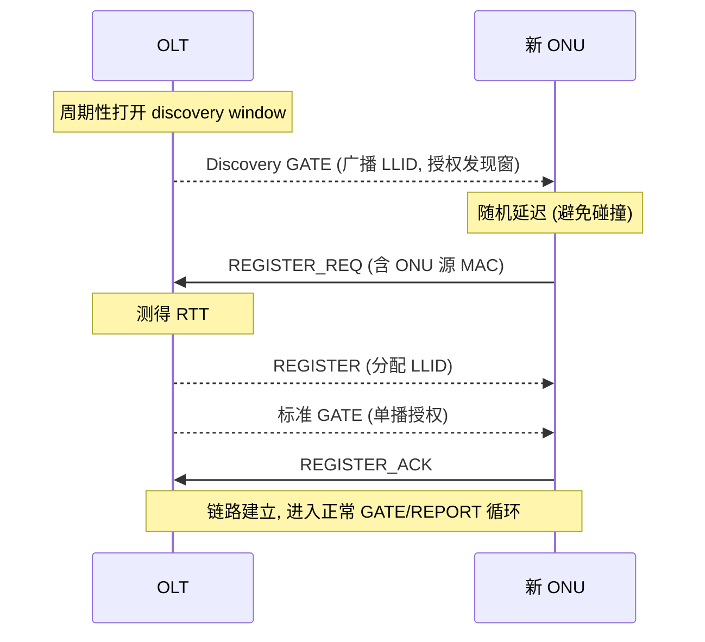

# EPON / 10G-EPON 概览（对照）

> IEEE 路线的 EPON（802.3ah）与 10G-EPON（802.3av）。本篇做对照梳理，帮助横向理解 IEEE 与 ITU 两条 PON 技术路线的异同；重点是 **MPCP**（多点控制协议）的发现与授权机制。

## 1. 与 ITU 路线的根本区别

- **封装**：EPON 直接传**原生以太网帧**，无 GEM/XGEM 封装（开销低，但无统一的 QoS/OAM 抽象层）。
- **多址 / 带宽授权**：用 **MPCP（Multi-Point Control Protocol，IEEE 802.3 Clause 64/77）** 的 **GATE / REPORT** 消息，而非 BWmap / DBRu。
- **管理**：用 **OAM（802.3 Clause 57 扩展 OAM）**，而非 OMCI；但 EPON ONU 也可被 OMCI 管理（G.988 Annex C，见 §6）。
- **逻辑链路标识**：用 **LLID（Logical Link ID）**，而非 GEM Port-ID / Alloc-ID。

## 2. 概念映射（速记）

| 功能 | EPON | ITU (GPON/XGS-PON) |
|------|------|--------------------|
| 逻辑链路 | LLID | GEM Port-ID / Alloc-ID |
| 上行授权 | GATE | BWmap |
| 缓存上报 | REPORT | DBRu / Status Report |
| 发现/注册 | MPCP Discovery（REGISTER_REQ/REGISTER） | Ranging（Assign_ONU-ID / Ranging_Time） |
| 管理 | OAM（可选 OMCI） | OMCI |
| 封装 | 原生以太网帧 | GEM / XGEM |

## 3. MPCP：多点控制协议

MPCP 是长度固定 **64 字节**的 MAC 控制帧（EtherType `0x8808`），承载 5 类 opcode：

| Opcode | 消息 | 方向 | 作用 |
|--------|------|------|------|
| 0x0002 | GATE | 下行 OLT→ONU | 授权上行发送窗口（start time + length） |
| 0x0003 | REPORT | 上行 ONU→OLT | 上报各队列缓存占用 |
| 0x0004 | REGISTER_REQ | 上行 ONU→OLT | 发现期请求注册 |
| 0x0005 | REGISTER | 下行 OLT→ONU | 分配 LLID |
| 0x0006 | REGISTER_ACK | 上行 ONU→OLT | 确认注册 |

每个 MPCPDU 都带 **32 位时间戳（timestamp）**，用于 RTT 测量与全网时钟同步（OLT 是时间基准）。

### 3.1 发现与注册握手

- **Discovery GATE**：OLT 周期性广播一个发现授权窗口（grant），邀请未注册 ONU 接入。
- **随机延迟**：多个新 ONU 同时响应会碰撞；各 ONU 在发现窗内**随机延迟**后发 REGISTER_REQ，降低碰撞概率（类似 CSMA 退避思想）。
- **RTT 测量**：OLT 用 REGISTER_REQ 中回填的时间戳与本地时钟差，算出该 ONU 的往返时延，用于后续 GATE 的精确定时（等效于 ITU 的测距/EqD）。
- **LLID**：OLT 在 REGISTER 中分配唯一逻辑链路 ID，写入以太帧前导码（preamble）中，实现 OLT 端的「点到点仿真」（P2PE）——下行广播帧按 LLID 过滤。

### 3.2 GATE / REPORT 带宽循环（EPON 的 DBA）

- **REPORT**：ONU 上报一个或多个队列集合的缓存占用（buffer occupancy），可按门限（threshold）报告多个队列深度，供 OLT 做优先级调度。
- **GATE**：OLT 下发一个或多个授权（每个含 start time + length）。ONU 在指定绝对时刻起、按指定长度发送。带 **discovery 标志** 的 GATE 即发现窗。
- 与 ITU 对照：REPORT≈DBRu/SR，GATE≈BWmap，OLT 侧 DBA 算法原理相通（见 [DBA 算法 ⭐](../../03-dba/dba-algorithms.md)）。

## 4. 10G-EPON 与 25/50G-EPON

| 技术 | 标准 | 速率 | FEC |
|------|------|------|-----|
| EPON | IEEE 802.3ah (2004) | 1G 对称 | 可选 |
| 10G-EPON | IEEE 802.3av (2009) | 10G 对称 / 10G下-1G上 非对称 | **强制** RS(255,223) |
| 25/50G-EPON | IEEE 802.3ca (2020) | 25 / 50 Gbit/s（多通道绑定） | 强制 |

- 10G-EPON 与 1G-EPON 可在同一 ODN 上**波分共存**（下行 1577nm vs 1490nm；上行用突发时分/波分）。
- 25/50G-EPON 通过多个 25G 通道**通道绑定（channel bonding）** 达到 50G。

## 5. 与 ITU PON 的取舍

| 维度 | EPON 优势 | ITU PON 优势 |
|------|-----------|--------------|
| 封装开销 | 原生以太，开销低 | GEM 适配多业务（TDM/ATM/Eth） |
| 管理标准化 | OAM 简单 | OMCI 模型完备、互通性强 |
| 运营商生态 | 早期日本/部分北美 | 全球电信主流（中国市场为主） |

## 6. EPON ONU 的 OMCI 管理（G.988 Annex C）

G.988 允许用 **OMCI 管理 EPON ONU**，把 ITU 的 ME 模型套用到 IEEE PON 上：

- **OMCC 建立**：EPON 的管理控制通道在 **ONU discovery 过程**中建立（IEEE 802.3 Clause 64/77）。发现期 OLT 与 ONU 交换 MAC 地址与物理参数，OLT 分配 **LLID**，逻辑连接即建立（G.988 C.1）。
- **OMCI 帧封装**：用 IEEE 802.3 **扩展 OAM 帧** 承载 EPON OMCI（G.988 C.2）。扩展 OMCI 消息变长，最长 **1493 字节**；目的 MAC = `0x0180C2000002`；前导码携带 LLID。
- **ANI-E（G.988 §9.2.19）**：专为 EPON ONU 定义的接入网接口 ME，每个 PON 物理口自动创建一个实例，承载加密与 FEC 能力等属性。
- Table 8-1 标注了各 ME 对 `IEEE 802.3 / 802.3av` 的适用性（M/可选/E）。

> 即：**底层接入是 IEEE MPCP/LLID，上层管理可用 ITU OMCI**——这正是很多多模 ONU 芯片的做法。

## 来源

- **公有标准**：
  - IEEE 802.3ah（EPON）、802.3av（10G-EPON）、802.3ca（25/50G-EPON）；MPCP 见 IEEE 802.3 Clause 64（1G）/ Clause 77（10G），扩展 OAM 见 Clause 57。
  - ITU-T G.988 (2024) Annex C：C.1（EPON OMCC 在 ONU discovery 建立、LLID 分配）、C.2（扩展 OAM 帧承载 OMCI、最长 1493B、DA=0x0180C2000002）、§9.2.19（ANI-E）、Table 8-1（ME 对 IEEE 802.3/av 适用性）。
- 说明：MPCP opcode 表、发现握手、GATE/REPORT 字段为 IEEE 802.3 公有知识的提炼；精确比特级字段以 IEEE 802.3 原文为准（该标准未在本 RAG 库内）。本篇按用户优先级「EPON 简略」处理。
