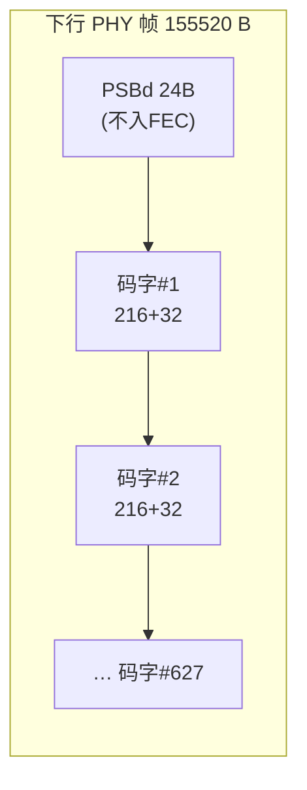

# PON 前向纠错（FEC）原理与各代对照

> FEC（Forward Error Correction）在发送端加**冗余校验**，让接收端无需重传即可纠正一定数量的误码——是 PON 延伸距离、增大分光比、抵抗突发损伤的关键。各代 PON 用不同码：GPON/XGS-PON 用 **Reed-Solomon (RS)**，HEC 用 **BCH**，50G-PON 升级到 **LDPC**。依据 G.9807.1 §C.10.1.3。

## 1. FEC 基本思想

```
[ 数据块 K 字节 ] → 编码 → [ 数据块 K 字节 | 校验 (N−K) 字节 ]  = 码字 N 字节
                                      ↑ 接收端用校验纠错
```

- **系统码（systematic）**：数据原样保留，校验附加在后——便于无 FEC 时直接取数据。
- **净编码增益（net coding gain, NCG）**：开 FEC 后，达到同一 BER 所需的接收光功率可降低若干 dB，相当于**赚回链路预算**（典型 RS 码 5~7 dB）。
- 代价：**带宽开销**（校验占比）与处理时延。

## 2. Reed-Solomon（RS）—— GPON / XGS-PON

RS 码特性（G.9807.1 §C.10.1.3）：
- **非二进制**，以**字节符号**为单位运算；属**系统线性循环分组码**；
- RS(N, K)：数据块 K 字节 + 校验 (N−K) 字节 = 码字 N 字节；
- 纠错能力：可纠正 **(N−K)/2** 个**符号（字节）**错误。

| 代际 | RS 码 | 数据/校验 | 纠错能力 |
|------|-------|-----------|----------|
| GPON | **RS(255, 239)** | 239 + 16 | 8 字节/码字 |
| XGS-PON 下行 | **RS(248, 216)** | 216 + 32 | **16 字节/码字** |
| XGS-PON 上行 | **RS(248, 216)** | 216 + 32 | 16 字节/码字 |

### XGS-PON 码字布局（§C.10.1.3.1）

- 下行每 PHY 帧 **627 个码字**；码字 248B = 216 数据 + 32 校验；**PSBd（24B）不入** FEC；第一码字起于第 **25** 字节。
- 上行：**PSBu 不入** FEC，首码字始于上行 FS header；同一 ONU 所有分配 FEC 状态一致；**连续分配作为一个数据块编码**，故突发末尾**至多一个 shortened（缩短）码字**。



## 3. BCH —— HEC（头错误校验）

XGS-PON 的 **HEC** 用 **BCH（Bose-Chaudhuri-Hocquenghem）+ 偶校验**保护关键头字段（§C.10.1.3 / HEC 应用）：

| 应用 | 受保护字段 | 结构 |
|------|-----------|------|
| FS header | 19 bit | 总 **32 bit**（HEC 计算时前补 32 个零比特，不传输） |
| BWmap / XGEM | 51 bit | 总 **64 bit**，`BCH(63,12,2) + 偶校验` |

> HEC 既能纠单比特、也用于 [XGEM 自定界](gem-xgem/encapsulation-delineation.md)（滑窗校验找帧头）。

## 4. LDPC —— 50G-PON（HSP）

- 50G-PON（G.9804 系列）线速率跃升至 25/50 Gbit/s，单纯 RS 已不足以提供所需增益；
- 改用 **LDPC（Low-Density Parity-Check）**：逼近香农极限的高增益软判决码，配合更复杂的 DSP/均衡，弥补高速率下更恶劣的色散与噪声；
- 详见 [25/50G-PON 概览](hsp-g9804/overview.md)。

## 5. 各代 FEC 速查

| 代际 | 数据 FEC | HEC | 净增益取向 |
|------|----------|-----|-----------|
| GPON | RS(255,239)（可选） | BCH/CRC | 距离/分光比 |
| XG(S)-PON | **RS(248,216)**（下行强制） | BCH(63,12,2)+偶校验 | 10G 高速补偿 |
| 50G-PON (HSP) | **LDPC** | — | 25/50G 极限补偿 |

## 6. 工程意义

- **FEC 开/关**：XGS-PON 下行**静态配置插入** FEC 校验；ONU FEC 解码器还给出下行 **BER 估计**（用于 SD/SF 告警，见 [告警速查](../02-omci/alarm-reference.md)）。
- **预算换算**：开 FEC 的链路可换更远距离或更大分光比（见 [光功率预算](optical-power-budget.md)）。
- **pre-FEC vs post-FEC BER**：pre-FEC 反映链路真实质量、post-FEC 反映用户体验；监控 pre-FEC 可在劣化恶化成丢包前预警。

## 来源

- **公有标准**：
  - ITU-T G.9807.1 (2023) §C.10.1.3（FEC 引入冗余；XGS-PON 基于 RS；RS 为非二进制、字节符号、系统线性循环分组码）、§C.10.1.3.1（下行 RS(248,216)、627 码字、216+32、PSBd 不入、首码字第 25 字节）、§C.10.1.3.2（上行 RS(248,216)、PSBu 不入、连续分配单块编码、末尾至多一个 shortened 码字）、HEC 应用（FS header 19→32 bit、BWmap/XGEM 51→64 bit `BCH(63,12,2)+偶校验`、19 bit 前补 32 零比特）。
  - ITU-T G.984.3（GPON RS(255,239)）。
  - ITU-T G.9804 系列（50G-PON 采用 LDPC）。
  - 缩略语：BCH = Bose-Chaudhuri-Hocquenghem（G.9807.1 §4）。
- 说明：净编码增益典型值、pre/post-FEC BER 用法为工程归纳；码与码字参数以原文为准。
