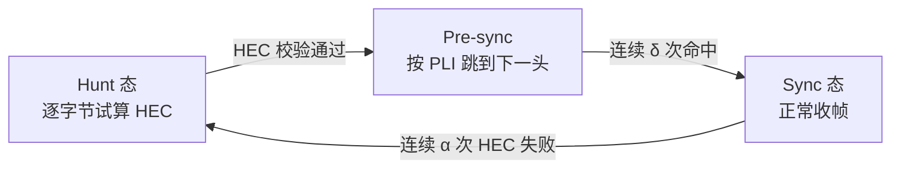
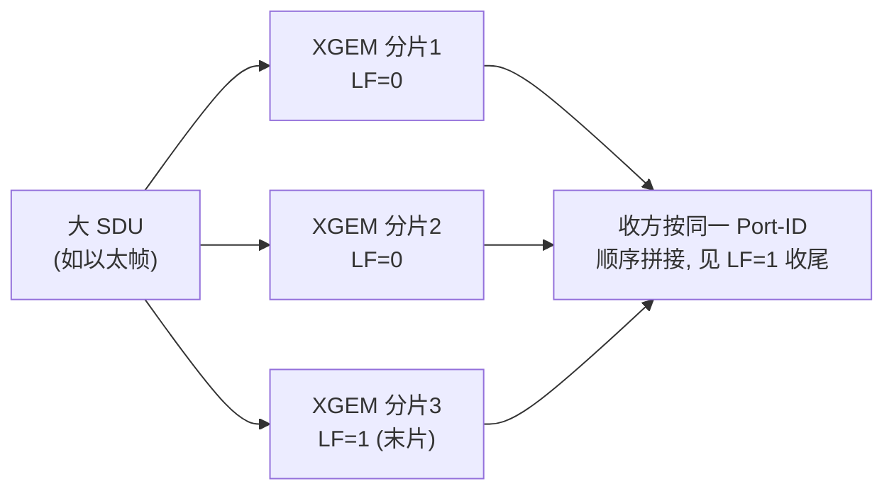

# GEM / XGEM 封装、定界与碎片重组

> GEM（GPON Encapsulation Method）与 XGEM（XG/XGS/NG-PON2/HSP）是 PON 的统一适配层：把以太/MPLS/OMCI 等 SDU 封进定长头 + 变长载荷的帧，并解决三件事——**定界（delineation）**、**碎片与重组（fragmentation/reassembly）**、**空闲填充（idle）**。本篇聚焦这三点的工程细节。依据 G.9807.1 §C.9（XGEM）与 G.984.3 §8（GEM）。

> 帧结构总览见 [GPON 帧结构](../gpon-g984/frame-structure.md) / [XGS-PON 帧结构](../xgspon-g9807/frame-structure.md)；本篇是它们的「适配层放大镜」。

## 1. XGEM 头（8 字节，G.9807.1 §C.9.1.2）

```
 0                            2   3        4 ........ 6              8 (byte)
+----------------------------+---+----------+--------+-+--------------+
|        PLI (14 bit)         |KI |  Port-ID |Options |L|   HEC (13b)  |
|                            |(2)|  (16 bit) | (18b) |F|              |
+----------------------------+---+----------+--------+-+--------------+
```

| 字段 | 位宽 | 含义 |
|------|------|------|
| **PLI**（Payload Length Indication） | 14 | 紧跟头之后的 **SDU 或 SDU 分片**长度 L（字节），0–16383，足够覆盖巨帧（9000B） |
| **Key Index (KI)** | 2 | 加密密钥索引（0=不加密；1/2 在用密钥，支持无缝换钥，见 [安全](../../04-security/key-management-encryption.md)） |
| **XGEM Port-ID** | 16 | 逻辑端口（业务流标识；0xFFFF=空闲帧） |
| **Options** | 18 | 预留/扩展 |
| **LF**（Last Fragment） | 1 | =1 表示这是某 SDU 的**最后一个分片**（或未分片的完整 SDU） |
| **HEC** | 13 | 头错误校验（兼纠错与定界，见 §3） |

> 对比 GPON 的 **5 字节 GEM 头**（PLI 12b / Port-ID 12b / PTI 3b / HEC 13b）：XGEM 头更大（8B），Port-ID 扩到 16 位、新增 Key Index 与 LF，去掉 PTI（XGS-PON 用 XGEM Port-ID 区分 OMCI/用户流）。

## 2. XGEM 载荷与填充（§C.9.1.3）

载荷长度 P 由 PLI 的 L 决定，**4 字节对齐**：

```
P = 4 × ⌈L/4⌉   (L ≥ 8)
P = 8           (0 < L < 8)
P = 0           (L = 0)
```

- 载荷 = `L 字节 SDU/分片` + `0..7 字节 Padding`（填 `0x55`，接收侧丢弃）。
- 4 字节对齐是为了配合 **AES-CTR 计数器块**与硬件流水线（见 [安全](../../04-security/key-management-encryption.md)）。

```
XGEM payload (P 字节):
+------------------------------+----------+
|   SDU or SDU fragment (L)    | Pad 0..7 |
+------------------------------+----------+
```

## 3. 定界（Delineation）——靠 HEC

GEM/XGEM **不用分隔符**，而是用头里的 **HEC** 做自定界（类似 ATM 信元定界）：



- **原理**：接收侧从候选位置试算 HEC；命中则认为找到 XGEM 头，按 **PLI** 推算下一个头的位置；连续命中进入同步态。
- **PLI 的双重作用**：既告诉收方载荷多长，又指明**下一个 XGEM 头在哪**——这是「length-based」定界的关键。
- HEC 同时能纠正头里的少量比特错误（提高定界鲁棒性）。

## 4. 碎片与重组（Fragmentation / Reassembly，§C.9.3）

一个 SDU 可能跨越 FS 载荷区边界（剩余空间装不下整个 SDU），此时把 SDU 切成多个 XGEM 分片：



- **同一 XGEM Port-ID** 的分片按顺序属于同一 SDU；收方拼接直到遇到 **LF=1**。
- **重组规则约束**：当剩余 FS 空间装不下 SDU、且分片会违反 §C.9.3 规则（如最小分片大小）时，**不分片**，转而填**空闲帧**（见 §5）。
- 分片降低了「帧尾浪费」，但增加头开销；DBA/调度需权衡。

## 5. 空闲 XGEM 帧（Idle，§C.9.1.4）

当发送侧**没有可发的 SDU**（或被非工作保持型调度判为不可发、或装不下又不能分片）时，用**空闲帧**填满 FS 载荷区：

| 特征 | 值 |
|------|-----|
| XGEM Port-ID | **0xFFFF** |
| PLI | 实际填充载荷大小（4 的倍数，可为 0） |
| 加密 | **不加密** |

- 空闲帧保证上/下行**始终满帧对齐**（PON 是连续比特流，不能「空着」）。
- **TM-DBA 的依据**：OLT 观察上行空闲帧的多少，反推 ONU 是否真有流量（见 [DBRu/BWmap](../../03-dba/dbru-bwmap-format.md) 的 SR vs TM）。

## 6. 业务映射示例

| 业务 | 映射（G.9807.1） |
|------|------------------|
| 以太帧 | 去掉前导/SFD/IPG，把 DA..FCS 作为 SDU 封入 XGEM（Fig C.9.5） |
| MPLS | MPLS 标签栈 + 载荷作为 SDU 封入（Fig C.9.6） |
| OMCI | OMCI 包封入 XGEM，走专用 OMCC Port-ID（见 [OMCI 消息格式](../../02-omci/message-formats.md)） |

## 7. 工程要点

- **Port-ID 规划**：OMCC、组播、各业务流分配不同 XGEM Port-ID；0xFFFF 保留给空闲。
- **巨帧**：PLI 14 位支持到 16383B，足够 9K 巨帧；但分片策略影响时延与开销。
- **加密与分片正交**：Key Index 按帧标注，分片各片可独立加密；空闲帧恒不加密。

## 来源

- **公有标准**：
  - ITU-T G.9807.1 (2023) §C.9.1.2（XGEM 头 8 字节：PLI 14b / Key Index 2b / XGEM Port-ID 16b / Options 18b / LF 1b / HEC 13b）、§C.9.1.3（载荷长度 P=4⌈L/4⌉ 规则、0x55 padding）、§C.9.1.4（空闲帧 Port-ID=0xFFFF、不加密、TM 依据）、§C.9.3（分片/重组规则）、Fig C.9.5（以太映射）/ Fig C.9.6（MPLS 映射）。
  - ITU-T G.984.3 §8（GPON GEM 5 字节头、PLI/Port-ID/PTI/HEC、HEC 自定界）。
- **工程实现**：`gopon/common/gem/frame.go`（GEM/XGEM 头逐位 codec、HEC 计算）。
- 说明：定界状态机（Hunt/Pre-sync/Sync）为基于 HEC 自定界原理的归纳；逐参数（δ/α 阈值）以 G.984.3 / G.9807.1 原文为准。
