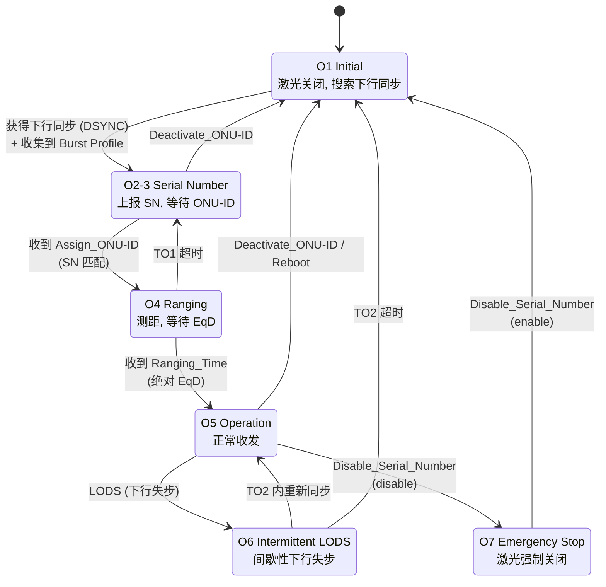
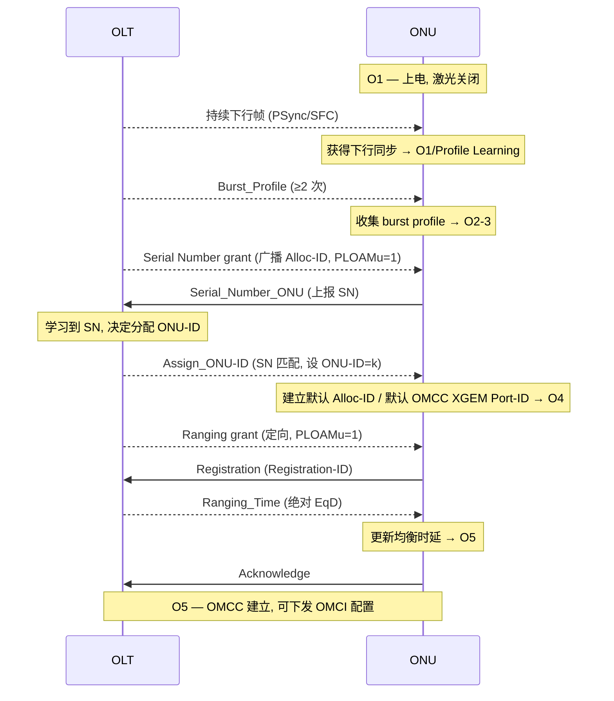

# GPON / XGS-PON ONU 激活状态机 ⭐

> 本篇梳理 ONU 从上电到正常通信的完整激活流程：O1→O5 的状态迁移、每一步对应的 PLOAM 消息、关键定时器，以及 GPON（G.984.3）与 XGS-PON（G.9807.1 Annex C）的差异。这是理解「设备如何上线」的钥匙。

## 1. 为什么需要激活状态机

PON 是**点到多点（P2MP）** 的共享介质：一棵 PON 树下挂多个 ONU，共享同一根上行光纤。要让多个 ONU 在上行方向**不冲突地**分时发送，OLT 必须：

1. **发现** 新接入的 ONU（学习其 Serial Number）；
2. 给它**分配** 一个唯一的 ONU-ID；
3. **测距（Ranging）**：测出该 ONU 到 OLT 的往返时延，下发**均衡时延 EqD**，使所有 ONU 的上行突发在 OLT 接收端「看起来」像是从同一距离发出的；
4. 把 ONU 带入**正常运行（O5）**，之后才允许业务数据和 OMCI 管理通道（OMCC）工作。

整个过程由一个**状态机**驱动，状态在 ONU 侧维护，迁移由「下行同步事件 / 定时器 / BWmap 授权 / PLOAM 消息」触发。

## 2. 状态总览

ITU-T 把 ONU 激活周期定义为 O1..O7（NG-PON2 额外有 O8/O9 波长调谐）。GPON 与 XGS-PON 命名一致，但 XGS-PON 把 GPON 的 O2/O3 合并标注为 **O2-3（Serial Number state）**。



### 状态语义（G.9807.1 Table C.12.1）

| 状态 | 全称 | 语义 |
|------|------|------|
| **O1** | Initial state | 上电/复位入口。**发射机关闭**。进入 O1 时丢弃 ONU-ID、Alloc-ID、默认 XGEM Port-ID、burst profile、均衡时延，下行同步状态机初始化。含两个子态：`O1/Off-Sync`（搜索并尝试同步下行信号）→ `O1/Profile Learning`（解析下行帧 PLOAM 分区，收集 burst profile，信息足够后转 O2-3）。 |
| **O2-3** | Serial Number state | 收到 SN grant 后回 `Serial_Number_ONU` PLOAM；等待 OLT 反馈 `Assign_ONU-ID`，随后转 O4。 |
| **O4** | Ranging state | 启动测距定时器 **TO1**。响应定向 ranging grant，发 `Registration` PLOAM；收到带**绝对 EqD** 的 `Ranging_Time` 后转 O5。TO1 超时则丢弃 ONU-ID/默认 Alloc-ID/默认 OMCC Port-ID，回 O2-3（保留已收集的 profile）。 |
| **O5** | Operation state | 正常处理下行帧、按 OLT 授权发送上行突发。入口子态 `O5/Associated`。 |
| **O6** | Intermittent LODS | 从 O5 因下行失步进入，启动 **TO2**；TO2 内重获同步则回 O5，超时则回 O1。 |
| **O7** | Emergency Stop | 收到带 `disable` 选项的 `Disable_Serial_Number` → 关激光、转 O7。O7 下仍保持下行同步、解析 PLOAM，但**禁止上下行转发数据**。收到 `enable` 选项则回 O1。**该状态跨重启/掉电保持**。 |

> O8/O9（Downstream / Upstream Tuning）仅用于 NG-PON2 的波长可调谐场景，GPON/XGS-PON 不涉及。

## 3. 激活时序（OLT ↔ ONU）

以最常见的「序列号方式」冷启动激活为例，OLT 与 ONU 的消息时序如下：



时序要点（来自 BBF TR-309 / TP-255 互通测试用例）：

- OLT 发 `Assign_ONU-ID` 后，ONU **建立默认 Alloc-ID（1）和默认 OMCC XGEM Port-ID（1）并转 O4**。
- O4 中 ONU 收到 ranging grant → 回 `Registration` 消息；OLT 回 `Ranging_Time`（octet 5 = 0x01 表示绝对均衡时延）→ ONU 更新 EqD、转 O5、回 `Acknowledge`。
- 验证 OMCC 是否打通的常用手段：O5 后从 OLT 下发一条 **reboot ONU** 看 ONU 是否响应。

### 两种 ONU 发现/激活方式

| 方式 | 触发 | 适用 | 标准参考 |
|------|------|------|----------|
| Serial Number | OLT 预配置/自动发现 SN，匹配后 `Assign_ONU-ID` | 默认方式 | G.984.3 Annex A.6 |
| Registration-ID | OLT 预配置 registration-ID 与 ONU-ID 的关联，ONU 本地录入 reg-ID 上报 | SN 不便预知时 | G.984.3 Amd1 §2.2/2.3，TR-156 R-151/R-155 |

## 4. 关键定时器

| 定时器 | 状态 | 作用 |
|--------|------|------|
| **TO1** | O4 | Ranging 超时：等待 `Ranging_Time`（EqD 分配）的最长时间，超时回 O2-3 |
| **TO2** | O6 | Intermittent LODS 超时：等待下行重新同步的最长时间，超时回 O1 |

> ITU-T G Supplement 46 给出了相关时间参考（如互通测试中 ONU 应在约 30 s 内完成同步并测距）。

## 5. 状态迁移的输入事件（G.9807.1 Table C.12.3）

状态机的迁移由以下几类输入驱动：

- **下行同步事件**：`DSYNC`（获得下行同步，由下行同步状态机从 Pre-Sync→Sync 产生）、`LODS`（下行失步，Re-Sync→Hunt）。
- **定时器事件**：`TO1 expires`（O4）、`TO2 expires`（O6）。
- **BWmap 事件**：`SN grant`（对广播 Alloc-ID 的授权，带已知 burst profile、特定 StartTime、PLOAMu=1）、`Directed PLOAM grant`、`Data grant`。
- **PLOAM 事件**：`ONU-ID assignment`（Assign_ONU-ID 且 SN 匹配）、`EqD assignment`（带绝对时延的 Ranging_Time）、`Deactivate ONU-ID request`、`Disable/Enable SN request`、`Burst_Profile`、`Ranging_Time`（相对调整）等。

## 6. 涉及的 PLOAM 消息

激活流程是 PLOAM 信令的「主战场」。下行（OLT→ONU）关键消息及其在状态机中的角色：

| 消息 | 触发的迁移 / 作用 |
|------|-------------------|
| `Burst_Profile` | O1/Profile Learning 收集突发参数 |
| `Assign_ONU-ID` | O2-3 → O4：分配 ONU-ID |
| `Ranging_Time` | O4 → O5：下发绝对均衡时延 EqD |
| `Deactivate_ONU-ID` | 任意激活态 → O1：去激活 |
| `Disable_Serial_Number` | → O7（disable）/ O7 → O1（enable） |
| `Request_Registration` | 索要 Registration |
| `Assign_Alloc-ID` | 分配 Alloc-ID（绑定 T-CONT） |
| `Key_Control` | 加密密钥控制 |
| `Reboot_ONU` | 重启 ONU |

上行（ONU→OLT）关键消息：`Serial_Number_ONU`（上报 SN）、`Registration`（O4 注册）、`Acknowledge`（确认下行 PLOAM）、`DBRu`/状态上报（DBA）。

> 完整 PLOAM 消息字段与编码见 [ploam-messages.md](ploam-messages.md)。

## 7. 工程实现佐证

`gopon` 用 Go 枚举把上述状态与消息建模，可直接对照标准：

**ONU 状态枚举**（注意注释直接引用了 G.984.3 / G.989.3）：

```88:101:/home/mingheh/project/gopon/common/types/types.go
// OnuState mirrors ITU-T G.984.3 / G.989.3 ONU activation states O1..O7.
type OnuState uint8

const (
	StateO1 OnuState = 1 // Initial state (laser off, awaiting downstream)
	StateO2 OnuState = 2 // Standby (downstream sync acquired)
	StateO3 OnuState = 3 // Serial Number / Ranging state
	StateO4 OnuState = 4 // Ranging state
	StateO5 OnuState = 5 // Operation state (active)
	StateO6 OnuState = 6 // Intermittent LODS / popup
	StateO7 OnuState = 7 // Emergency stop state
	StateO8 OnuState = 8 // Downstream tuning (NGPON2 only, optional)
	StateO9 OnuState = 9 // Upstream tuning (NGPON2 only, optional)
)
```

**下行 PLOAM 消息 ID**（与第 6 节表格一一对应）：

```16:37:/home/mingheh/project/gopon/common/ploam/ids.go
const (
	DsUnknown            DsMsgID = 0x00
	DsBurstProfile       DsMsgID = 0x01
	DsAssignOnuID        DsMsgID = 0x03
	DsRangingTime        DsMsgID = 0x04
	DsDeactivateOnuID    DsMsgID = 0x05
	DsDisableSerialNum   DsMsgID = 0x06
	DsRequestRegistration DsMsgID = 0x09
	DsAssignAllocID      DsMsgID = 0x0A
	DsKeyControl         DsMsgID = 0x0D
	...
	DsRebootOnu          DsMsgID = 0x1D
)
```

ONU-ID 取值范围（10-bit，1023 广播）也在代码里固化：

```29:38:/home/mingheh/project/gopon/common/types/types.go
// OnuID is the ITU-T 10-bit ONU identifier assigned via Assign_ONU_ID PLOAM.
// Range 0..1022; 1023 is broadcast for NGPON2/XGSPON.
type OnuID uint16

const (
	OnuIDBroadcast     OnuID = 1023
	OnuIDBroadcast25G  OnuID = 1020
	OnuIDBroadcast10G  OnuID = 1019
	OnuIDUnassigned    OnuID = 0xFFFF
)
```

## 8. GPON vs XGS-PON 差异要点

| 维度 | GPON (G.984.3) | XGS-PON (G.9807.1 Annex C) |
|------|----------------|----------------------------|
| 状态命名 | O1..O7（O2 Standby / O3 Serial Number 分开） | O1, **O2-3 合并**, O4, O5, O6, O7 |
| PLOAM 消息长度 | 13 字节 | 48 字节 |
| 帧成帧 | GTC，PSBd 同步 | XGTC / FS，PSBd（PSync 0xC5E51840FD59BB49） |
| MIC | CRC | 基于 PLOAM-IK 的 MIC |

## 延伸阅读

- [PLOAM 消息详解](ploam-messages.md)
- [测距与激活细节](ranging-activation.md)
- [GPON 帧结构](frame-structure.md)
- [XGS-PON 激活状态机](../xgspon-g9807/activation-state-machine.md)

## 来源

- **公有标准**：
  - ITU-T G.9807.1 (2023) Annex C.12.1.4 "XGS-PON ONU activation cycle state machine"：Table C.12.1（状态语义 O1-O7）、Table C.12.2（定时器 TO1/TO2）、Table C.12.3（输入事件）。
  - BBF TR-309 Issue 3 "PON TC Layer Interoperability Test Plan" §7.1.x：ONU 激活/测距消息时序与 Pass/Fail 准则。
  - BBF TP-255 §6.8.x：序列号方式 / Registration-ID 方式激活测试（引用 G.984.3 §10、Annex A.6、Amd1 §2.2/2.3，TR-156 R-150/151/154/155）。
- **工程实现**：`gopon/common/types/types.go`（OnuState、OnuID）、`gopon/common/ploam/ids.go`（PLOAM 消息 ID）。
