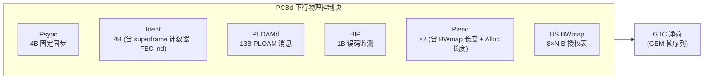

# GPON 帧结构 (GTC)

> GPON 的 TC 层称为 GTC（GPON Transmission Convergence）。本篇梳理下行帧（含 PCBd 物理控制块、BWmap）、上行突发帧（PLOu/PLOAMu/DBRu）、GEM 封装与分片，以及 FEC。下行帧周期固定 **125 µs**。

## 1. GTC 层结构

GTC 层在 SDU（用户数据/OMCI）与适合调制光载波的比特流之间做映射，分两个子层：

- **GTC 成帧子层（Framing Sublayer）**：构造下行帧 / 上行突发，含 PCBd、BWmap、PLOAM、净荷。
- **GTC 适配子层（Adaptation Sublayer）**：GEM 封装、分片/重组、GEM 帧定界、GEM Port-ID 过滤。


## 2. 下行 GTC 帧

下行是**连续比特流**，按 125 µs 切分为帧。每帧 = **PCBd（Physical Control Block downstream）** + **GTC 净荷**。



| 字段 | 长度 | 作用 |
|------|------|------|
| Psync | 4 B | 物理同步图案，ONU 据此对齐帧边界 |
| Ident | 4 B | 超帧计数器（驱动加密）、FEC 指示等 |
| PLOAMd | 13 B | 下行 PLOAM 消息（见 [PLOAM 消息](ploam-messages.md)） |
| BIP | 1 B | Bit-Interleaved Parity，误码监测 |
| Plend | 2 B（重复一次冗余） | BWmap 长度（Blen）+ ATM 分配长度（Alen）+ CRC |
| US BWmap | 8 × N B | 上行带宽映射（N 个 8 字节 allocation structure） |

> Plend 重复发送两份以增强健壮性（ONU 取其一正确者）。

### BWmap：上行授权表

BWmap 是 DBA 的「输出」，是一串 **8 字节 allocation structure**，数量由 Plend 的 BWmap 长度字段给出。每个 allocation structure 把一段上行时隙授权给一个 Alloc-ID：

| 字段 | 作用 |
|------|------|
| Alloc-ID | 被授权的 T-CONT |
| Flags | 含 **PLOAMu**（本次是否携带上行 PLOAM）、**DBRu**（是否携带动态带宽报告）等指示位 |
| StartTime | 上行突发起始时刻（相对帧起点） |
| StopTime | 上行突发结束时刻 |

属于同一 ONU、需连续上行发送的一组 allocation structure 构成一个 **burst allocation series**。BWmap 如何生成见 [DBA 算法 ⭐](../../03-dba/dba-algorithms.md)。

## 3. 上行突发帧

上行是**突发（burst）**：每个 ONU 只在 BWmap 授权的时隙发送。一个上行突发的结构：


| 字段 | 作用 |
|------|------|
| PLOu | Physical Layer Overhead upstream：前导（preamble）、定界符（delimiter）、BIP、ONU-ID、Ind（实时状态） |
| PLOAMu | 上行 PLOAM 消息（仅当 BWmap Flags 的 PLOAMu=1 时存在） |
| PLSu | Power Levelling Sequence upstream，功率测量（OLT 索要时） |
| DBRu | Dynamic Bandwidth Report upstream：ONU 上报该 T-CONT 缓存深度（仅当 DBRu=1） |
| 净荷 | GEM 帧序列 |

> DBRu / PLOAMu 是否出现，完全由该 allocation structure 的 Flags 控制 —— 这是 SR-DBA 的带内信令载体。

## 4. GEM 封装

GEM（G-PON Encapsulation Method）把用户帧/OMCI 封进 GEM 帧。**5 字节 GEM 头** 布局（G.984.3 §8.1.1）：

```
 0                   1                   2                   3                   4
+-------------------+-------------------+----+--------------------------------+
|        PLI (12 bit)        |     Port-ID (12 bit)    | PTI(3) |  HEC (13 bit) |
+----------------------------+-------------------------+--------+---------------+
```

| 字段 | 位宽 | 含义 |
|------|------|------|
| PLI | 12 | Payload Length Indication，净荷字节数（最大 4095） |
| Port-ID | 12 | GEM Port-ID，标识一条逻辑连接（业务流） |
| PTI | 3 | Payload Type Indicator：000=用户数据(无拥塞)，001=OMCC(OMCI)，100=分片结束 |
| HEC | 13 | 头部纠错（CRC-13），保护前 24 bit |

**分片**：当一个 SDU 跨多个 GEM 净荷时，用 PTI 的 end-of-fragment 位标记最后一片；接收端按 Port-ID 重组。

### 工程实现佐证

`gopon` 的 GEM codec 把上述布局逐位实现，可直接对照标准：

```92:104:/home/mingheh/project/gopon/common/gem/frame.go
	out := make([]byte, HeaderSize+len(f.Payload))
	// PLI (12 bits) | Port-ID (12 bits) | PTI (3 bits) | HEC (13 bits)
	// Layout per G.984.3 §8.1.1: PLI first, then Port-ID, then PTI+HEC.
	pli := uint16(len(f.Payload))
	binary.BigEndian.PutUint16(out[0:2], pli<<4|(f.PortID>>8)&0x0F)
	out[2] = byte(f.PortID & 0xFF)
	// PTI in the top 3 bits of byte 3; bottom 5 bits + byte 4 carry HEC.
	hec := crc13(out[:3]) // CRC-13 over the 24-bit prefix
	out[3] = (f.PTI&0x07)<<5 | byte((hec>>8)&0x1F)
	out[4] = byte(hec & 0xFF)
	copy(out[HeaderSize:], f.Payload)
```

PTI 取值与 OMCC Port-ID 约定：

```56:60:/home/mingheh/project/gopon/common/gem/frame.go
const (
	PtiUserDataNoCongestion uint8 = 0b000
	PtiOmcc                 uint8 = 0b001 // OMCI carried in OMCC (G.984.3 §8.1.1.3)
	PtiEndOfFragment        uint8 = 0b100
)
```

CRC-13 HEC 多项式（G.984.3 §8.1.1.4）：

```180:182:/home/mingheh/project/gopon/common/gem/frame.go
func crc13(b []byte) uint16 {
	const poly uint16 = 0x29B5 // x^13+x^12+x^11+x^7+x^5+x^4+x^2+x+1 (13 bits)
	var crc uint16
```

## 5. FEC

GPON 上下行可选 **RS(255,239)** 前向纠错（255 字节码字 = 239 数据 + 16 校验）。启用 FEC 会占用净荷开销，DBA 在计算上行字节预算时须扣除（见 [DBA 算法 ⭐](../../03-dba/dba-algorithms.md) 第 5 节）。

> XGS-PON 改用更强的 RS(248,216)，见 [XGS-PON 帧结构](../xgspon-g9807/frame-structure.md)。

## 6. 与其他章节的衔接

- BWmap 的生成 → [DBA 算法 ⭐](../../03-dba/dba-algorithms.md)
- PLOAMd/PLOAMu 消息 → [PLOAM 消息](ploam-messages.md)
- GEM Port-ID 绑定到 T-CONT → [OMCI HSI 配置 ⭐](../../02-omci/provisioning-hsi.md)

## 来源

- **公有标准**：ITU-T G.984.3 §8（GTC 帧结构、下行 PCBd、上行突发、Plend/BWmap）、§8.1.1（GEM 帧头、PLI/Port-ID/PTI/HEC）、§8.1.1.4（CRC-13 HEC 多项式）。BBF TP-255 §2.3（GEM Port-ID 定义：12-bit OLT 分配的逻辑连接标识；GTC adaptation sublayer 负责分片/封装/定界/过滤）。
- **工程实现**：`gopon/common/gem/frame.go`（5 字节 GEM 头编码、CRC-13、PTI/Port-ID/PLI）。
- **说明**：本页 BWmap 的 8 字节 allocation structure（Alloc-ID + Flags(PLOAMu/DBRu) + StartTime + StopTime）概念与 XGS-PON C.8.1.1.2 一致；GPON GTC 帧字段编码以 G.984.3 §8 为准。
