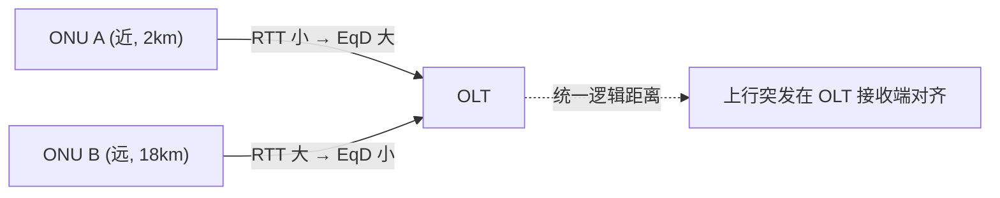
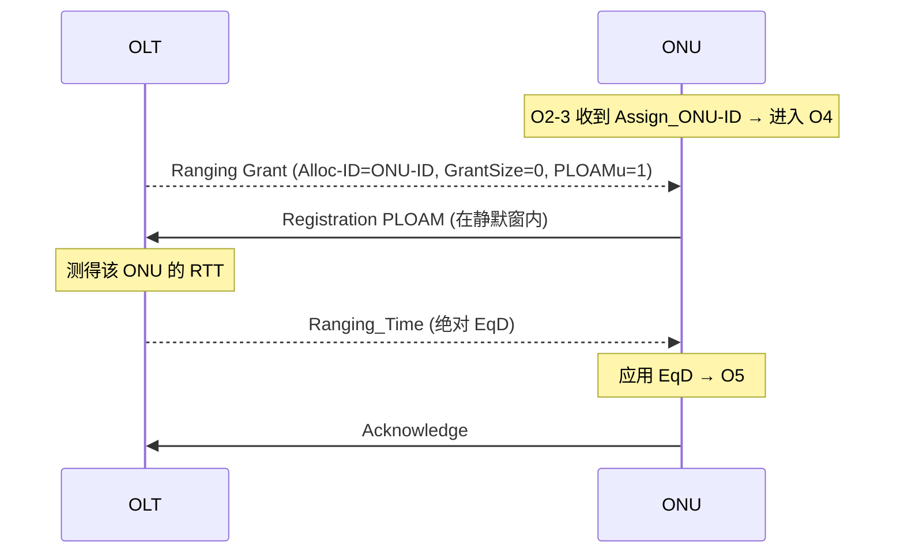

# 测距与激活细节

> 测距（Ranging）是 PON 的关键机制：测出各 ONU 到 OLT 的往返时延，下发**均衡时延（EqD）**，使所有 ONU 的上行突发在 OLT 接收端对齐、互不碰撞。本篇梳理测距原理、静默窗（quiet window）、EqD 计算与传输漂移控制。

## 1. 为什么要测距

PON 是点到多点共享上行：不同 ONU 到 OLT 的物理距离不同（往返时延不同）。若各 ONU 各自按收到的下行帧定时发送，到达 OLT 时会因距离差而**相互碰撞**。

解决办法：给每个 ONU 分配一个 **均衡时延 EqD**，让「近」的 ONU 多等一会、「远」的 ONU 少等，使得**所有 ONU 在逻辑上等效于位于同一最大距离处**（logical reach）。



## 2. 测距发生在激活的哪一步

测距是激活状态机 **O4（Ranging）** 的核心工作（见 [激活状态机 ⭐](activation-state-machine.md)）：



## 3. 静默窗（Quiet Window）

发现/测距新 ONU 时，OLT **尚不知道**该 ONU 的 EqD，无法预测它的上行突发何时到达。为避免新 ONU 的 `Serial_Number_ONU` / `Registration` 响应与在线 ONU 的正常上行**碰撞**，OLT 打开一个 **静默窗（quiet window）**：在该窗口内**暂停所有在线 ONU 的上行授权**，只给广播/测距 grant。

两类静默窗（G.9807.1 C.13.1）：

| 阶段 | 场景 | 标准 |
|------|------|------|
| 序列号采集静默窗 | O2-3：ONU 发 `Serial_Number_ONU` | C.13.1.2 |
| 测距静默窗 | O4：ONU 发 `Registration` | C.13.1.3 |

### 静默窗大小的决定因素

静默窗必须覆盖「最近 ONU 与最远 ONU 的响应到达时间差」。关键参数（G.9807.1 C.13.1.7 示例）：

| 参数 | 含义 | 示例值 |
|------|------|--------|
| Lmin | 最小逻辑距离 | 0 |
| Dmax | 最大差分距离 | 20 km |
| Teqd | 均衡时延总量 | 236 µs |
| 传播时延上界 | 单程光纤传播 | ≈100 µs（20km 往返约对应该量级） |
| ONU 响应时间 | ONU 收到 grant 到发出响应 | 35 ± 1 µs（厂商间可变，OLT 未知） |

> 静默窗越大，发现新 ONU 越可靠，但会**牺牲在线业务带宽**（窗口内不能授权）。这是「发现速度 vs 带宽利用率」的权衡。

## 4. 均衡时延 EqD 的计算与下发

- OLT 在测距 grant 中设 `StartTime = S`，记录 ONU 响应实际到达时刻，反推该 ONU 的往返时延 **RTD**。
- `EqD = Teqd − (RTD / 2 相关项)`，使所有 ONU 等效到统一逻辑距离。
- 通过 **`Ranging_Time` PLOAM** 下发：在 GPON/XGS-PON 中，octet 指示**绝对（0x01）** 还是相对均衡时延；ONU 应用后进入 O5。
- 运行期可用 **相对 Ranging_Time** 做微调（应对温漂等导致的窗口漂移）。

### 4.1 EqD 计算的逐步推导（G.9807.1 §C.13.1.4）

**第一步：OLT 选定上行 PHY 帧偏移 Teqd**（系统级常量，按 ODN 设计）。它必须大到能容纳「最大响应时间 + 最大距离往返」：

```
Teqd ≥ RspTime_max + (Lmin + Dmax) × (ndn + nup)        … (C.13-6)
```

- `RspTime_max`：ONU 最大响应时间；
- `Lmin`：最小逻辑距离；`Dmax`：最大差分距离；
- `ndn + nup`：下行/上行光纤折射率相关的单位距离时延系数。

> 直觉：Teqd 是「全网统一的逻辑时延预算」，足够覆盖最远 ONU + 最慢响应，**所有 ONU 都被对齐到这个预算上**。

**第二步：测每个 ONU 的实际往返，算各自 EqD**。OLT 给 O4 的 ONU 发 ranging grant，**精确测量**下行 PHY 帧（含 grant）与上行 PHY 突发（含 Registration PLOAM）之间的实测时间 **ΔRNG**（见 Figure C.13.4）：

```
EqD_i = Teqd − ΔRNG_i    （概念式, 精确形式见 C.13-7）
```

- 近的 ONU：ΔRNG 小 → EqD 大（多等）；远的 ONU：ΔRNG 大 → EqD 小（少等）。
- 结果：所有 ONU 的上行突发在 OLT 接收端**对齐到同一参考**。OLT 也可通过对突发计时**直接测量** EqD。

**第三步：下发 + 应用**。`Ranging_Time` PLOAM 把 EqD（绝对值）下发，ONU 据此延迟自己的上行发送，进入 O5。

### 4.2 EqD 精度（§C.13.2.3.1）

- EqD 精度由 **DOW 门限**（§C.13.1.6）决定，约 **±3 ns**；
- 远小于系统整体定时要求 **1 µs**，故通常**可忽略**——这也是 PON 能支持高精度时间同步（移动回传）的基础。

### 4.3 由测距反推光纤距离（§C.13.1.8）

OLT 可用往返测量估算每个 ONU 的光纤距离（米）：

```
FD_i = ( RTT_i − RspTime_i − EqD_i − StartTime × Q0 ) × 10²     … (C.13-8)
```

- `RTT_i`：实测上行突发起点相对下行帧起点的偏移（µs）；
- `RspTime_i`：ONU 上报的真实响应时间（µs，经 OMCC 获取）；
- `EqD_i`：该 ONU 的均衡时延；`Q0`：字长相关换算系数。

> 用途：运维定位（光纤实际长度/是否绕接）、规划（差分距离是否超限）。

## 5. 传输漂移控制（Drift Control）

ONU 进入 O5 后，因温度、器件老化等，其上行突发时刻会缓慢**漂移**，可能逐渐侵入相邻 ONU 的时隙。OLT 持续监测并控制（BBF TR-309 §8.4）：

| 机制 | 含义 |
|------|------|
| **DOW（Drift of Window）** | 可接受的传输漂移边界；OLT 据此发相对 Ranging_Time 校正 |
| **TIW（Transmission Interference Warning）** | 漂移超出不可接受边界 → 告警，防止干扰其他 ONU |

互通测试关注三类边界：可接受漂移边界、可调整漂移边界（DOW）、不可接受漂移边界（TIW）。

## 6. 与时间同步的关系

均衡时延与 **Time of Day（ToD）分发** 配合：OLT 可在 PON 上分发精确时间（1PPS/ToD），EqD 的稳定性直接影响时间同步精度（移动回传场景关键）。BBF TR-309 §8.5 定义了固定/可调 EqD 下的 ToD 分发测试。

## 延伸阅读

- [GPON/XGS-PON 激活状态机 ⭐](activation-state-machine.md)（O4 Ranging 上下文）
- [GPON 帧结构](frame-structure.md)（BWmap 授权、StartTime）
- [PLOAM 消息](ploam-messages.md)（Ranging_Time / Registration）

## 来源

- **公有标准**：
  - ITU-T G.9807.1 (2023) C.13.1.2（序列号采集的时序与静默窗，Figure C.13.2）、C.13.1.3（测距的时序与静默窗，Figure C.13.3）、C.13.1.7（静默窗实现考量：Lmin=0、Dmax=20km、Teqd=236µs、传播时延≈100µs、ONU 响应 35±1µs）。
  - ITU-T G.9807.1 C.13.1.4（EqD 计算：Teqd 选取条件 C.13-6、测 ΔRNG 求 EqD C.13-7，Figure C.13.4）、C.13.1.8（光纤距离估算 FD C.13-8）、C.13.2.3.1（EqD 精度由 DOW 门限决定 ≈±3ns，远小于 1µs 系统定时要求）。
  - ITU-T G.984.3 §10（GPON Ranging、EqD）；G Supplement 46（时间参考）。
  - BBF TR-309 Issue 3 §8.4（Drift Control：可接受/可调(DOW)/不可接受(TIW) 边界）、§8.5（Time of Day 分发）。
- 说明：EqD 计算公式为原理性表述，精确比特级定义以 G.984.3 / G.9807.1 为准。
