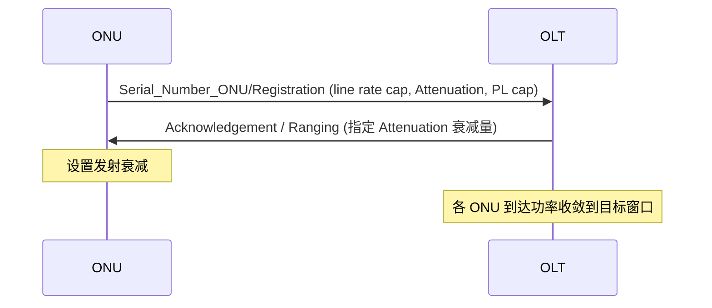

# HSP 功率调平与能力协商（Power Levelling / Registration）

> 高速 PON（25/50G）链路预算更紧、突发动态范围更苛刻，于是引入**功率调平（Power Levelling）**：OLT 在激活/注册阶段读取 ONU 能力、并指挥其调整**发射衰减（Attenuation）**，把各 ONU 到达 OLT 的功率拉到合理窗口。本篇梳理相关 PLOAM 字段与 25GS-PON 的细节。依据 G.9804.2 §11.2.6.7/§11.2.6.8、G.9807.1 §C.11、BBF TR-309。

> 激活流程见 [激活状态机](../gpon-g984/activation-state-machine.md)；PLOAM 格式见 [XGS-PON PLOAM](../xgspon-g9807/ploam-messages.md)（HSP 同源）；功率与预算见 [光功率预算](../optical-power-budget.md)。

## 1. 为什么要功率调平

- 同一 PON 上**近端 ONU 收得强、远端 ONU 收得弱**，OLT 突发接收机要在大动态范围内逐突发适配；
- 速率越高，接收机对**过载/弱光**越敏感，单靠 OLT 适配不够；
- 让 ONU **主动降低**发射功率（近端 ONU 衰减更多），可压缩 OLT 看到的功率差，改善误码与预算——这就是 Power Levelling。

## 2. 能力协商：Registration / Serial_Number_ONU 上行字段

ONU 在上行 `Serial_Number_ONU` / `Registration` 类消息中携带能力（G.9807.1 §C.11；HSP 沿用扩展）：

| Octet | 字段 | 含义 |
|-------|------|------|
| 37 | **Upstream line rate capability** | 位图 `0000 00HL`：**H**=9.95328 Gbit/s 支持位（HSP 再扩展更高速率位）；**L**=2.48832 Gbit/s（注意 L 语义为「0=支持」） |
| 38 | **Attenuation** | ONU 当前/可调的发射衰减能力 |
| 39 | **Power levelling capability** | ONU 是否支持功率调平及其档位 |
| 40 | Padding | 填充（XGS-PON 不用，发 0x00） |

> 在纯 XGS-PON 里 Attenuation/Power levelling 这些字节**置 0x00**；到 HSP（G.9804.2）才真正启用，承载更细的速率能力与功率档位。

## 3. 下行指挥：Acknowledgement / Ranging 中的功率调平

- OLT 在 `Acknowledgement` 等下行 PLOAM 中带 **Attenuation**（§11.2.6.7）与 **Power levelling capability**（§11.2.6.8）相关参数，告知 ONU 采用的衰减量；
- ONU 据此设置发射衰减，使到达 OLT 的功率落入目标窗口；
- TR-309 用例参数示例：`Completion_code=0x00(OK)`、`SeqNo` 按 G.9804.2 Table 11-28、`Attenuation`/`Power levelling capability` 按 §11.2.6.7/§11.2.6.8。

## 4. 25GS-PON 的若干细节（TR-309）

| 项 | XG-PON / XGS-PON | **25GS-PON** |
|----|------------------|--------------|
| 广播 ONU-ID | 0x3FF / 0x3FE | **0x3FB / 0x3FC** |
| 速率 | 10G | 25G 对称（25GS-PON MSA） |
| FEC | RS(248,216) | LDPC |
| 标准来源 | G.9807.1 | 25GS-PON MSA / G.9804 |

- **广播 ONU-ID 不同**是混速系统抓包/解析时的易错点：25GS-PON 用 0x3FB/0x3FC 做广播，需按「协议+上行速率」区分。
- 混速系统里 **Broadcast Burst profile version changes** 等下行 PLOAM 要能被各代 ONU 正确处理（TR-309 用例）。

## 5. 与 XGS-PON 的「同 vs 增强」

| 方面 | 同源（沿用 XGS-PON） | HSP 增强 |
|------|---------------------|----------|
| 帧/XGEM/DBA/状态机/AES | ✅ 完全同源 | — |
| PLOAM 字段 | 48B 同布局 | 启用 Attenuation / Power levelling capability / 更高速率能力位 |
| FEC | RS(248,216) | **LDPC** |
| 广播 ONU-ID | 0x3FF/0x3FE | 25GS-PON 0x3FB/0x3FC |

## 来源

- **公有标准 / 规范**：
  - ITU-T **G.9804.2** §11.2.6.7（Attenuation）、§11.2.6.8（Power levelling capability）、§11 PLOAM、Table 11-28（SeqNo）。
  - ITU-T **G.9807.1** §C.11.3（Serial_Number_ONU / Registration 上行字段：Octet 37 Upstream line rate capability 位图 `0000 00HL`、Octet 38 Attenuation、Octet 39 Power levelling capability、Octet 40 Padding；XGS-PON 置 0x00）。
  - BBF **TR-309 Issue 3**（Acknowledgement 参数：Completion_code=0x00、SeqNo 按 G.9804.2 Table 11-28、Attenuation §11.2.6.7、Power levelling §11.2.6.8；广播 ONU-ID XG-PON/XGS-PON 0x3FF/0x3FE、25GS-PON 0x3FB/0x3FC；混速 Broadcast Burst profile version changes 用例）。
  - **25GS-PON MSA**（25 Gigabit Symmetric PON Specification, 2023）。
- 说明：功率调平动机（§1）为工程归纳；PLOAM 字节布局与 25GS-PON 广播 ID 以原文为准。
