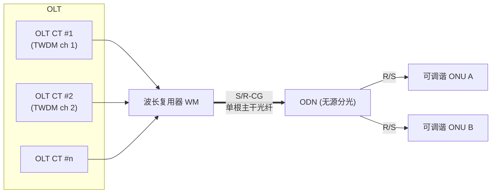

# NG-PON2 与 TWDM 波长调谐

> NG-PON2（ITU-T G.989 系列）是**多波长** PON：在 TDM（时分）之上叠加 **WDM（波分）**，形成 **TWDM**（Time and Wavelength Division Multiplexing）。它比此前所有 PON 多了一个互通维度——**可调谐 ONU** 在多个波长通道间切换，以及 **OLT 多通道终端（CT）之间** 的协同。本篇梳理架构、ONU 调谐状态机与 CT 间协议 ICTP。

> XGS-PON（G.9807.1）其实是从 G.989.3 TC 层裁剪出来的**单波长**版本（删去了多波长相关的 PLOAM 与省电子句）。理解 NG-PON2 有助于看清 XGS-PON 的「来历」。

## 1. 架构：通道、通道对、通道组



| 术语 | 含义 |
|------|------|
| **CT（Channel Termination）** | OLT 侧一个通道终端，终结一个 **TWDM 通道**（一对上/下行波长）或一个 PtP WDM 通道 |
| **TWDM 通道** | 一对 DS+US 波长通道，提供逻辑点到多点连接 |
| **WM（Wavelength Multiplexer）** | 把多个 CT 的波长合到一根主干光纤 |
| **参考点** | S/R-CG（通道组，主干根）、S/R-CP（通道对，CT↔WM）、R/S（ONU 侧） |
| **DWLCH ID / UWLCH ID** | 下行 / 上行波长通道标识 |
| **NG2SYS ID** | 20-bit，标识一个 NG-PON2 系统（G.989.3 §6.5.2） |
| **PON-ID** | 32-bit，唯一标识一个 TWDM/PtP WDM CT（§6.5.3） |

- 每个 ONU 同一时刻**只工作在一对波长**上，但可被**调谐**到别的通道，实现负载均衡、波长保护、节能（关闭部分 CT）。
- 速率：TWDM 每通道 10G（对称/非对称），多通道叠加（如 4×10G = 40G）；另有 PtP WDM 通道用于高带宽专线。

## 2. ONU 激活：多出的「调谐」维度

NG-PON2 ONU 激活状态机在 GPON/XGS-PON 的 O1–O7 之上，增加了与**波长**相关的处理（G.989.3 clause 12）：

- **Silent Start / 上电选波**：ONU 上电后先在默认/扫描波长上尝试取得下行同步，再进入序列号/测距。
- **O8（Intermittent LODS）/ 调谐相关态**：当 OLT 决定把某 ONU 迁到另一波长通道时，进入**波长通道切换（handover）** 流程。
- 相关 PM：G.988 §9.16.8 **TWDM channel tuning PM history data** 统计调谐控制事件（引用 G.989.3 clause 12 的激活周期状态与计时器）。

## 3. 波长通道切换（Tuning / Handover）

OLT 通过 **Tuning_Control PLOAM** 指挥 ONU 从源波长通道迁到目标波长通道。OLT CT 侧调谐状态机（G.989.3 clause 17.3.3）概念如下：

```mermaid
sequenceDiagram
    participant SrcCT as 源 CT
    participant ONU as 可调谐 ONU
    participant TgtCT as 目标 CT
    SrcCT-->>ONU: Tuning_Control (Request, 目标 DWLCH/UWLCH)
    Note over SrcCT,TgtCT: ICTP: Tune-in() 通知目标 CT 准备接纳
    ONU->>ONU: 调谐收发到目标波长
    Note over TgtCT: 进入 Expecting, 等待 ONU 出现
    ONU->>TgtCT: PLOAM (Serial_Number_ONU / TuningResp)
    TgtCT->>ONU: TuningResp(Complete)
    Note over SrcCT,TgtCT: ICTP 保证两 CT 状态一致; 失败则 handoverAbort()
```

- **失败回退**：若目标通道在 `Ttarget` 内没等到 ONU（调谐失败/丢失），目标 CT 发 `ICTP: ONU Alert()`，源/目标 CT 通过 `handoverAbort()` 协商回退，避免 ONU「失踪」。
- 这正是 NG-PON2 比单波长 PON 复杂的根因：**切换过程要跨两个 CT 维持状态一致**。

## 4. ICTP：CT 间互通协议（BBF TR-352）

多波长引入了一个新的互通面——**不同 OLT CT 之间**也要协同（可能来自不同供应商）。BBF **TR-352** 定义 **ICTP（Inter-Channel-Termination Protocol）**：

| ICTP 用例（G.989.3 Table VI.1） | 说明 |
|------|------|
| **CT Profile Sharing** | CT 周期性广播自己的通道 profile 给系统内其他 CT |
| **Silent Start & CT Initialization** | 新 CT 上线时用 ICTP 校验配置一致性，避免误干扰 |
| **ONU Tuning / Handover** | 波长切换时跨 CT 维持状态一致（见 §3） |
| **ONU LOB Mitigation** | 某 CT 收不到 ONU 预期突发时，广播 ICTP alert 通知其他 CT |
| **Rogue ONU Mitigation** | 流氓 ONU（乱发光干扰他人）的隔离协同 |
| **Wavelength Protection** | 波长/通道保护倒换 |

- ICTP 让 **TWDM 子系统供应商可多元化**：OLT 的多个 CT 可来自不同厂商，只要都遵循 ICTP。

## 5. 与 XGS-PON 的关系（裁剪说明）

G.9807.1（XGS-PON）显式声明它**复用** G.989.3 TC 层，但**删除**多波长相关条款，例如：

- 不使用 G.989.3 §11.2.6.3–11.2.6.8、§11.3、§11.3.3.10–18、§11.3.4.6–8（多波长/调谐相关 PLOAM）；
- Burst_Profile 中对上行线速率（2.48832G / 9.95328G）做了 XGS-PON 专属的取值约定。

> 即：**XGS-PON = NG-PON2 TC 框架 − 多波长**。掌握 NG-PON2，再看 XGS-PON 会觉得「少了波长那一层」。

## 来源

- **公有标准**：
  - ITU-T G.989 系列（NG-PON2）：G.989.1（要求）/ G.989.2（PMD）/ G.989.3（TC 层）。架构（CT / TWDM 通道 / WM / S-R-CG / S-R-CP / R-S）、NG2SYS ID（§6.5.2）、PON-ID（§6.5.3）、ONU 激活与调谐（clause 12）、波长通道切换状态机（clause 17.3.3）。
  - BBF TR-352（Multi-wavelength PON Inter-Channel-Termination Protocol, ICTP）：执行摘要（CT 间互通维度）、Table 5-1（数据元素 NG2SYS ID / PON-ID）、Table 5-2 / G.989.3 Table VI.1（ICTP 用例：CT Profile Sharing / Silent Start / ONU Tuning / LOB / Rogue ONU / Wavelength Protection）、§7.2.2 OLT CT 调谐状态机（Away/Expecting、Tune-in/TuningResp/handoverAbort）。
  - ITU-T G.988 §9.16.8（TWDM channel tuning PM history data，引用 G.989.3 clause 12）。
  - ITU-T G.9807.1 §A（XGS-PON 复用并裁剪 G.989.3 的条款清单）。
- 说明：调谐时序与 ICTP 用例为基于上述文档的归纳；逐字段 PLOAM/ICTP 编码以 G.989.3 / TR-352 原文为准。本篇按「NG-PON2 作为知识延伸」处理。
