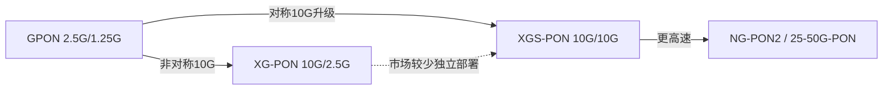

# XG-PON 与 XGS-PON 的差异

> XG-PON（NG-PON1，ITU-T G.987.x）与 XGS-PON（G.9807.1）TC 层高度同源。本篇以「差异」方式呈现，避免与 [XGS-PON 帧结构](../xgspon-g9807/frame-structure.md) / [PLOAM](../xgspon-g9807/ploam-messages.md) / [状态机](../xgspon-g9807/activation-state-machine.md) 重复。

## 1. 一句话总结

> **XGS-PON ≈ 对称化的 XG-PON。** G.9807.1 在结构上**继承 G.987 系列**，把上行从 2.5G 提到 10G，TC 层（帧/PLOAM/DBA/OMCI/状态机/安全）**几乎逐条复用** G.987.3 的定义。G.9807.1 自身说明：其总体要求「largely based on G.987.1」，并以**附录（annexes）**形式收纳 PMD/TC 规范，而非独立成册。

## 2. 核心差异表

| 维度 | XG-PON (G.987.x) | XGS-PON (G.9807.1) |
|------|------------------|--------------------|
| 别名 | NG-PON1 | （无；G.987 的对称版） |
| 下行速率 | 9.953 Gbit/s | 9.953 Gbit/s |
| **上行速率** | **2.488 Gbit/s** | **9.953 Gbit/s（对称）** |
| 定位 | 10G 非对称 | 对称 10G，FTTH/商业/移动回传主流升级路径 |
| 标准组织 | G.987.1（要求）/.2（PMD）/.3（TC）/.4（reach ext） | G.9807.1 单册 + 附录 A(要求)/B/C(TC) |
| 下行波长 | 1577 nm | 1577 nm |
| 上行波长 | 1270 nm | 1270 nm |
| 共存 | 与 GPON 在同 ODN 波分共存 | 同上（CEx 共存元件） |

## 3. TC 层逐项对照

| TC 层项目 | XG-PON (G.987.3) | XGS-PON (G.9807.1 Annex C) | 是否相同 |
|-----------|------------------|---------------------------|----------|
| 三子层划分（PHY 适配 / Framing / Service 适配） | ✅ | ✅ | 同 |
| PSBd 结构（PSync 64b + SFC + OC） | ✅ | ✅ | 同 |
| FS 帧 / 突发结构 | ✅ | ✅ | 同 |
| XGEM 封装（含 18b Key-Index/PLI 等） | ✅ | ✅ | 同 |
| FEC：RS(248,216) | ✅ | ✅ | 同 |
| PLOAM 48 字节格式 + MIC(8B) | ✅ | ✅ | 同 |
| DBA（SR/NSR、DBRu、BWmap） | ✅ | ✅ | 同 |
| 激活状态机 O1–O7 | ✅ | ✅ | 同 |
| 安全（AES-CTR、MSK/SK 派生） | ✅ | ✅ | 同 |
| 行速率相关的时序/带宽换算 | 按 2.5G 上行 | 按 10G 上行 | **不同** |

> 因此，本知识库的 XGS-PON 章节内容**绝大部分直接适用于 XG-PON**，唯一需换算的是上行带宽/时序相关的数值（grant 大小、DBA 容量上界等）。

## 4. PMD / ODN 差异

- **上行光器件**：XG-PON 上行 2.5G，发射/接收器件成本更低；XGS-PON 上行 10G，需 10G 突发收发模块（成本更高，但对称带宽）。
- **光功率预算 / ODN class**：两者都定义 Nominal1/Nominal2/Extended 等 ODN 类别；对称 10G 上行对接收灵敏度要求更高。
- **共存**：均通过共存元件（Coexistence Element, CEx）与 GPON/NG-PON2 在同一 ODN 上波分叠加。

## 5. 选型与演进

- 实际部署中，**XGS-PON 已基本取代 XG-PON** 成为 10G 代的主流（对称带宽更适配商业专线、移动回传、上行密集业务）。
- 互通测试规范（BBF TR-309 / TP-255）常将 **XG-PON / XGS-PON / 25GS-PON / G.9804.x** 并列引用，正是因为它们 TC 层同源、用例可复用。

## 来源

- **公有标准**：
  - ITU-T G.9807.1 (2023)「Overview」：XGS-PON 总体要求 largely based on G.987.1，PMD/TC 以附录形式收纳；新增对称 10G 上行。
  - ITU-T G.987.1（要求）/ G.987.2（PMD）/ G.987.3（TC 层）/ G.987.4（reach extension）。
  - BBF TR-309 Issue 3 §3（缩写与引用并列 XG-PON / XGS-PON / 25GS-PON / G.9804.x）。
- 说明：差异表为两标准框架的归纳对照；逐比特字段以各自原文为准。
