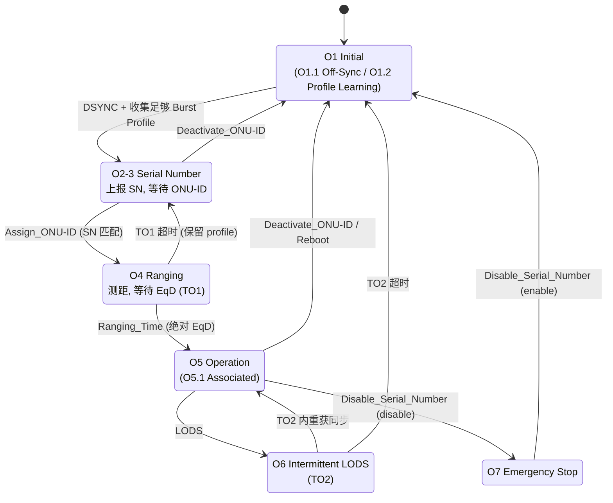
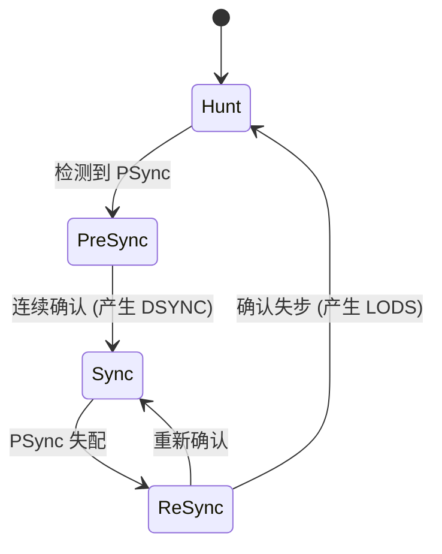

# XGS-PON ONU 激活状态机

> XGS-PON（G.9807.1 Annex C.12）的 ONU 激活周期状态机。与 GPON 同源，但把 GPON 的 O2/O3 合并为 **O2-3（Serial Number state）**，并引入明确的下行同步状态机与子态。本篇可独立阅读；GPON 视角与时序图见 [GPON/XGS-PON 激活状态机 ⭐](../gpon-g984/activation-state-machine.md)。

## 1. 状态机总览



## 2. 状态与子态（G.9807.1 Table C.12.1）

| 状态 | 子态 | 语义 |
|------|------|------|
| **O1 Initial** | O1/Off-Sync (=O1.1) | 入口子态：搜索并尝试同步下行信号；发射机关闭。进入 O1 时丢弃 ONU-ID、默认/显式 Alloc-ID、默认 XGEM Port-ID、burst profile、EqD；下行同步状态机初始化。 |
| | O1/Profile Learning (=O1.2) | 解析下行 FS 帧的 PLOAM 分区，收集 burst profile。信息足够后转 O2-3。 |
| **O2-3 Serial Number** | — | 收到 SN grant 后回 `Serial_Number_ONU` PLOAM；等待并处理 OLT 的 `Assign_ONU-ID`，随后转 O4。 |
| **O4 Ranging** | — | 启动测距定时器 **TO1**。响应定向 ranging grant，发 `Registration` PLOAM；收到带绝对 EqD 的 `Ranging_Time` → O5。TO1 超时则丢弃 ONU-ID/默认 Alloc-ID/默认 OMCC XGEM Port-ID，回 O2-3（保留已收集 profile）。 |
| **O5 Operation** | O5/Associated (=O5.1) | 入口子态：正常处理下行帧、按 OLT 授权发上行突发；上行 SDU 分片规则无额外限制。 |
| **O6 Intermittent LODS** | — | 从 O5 因下行失步进入，启动 **TO2**；TO2 内重获同步回 O5，超时回 O1。 |
| **O7 Emergency Stop** | — | 收到带 `disable` 选项的 `Disable_Serial_Number` → 关激光、转 O7；O7 下仍保持下行同步、解析 PLOAM，但禁止上下行转发数据。收 `enable` 回 O1。**跨重启/掉电保持**。 |

## 3. 下行同步状态机

激活状态机依赖一个独立的**下行同步状态机**（G.9807.1 C.10.1.1.3），它在 PSBd 的 PSync 上做帧对齐：



- **DSYNC** 事件：Pre-Sync → Sync 时产生，驱动 O1/Off-Sync → O1/Profile Learning。
- **LODS** 事件：Re-Sync → Hunt 时产生，驱动 O5 → O6（或其他态 → O1）。

PSBd 结构见 [XGS-PON 帧结构](frame-structure.md) 第 2 节。

## 4. 定时器（Table C.12.2）

| 定时器 | 状态 | 作用 |
|--------|------|------|
| TO1 | O4 | Ranging 超时，超时回 O2-3 |
| TO2 | O6 | LODS 重同步超时，超时回 O1 |

## 5. 输入事件（Table C.12.3）

- **下行同步**：DSYNC、LODS。
- **定时器**：TO1 expires（O4）、TO2 expires（O6）。
- **BWmap**：SN grant（对广播 Alloc-ID、已知 burst profile、特定 StartTime、PLOAMu=1 的授权）、Directed PLOAM grant、Data grant。
- **PLOAM**：ONU-ID assignment（Assign_ONU-ID 且 SN 匹配）、EqD assignment（绝对 Ranging_Time）、Deactivate ONU-ID、Disable/Enable SN、Burst_Profile、Ranging_Time（相对调整）。

## 6. 与 GPON 的差异

| 维度 | GPON | XGS-PON |
|------|------|---------|
| 状态命名 | O2 Standby + O3 Serial Number 分开 | **O2-3 合并** |
| PLOAM | 13 B / CRC | 48 B / MIC（PLOAM_IK） |
| ONU-ID | 8-bit（0xFF 广播） | 10-bit（0x03FF 广播） |
| 同步图案 PSync | 32-bit `0xB6AB31E0` | 64-bit `0xC5E51840FD59BB49` |

> 25GS-PON / G.9804.2 在 G.9807.1 状态机基础上演进，互通测试（BBF TR-309 / TP-255）常将 XG-PON / XGS-PON / 25GS-PON 并列引用。

## 7. 工程实现佐证

`gopon` 的状态枚举注释直接引用 G.989.3，O2-3 在代码中体现为 O2(Standby) + O3(SerialNumber)，对照标准合并语义即可：

```91:101:/home/mingheh/project/gopon/common/types/types.go
const (
	StateO1 OnuState = 1 // Initial state (laser off, awaiting downstream)
	StateO2 OnuState = 2 // Standby (downstream sync acquired)
	StateO3 OnuState = 3 // Serial Number / Ranging state
	StateO4 OnuState = 4 // Ranging state
	StateO5 OnuState = 5 // Operation state (active)
	StateO6 OnuState = 6 // Intermittent LODS / popup
	StateO7 OnuState = 7 // Emergency stop state
	StateO8 OnuState = 8 // Downstream tuning (NGPON2 only, optional)
	StateO9 OnuState = 9 // Upstream tuning (NGPON2 only, optional)
)
```

## 延伸阅读

- [GPON/XGS-PON 激活状态机 ⭐](../gpon-g984/activation-state-machine.md)（含 OLT↔ONU 时序图、两种发现方式）
- [XGS-PON 帧结构](frame-structure.md)（PSBd / 下行同步）
- [XGS-PON PLOAM 消息](ploam-messages.md)（48B 字段级）

## 来源

- **公有标准**：ITU-T G.9807.1 (2023) Annex C.12.1.4（XGS-PON ONU activation cycle state machine）：Table C.12.1（状态与子态 O1.1/O1.2/O2-3/O4/O5.1/O6/O7）、Table C.12.2（定时器 TO1/TO2）、Table C.12.3（输入事件）；C.10.1.1.3（下行同步状态机 Hunt/Pre-Sync/Sync/Re-Sync、DSYNC/LODS）。
- **工程实现**：`gopon/common/types/types.go`（OnuState O1..O9）。
