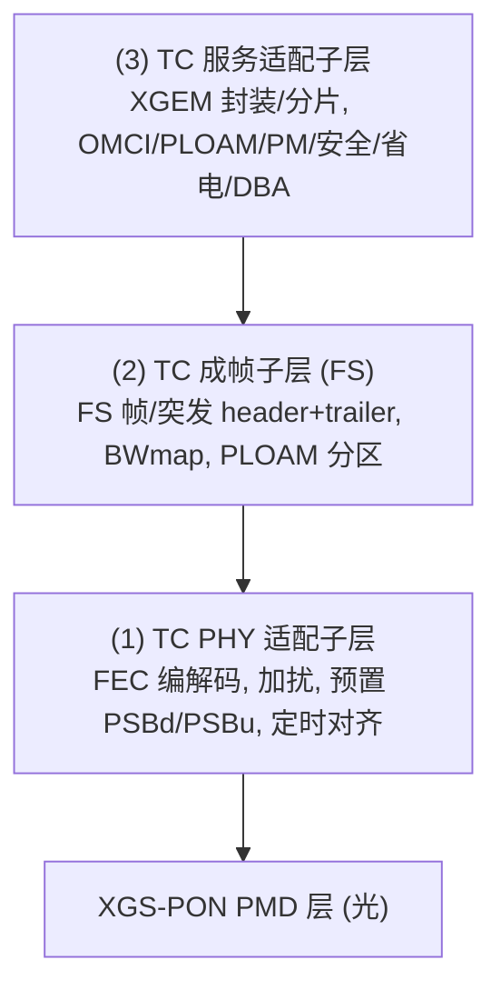
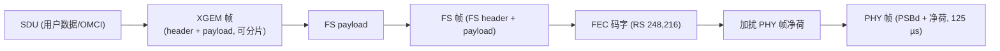
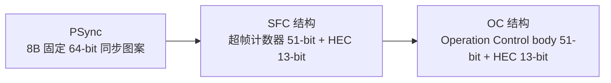

# XGS-PON 帧结构 (XGTC)

> XGS-PON 的 TC 层与 GPON 同源但更现代：三子层结构、24 字节 PSBd 物理同步块、FS（成帧子层）帧/突发、XGEM 封装、RS(248,216) FEC、AES-CTR 加密。下行 PHY 帧周期同为 **125 µs**。

## 1. XGS-PON TC 层结构（三子层）

XGS-PON TC 层由三个子层组成（G.9807.1 C.6.1.2）：



- **下行**：PMD 接口是**连续比特流**，按 125 µs 切分 PHY 帧。
- **上行**：PMD 接口是**精确定时的突发序列**。

下行 SDU 到 PHY 帧的映射链（G.9807.1 Figure C.6.1）：



## 2. PSBd：下行物理同步块（24 字节）

PSBd（Physical Synchronization Block downstream）固定 **24 字节**，含三个 8 字节结构（G.9807.1 C.10.1.1.1）：



| 结构 | 长度 | 内容 |
|------|------|------|
| PSync | 8 B | 固定 64-bit 图案，ONU 据此在下行 PHY 帧上实现对齐。XGS-PON 值 `0xC5E51840FD59BB49`；GPON 用 `0xB6AB31E0`。 |
| SFC 结构 | 8 B | Superframe Counter（51 bit）+ HEC（13 bit）。SFC 驱动加密计数器。 |
| OC 结构 | 8 B | Operation Control body（51 bit，含 PON-ID 类型、FEC/默认 burst profile 指示等）+ HEC（13 bit）。 |

> 上行对应 **PSBu**（Physical Sync Block upstream），含前导 + 定界，用于突发同步。

### 工程实现佐证

`gopon` 的 TC codec 实现了 24 字节 PSBd（PSync + SFC + PON-ID + Pre-OAM）加 BIP-8 尾：

```40:58:/home/mingheh/project/gopon/common/tc/psbd.go
const (
	// PsbdLen is the on-wire fixed length of the PSBd envelope
	// gopon writes (in bytes). Includes Pre-OAM tail.
	PsbdLen = 24

	// PSync is the fixed 64-bit XGS-PON sync pattern (G.987.3
	// §10.1.1). G-PON uses 0xB6AB31E0; we always write the XGS-PON
	// value because gopon doesn't yet emulate the legacy line rate.
	PSync uint64 = 0xC5E51840FD59BB49
	...
)
```

## 3. FS 帧 / FS 突发（成帧子层）

FS（Framing Sublayer）层定义下行 **FS 帧**和上行 **FS 突发**（G.9807.1 C.8）：

- **下行 FS 帧** = FS frame header + FS payload + FS frame trailer。
  - FS header 含 **HLend**（含 BWmap 长度）、**BWmap 分区**（8×N allocation structure）、**PLOAMd 分区**。
- **上行 FS 突发** = FS burst header（含 PLOAMu 等）+ FS payload + FS burst trailer。

### BWmap（XGS-PON，C.8.1.1.2）

BWmap 是一串 **8 字节 allocation structure**，数量由 HLend 的 BWmap 长度字段给出，实际长度 = 8 × N 字节。每个 allocation structure 把上行授权给一个 Alloc-ID：

| 字段 | 作用 |
|------|------|
| Alloc-ID | 被授权的 T-CONT |
| Flags | 含 PLOAMu / DBRu 等指示位 |
| StartTime / GrantSize | 上行突发起始与大小 |

同一 ONU 连续上行的一组 allocation structure 构成 **burst allocation series**。生成逻辑见 [DBA 算法 ⭐](../../03-dba/dba-algorithms.md)。

## 4. XGEM 封装

XGEM（10G GEM）封装与 GPON GEM 类似，承载用户 SDU / OMCI，支持分片。XGEM 头含 Port-ID、PLI、Key Index（加密密钥选择）、Options、HEC、Last-Fragment 标志等。OMCI 经专用 OMCC XGEM Port 承载。

## 5. FEC：RS(248,216)

XGS-PON（9.95328 Gbit/s）上下行均用 **RS(248, 216)** 前向纠错（G.9807.1 C.10.1.3）：

| 维度 | 下行 | 上行 |
|------|------|------|
| 码字 | 248 字节（216 数据 + 32 校验） | 同 |
| 每 PHY 帧码字数 | 627 个 | — |
| PSBd/PSBu | **不计入** FEC 码字 | 不计入 |
| 处理顺序 | FEC 编码 **先于** 加扰 | 同；ONU 同一突发内所有 allocation 的 FEC 状态一致 |

- 下行：第 1 个码字从 PHY 帧第 25 字节（FS header 首字节）开始，之后每 248 字节一个码字。
- 上行：每个 PHY burst 的第 1 个码字从 FS 突发头开始；连续 allocation 编为一整块，至多一个「缩短码字」在突发末尾。

**FEC 开销** ≈ (248−216)/216 ≈ **14.8%**。这正是 DBA 必须从 PON 上行字节预算里预留的部分（见 [DBA 算法 ⭐](../../03-dba/dba-algorithms.md) 第 5 节、swbwm 的 `RS(248,216)` 处理）。

## 6. 加密：AES-CTR

XGS-PON 用 **AES-128 计数器模式（CTR）** 加密 XGEM 净荷。每个 XGEM 帧的 128-bit 初始计数器块由 **SFC（取 50 bit，省略 MSB）+ IFC（Intra-Frame Counter）** 决定（G.9807.1 C.15.4.3）：

- 下行：SFC 取自该下行 XGEM 帧所在 PHY 帧的 PSBd。
- 上行：SFC 取自指定该上行 PHY burst 的 PHY 帧的 PSBd。
- 密钥经 PLOAM 的 Key_Control / Key_Report 协商（见 [PLOAM 消息](../gpon-g984/ploam-messages.md)）。

## 7. GPON vs XGS-PON 帧层差异速记

| 维度 | GPON (GTC) | XGS-PON (XGTC) |
|------|------------|----------------|
| 同步块 | Psync 4B（PCBd 内） | PSBd 24B（PSync 8B + SFC 8B + OC 8B） |
| PSync 值 | `0xB6AB31E0` | `0xC5E51840FD59BB49` |
| 成帧 | PCBd + 净荷 | FS 帧/突发（header+payload+trailer） |
| FEC | RS(255,239) | RS(248,216)（627 码字/帧） |
| 加密 | AES-CTR（churning/AES） | AES-128-CTR（SFC+IFC 计数器块） |
| PLOAM | 13 B | 48 B（带 MIC） |

## 来源

- **公有标准**：ITU-T G.9807.1 (2023)：
  - C.6.1.2（TC 层三子层结构、下行连续流/上行突发、125 µs）、Figure C.6.1（下行 SDU→XGEM→FS→FEC→PSBd→PHY 帧映射）、Figure C.6.3（TC 信息流）。
  - C.8 / C.8.1.1.2（FS 成帧子层概述、BWmap 分区：8 字节 allocation structure、burst allocation series）。
  - C.10.1.1.1（PSBd 24 字节 = PSync + SFC + OC；SFC/OC 各 51-bit body + 13-bit HEC；PSync 64-bit）。
  - C.10.1.3.1 / C.10.1.3.2（下行/上行 FEC RS(248,216)，627 码字/PHY 帧，216+32，PSBd 不计入，FEC 先于加扰）。
  - C.15.4.3（AES-CTR 初始计数器块由 SFC(50bit)+IFC 构造）。
- **工程实现**：`gopon/common/tc/psbd.go`（24 字节 PSBd、PSync 值、BIP-8）。
