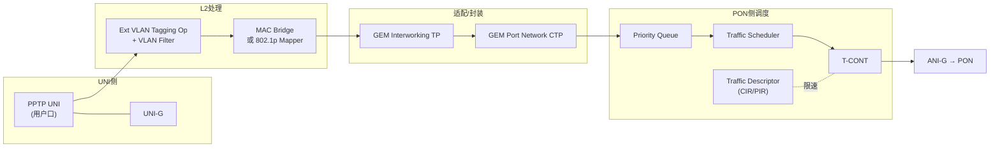

# 数据通道全景：L2 OMCI 配置模型（串讲）⭐

> 把前面散落在各章的 ME 串成**一条完整的数据通道**：用户帧从 UNI 进、经分类/打标/桥接/映射、封进 GEM、绑到 T-CONT、由 DBA 调度上 PON——以及下行的镜像路径。这是理解「OMCI 到底在配什么」的**总览图**，G.988 称之为 **L2-OCM（Layer 2 OMCI Configuration Model）**。依据 G.988 Annex II（L2-OCM）与 Annex C.4（G-PON L2 flows）。

> 本篇是 [HSI ⭐](provisioning-hsi.md) / [VLAN/QoS](vlan-qos-modeling.md) / [IPTV](provisioning-iptv.md) / [DBA](../03-dba/dba-algorithms.md) 的「拼图合成」。

## 1. 一张图看懂上下行

- **上行**：`PPTP UNI → VLAN 分类打标 → 桥接/映射 → GEM IW TP（把 L2 流映射到 GEM 端口）→ GEM Port Network CTP → Priority Queue → (Traffic Scheduler) → T-CONT → ANI → PON`；DBA 据 Traffic Descriptor 调度。
- **下行**：镜像逆向——`ANI → GEM CTP → GEM IW TP（从 GEM 端口提取 L2 流）→ 桥接 → VLAN 逆操作 → PPTP UNI`；下行有独立的 Priority Queue。

> 出处：G.988 Figure C.4.1-1「Layer 2 flows in G-PON ONU」——上行把 L2 流**映射到** GEM 端口，下行从 GEM 端口**提取** L2 流。

## 2. 两种 L2 模型

G.988 的 L2-OCM 有两种组织 UNI↔GEM 关系的方式：

| 模型 | 核心 ME | 适用 |
|------|---------|------|
| **MAC Bridge 模型** | MAC Bridge Service Profile + MAC Bridge Port Config Data | 多口桥接、需要 802.1 学习/转发 |
| **802.1p Mapper 模型** | 802.1p Mapper Service Profile | 按优先级把一个 UNI 的流分到多个 GEM（N:1 / 优先级分流） |

- **MAC Bridge**：把 UNI、GEM IW TP 都作为 **bridge port** 挂在桥上，按 MAC/VLAN 转发。
- **802.1p Mapper**：把 8 个 802.1p 优先级各映射到一个 GEM IW TP（见 [VLAN/QoS](vlan-qos-modeling.md)），无需完整桥。

## 3. 关键 ME 的角色速记

| ME | 在通道里的角色 |
|----|----------------|
| **PPTP UNI / UNI-G** | 物理用户口 + 通用 UNI 容器 |
| **Ext VLAN Tagging Op** | 分类、打标/翻译/剥标签、定 802.1p（可由 DSCP 推导） |
| **VLAN Tagging Filter Data** | 按 VLAN 放行/丢弃 |
| **MAC Bridge Port Config Data** | 把某 TP 接入桥 |
| **802.1p Mapper Service Profile** | 优先级 → GEM IW TP 分流 |
| **GEM Interworking TP** | L2 流 ↔ GEM 端口的「适配/互通」 |
| **GEM Port Network CTP** | GEM 端口本身（Port-ID、方向、关联 T-CONT/PQ） |
| **Priority Queue** | 上/下行队列（队列深度、权重、关联调度器/T-CONT） |
| **Traffic Scheduler** | 队列间调度（SP/WRR），上接 T-CONT |
| **T-CONT** | 上行带宽容器，绑 Alloc-ID（见 [T-CONT](../03-dba/tcont-types.md)） |
| **Traffic Descriptor** | CIR/PIR/CBS/PBS 限速参数 |
| **ANI-G** | PON 侧接口 |

## 4. 上行 QoS 全链（端到端）

- **三段对齐**：L2 优先级（802.1p）→ 队列（Priority Queue）→ 调度等级（T-CONT 类型）必须一致规划，QoS 才端到端不掉级（见 [DBA 参考模型](../03-dba/reference-model.md)）。

## 5. 业务复用同一套骨架

不同业务只是这套骨架上「换 UNI / 换 VLAN / 换 T-CONT 等级」：

| 业务 | UNI | 特点 |
|------|-----|------|
| [HSI 上网](provisioning-hsi.md) | Eth UNI | Best-Effort/Assured T-CONT |
| [VoIP](provisioning-voip.md) | POTS（经 IP Host/SIP） | 小带宽、Assured/HRT、低时延 |
| [IPTV](provisioning-iptv.md) | Eth UNI + 组播 | Multicast GEM IW TP + ACL |
| [TDM 伪线](tdm-pseudowire.md) | E1/T1 CES | Fixed/HRT、严抖动 |

> 记住这张骨架图，再看任何业务的 provisioning，都是「在主干上接不同的叶子」。

## 6. EPON 下的解释（Annex C.4）

EPON 没有 GEM/T-CONT 概念，但 G.988 用「解释映射」复用同一模型（见 [EPON](../01-protocol-stack/epon-10gepon/overview.md)）：
- **GEM port** 被解释为「一个 L2 流（VLAN/CoS）」；
- **T-CONT** 概念由 EPON 的 LLID/调度吸收；
- **UNI 侧 ME 原样可用**——所以同一套 OMCI 数据面模型能跨 ITU/IEEE。

## 7. 工程要点

- **先画通道再配**：配置前先在纸上画出这条链（哪个 UNI→哪个 GEM→哪个 T-CONT），再逐 ME 下发，能避免大多数「不通」。
- **指针一致性**：相邻 ME 靠指针串联，任一指针错位即断链；排障从 UNI 往 ANI 顺着指针查。
- **上下行对称**：下行是上行的逆操作（VLAN 逆、GEM 提取），配置时成对考虑。

## 来源

- **公有标准**：
  - ITU-T G.988 (2024) Annex II（L2-OCM：Figure II.2-1 Dual-managed ONU 数据面模型、II.1.3.x 多 UNI/组播模型，含 PPTP/UNI-G、MAC Bridge、802.1p Mapper、GEM IW TP、GEM Port Network CTP、Priority Queue、Traffic Scheduler、T-CONT、Traffic Descriptor、Multicast Operations Profile/Subscriber Config Info 的连接关系）。
  - Annex C.4（Figure C.4.1-1 Layer 2 flows in G-PON ONU：上行映射 L2 流到 GEM 端口、下行从 GEM 端口提取；Table C.4-1 EPON 侧 ANI ME 的解释映射）。
  - ME 标识：Priority queue(277)、Traffic scheduler(278)、Traffic descriptor(280)、Multicast GEM IW TP(281) 等（§11.2.4-1）。
- **工程实现**：`gopon/common/datapath/`（BinaryCodec、流映射）、`liteaggregator` 的数据面建模。
- 说明：通道串讲为基于 L2-OCM 的归纳整合；逐 ME 属性见各自 [ME 速查表](me-reference.md) 与 G.988 原文。
