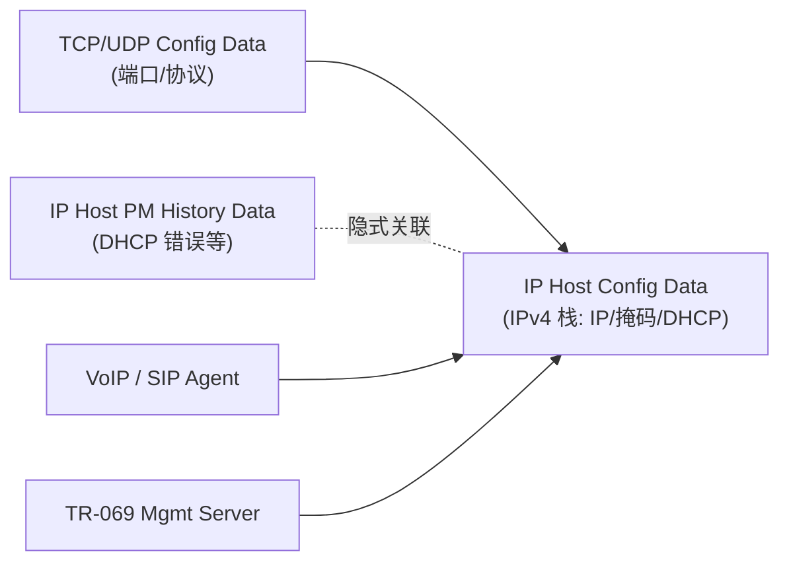
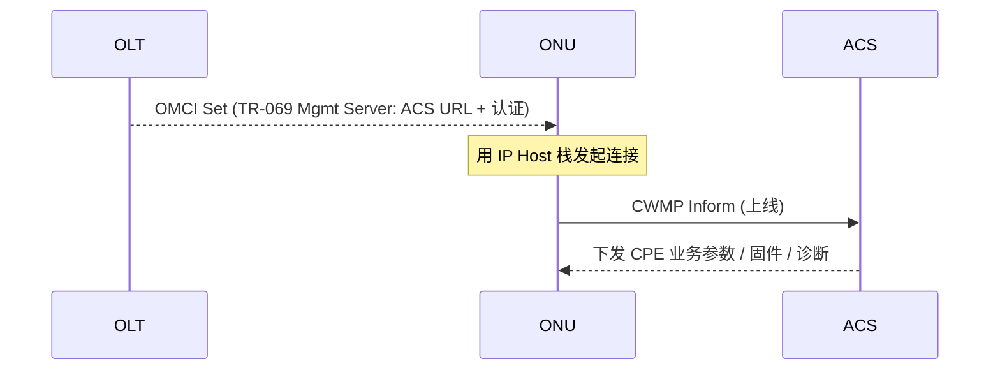

# IP Host 与 TR-069 远程管理（OMCI）

> ONU 自身的「IP 协议栈」与「被 ACS 远程管理」如何用 OMCI 建模。**IP Host Config Data** 给 ONU 一个可寻址的 IP 栈（VoIP/TR-069/IP 业务用），**BBF TR-069 Management Server** 让 OLT 经 OMCI 配置 ACS 连接。两者构成 ONU「管理面双栈」：底层 OMCI（PON 内）+ 上层 TR-069（业务/CPE 远管）。依据 G.988 §9.4 / §9.12.16。

> VoIP 中 IP Host 的用法见 [VoIP 配置](provisioning-voip.md)；本篇聚焦 IP 栈与远管建模本身。

## 1. 两种管理面的分工

```mermaid
flowchart LR
    OLT -->|OMCI (PON 内, G.988)| ONU
    ACS["ACS (TR-069 自动配置服务器)"] -->|CWMP/TR-069 (经 IP 栈)| ONU
    ONU -. OMCI 配置 ACS URL .- ACS
```

| 管理面 | 协议 | 范围 | 谁管 |
|--------|------|------|------|
| **OMCI** | G.988 | PON 段内（OLT↔ONU） | 运营商 OLT |
| **TR-069 (CWMP)** | BBF TR-069 | 端到端（ACS↔CPE） | ACS（常含家庭网关/CPE 业务参数） |

> 典型分工：**OMCI 管 PON 接入与业务通道**，**TR-069 管 CPE 业务参数与固件/诊断**。OMCI 可「引导」TR-069——下发 ACS URL。

## 2. IP Host Config Data ME（§9.4.1）

给 ONU 一个独立 IPv4 协议栈，供 VoIP、TR-069、ONU 自身 IP 业务使用。

| 要点 | 说明 |
|------|------|
| 创建 | ONU **自动创建**（有 IP host 服务时），有几个独立 IPv4 栈就创建几个实例 |
| 关联 | 与 ONU ME 关联；多个 **TCP/UDP Config Data** ME 可指向它（建模端口/协议） |
| 静态 IP | OLT 设置 IP 地址/掩码/网关等参数 |
| 动态 IP | 也可经 **DHCP** 动态获取 |
| 只读现态 | 一组只读「当前 IP 参数」属性，显示实际生效值 |
| IP options | 控制 IP 栈行为（如是否启用 DHCP/ping/traceroute 响应等） |
| PM | 经隐式关联的 **IP Host PM History Data**（含 DHCP 访问错误，§9.4.6）监控 |

- **IPv6**：对应 **IPv6 Host Config Data** ME（§9.4.x）。
- **TCP/UDP Config Data**（§9.4.3）：建模 ONU 上的端口/协议（如 SIP 信令端口），指针指向 IP Host Config Data。



## 3. BBF TR-069 Management Server ME（§9.12.16）

让 OLT 经 OMCI 配置 ONU 发起 ACS 连接所需的信息：

| 属性 | 含义 |
|------|------|
| **ACS URL** | 自动配置服务器地址（ONU 主动连它） |
| 认证信息 | 连接 ACS 的用户名/口令等 |
| 关联 | 每个 **TR-069 management domain** 对应一个该 ME 实例；ONU 支持 OMCI 配 ACS 时**自动创建** |

注意（标准明确）：
- TR-069 **本身也有别的 ACS 发现方式**（如 DHCP option 43），所以**并非所有** TR-069 兼容 ONU 都支持此 ME；
- 即使支持，**运营商也可选择不用**（用其它方式下发 ACS）。



## 4. 管理模型选择（OMCI vs TR-069 vs 混合）

| 模型 | 谁管 VoIP/CPE 参数 | 适用 |
|------|-------------------|------|
| **纯 OMCI** | OLT 经 OMCI 全配（如 VoIP SIP Agent ME） | 运营商深度集成 ONT |
| **纯 TR-069** | ACS 配，OMCI 仅开通道 | CPE 业务参数复杂、复用既有 ACS |
| **混合** | OMCI 配 PON+引导 ACS URL，TR-069 配业务 | 最常见 |

> 与 [VoIP 配置](provisioning-voip.md) 的「OMCI 管理 vs 非 OMCI 管理」呼应：VoIP 既可由 OMCI 的 SIP/VoIP ME 全配，也可仅由 OMCI 给个 IP 栈、其余交给 TR-069。

## 5. 工程要点

- **IP 栈数量**：管理用 IP（带内/带外）、VoIP 用 IP、可能分多个 IP Host 实例；规划好 VLAN/路由。
- **ACS 发现优先级**：OMCI 下发的 ACS URL 与 DHCP option 43 等可能并存，注意优先级避免冲突。
- **诊断**：IP Host PM 的 DHCP 错误计数是定位「ONU 拿不到地址」的关键。

## 来源

- **公有标准**：
  - ITU-T G.988 (2024) §9.4.1（IP Host Config Data：ONU 自动创建、每独立 IPv4 栈一个实例、静态/DHCP、只读现态、IP options、TCP/UDP Config Data 指向）、§9.4.3（TCP/UDP Config Data）、§9.4.6（IP Host PM History Data part 2：DHCP 访问错误）、IPv6 Host Config Data。
  - §9.12.16（BBF TR-069 Management Server：OMCI 配 ACS URL + 认证；每 TR-069 management domain 一个实例；ONU 支持时自动创建；TR-069 另有 ACS 发现方式，ME 非必备）。
  - §I.1.4.2（VoIP common provisioning：IP Host Config Data 每 IP 栈一个、单 IP、静态或 DHCP）。
  - BBF TR-069（CWMP，ACS↔CPE 远程管理）。
- 说明：管理模型对比与时序为归纳；逐属性以 G.988 §9.4/§9.12.16 原文为准。
