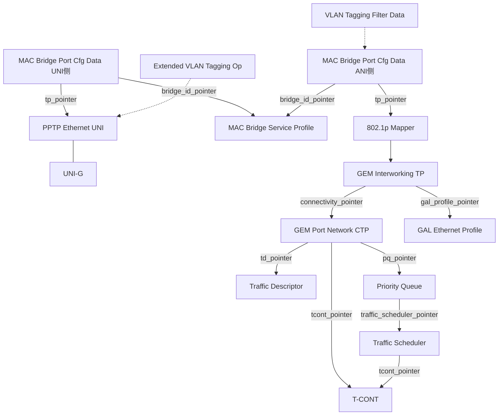

# OMCI ME 速查表（属性级）

> 常见 Managed Entity 的属性级速查：属性序号（index，决定 attribute mask 位）、类型、读写权限、是否 SetByCreate。属性表与 `gopon/common/omci/me_g988.go` 的实际注册一致，可作为对照。完整定义以 ITU-T G.988 第 9 章为准。

> 属性 index 决定 attribute mask：bit (16 − index) 置位表示选中该属性（见 [OMCI 规范总览](omci-spec.md) 第 4 节）。访问权限缩写：R=读，W=写，C=SetByCreate（创建时可设）。

## 1. 设备 / 接口级（ONU 自建，AutoCreate）

### ONT-G（设备级，G.988 §9.1.1）

| # | 属性 | 类型 | 访问 |
|---|------|------|------|
| 1 | vendor_id | string(4) | R |
| 2 | version | string(14) | R |
| 3 | serial_number | bytes(8) | R |
| 4 | traffic_management_option | uint8 | R |
| 7 | administrative_state | uint8 | R/W |
| 8 | operational_state | uint8 | R |
| 9 | onu_survival_time | uint8 | R |

### ONT-2G（能力上报，G.988 §9.1.2）

| # | 属性 | 类型 | 访问 |
|---|------|------|------|
| 1 | equipment_id | string(20) | R |
| 2 | omcc_version | uint8 | R |
| 6 | total_priority_queue_number | uint16 | R |
| 7 | total_traffic_scheduler_number | uint8 | R |
| 9 | total_gem_port_number | uint16 | R |
| 10 | sys_up_time | uint32 | R |

### ANI-G（PON 侧接口，G.988 §9.2.1）

| # | 属性 | 类型 | 访问 | 说明 |
|---|------|------|------|------|
| 1 | sr_indication | uint8 | R | 是否支持 SR-DBA |
| 2 | total_tcont_number | uint16 | R | 可用 T-CONT 数 |
| 3 | gem_block_length | uint16 | R/W | |
| 4 | piggyback_dba_reporting | uint8 | R | |
| 6/7 | sf_threshold / sd_threshold | uint8 | R/W | 信号失败/劣化门限 |
| 10 | optical_signal_level | uint16 | R | 收光功率 |

### PPTP Ethernet UNI（用户物理口，G.988 §9.5.2）

| # | 属性 | 类型 | 访问 |
|---|------|------|------|
| 1 | expected_type | uint8 | R/W |
| 2 | sensed_type | uint8 | R |
| 5 | administrative_state | uint8 | R/W |
| 6 | operational_state | uint8 | R |
| 8 | max_frame_size | uint16 | R/W |
| 12/13 | arc / arc_interval | uint8 | R/W |

> 业务配好后须 `Set administrative_state = 0 (unlock)` 才放通。

### Software Image（G.988 §9.1.4，最多 2 实例）

| # | 属性 | 类型 | 访问 |
|---|------|------|------|
| 1 | version | string(14) | R |
| 2 | is_committed | uint8 | R |
| 3 | is_active | uint8 | R |
| 4 | is_valid | uint8 | R |

## 2. 上行带宽链路（OLT Create/Set）

### T-CONT（G.988 §9.2.2，Class 262）

| # | 属性 | 类型 | 访问 | 说明 |
|---|------|------|------|------|
| 1 | alloc_id | uint16 | R/W | 绑定 OLT 分配的 Alloc-ID |
| 3 | policy | uint8 | R/W | 调度策略（null/SP/WRR） |

### Traffic Descriptor（G.988 §9.11.2，Class 280）

| # | 属性 | 类型 | 访问 | 说明 |
|---|------|------|------|------|
| 1 | cir | uint32 | R/W/C | 承诺信息速率 |
| 2 | pir | uint32 | R/W/C | 峰值信息速率 |
| 3 | cbs | uint32 | R/W/C | 承诺突发尺寸 |
| 4 | pbs | uint32 | R/W/C | 峰值突发尺寸 |
| 5 | color_mode | uint8 | R/W/C | 颜色模式 |
| 6/7 | ingress/egress_color_marking | uint8 | R/W/C | 颜色标记 |
| 8 | meter_type | uint8 | R/W/C | 计量类型 |

### Traffic Scheduler（G.988 §9.11.3）

| # | 属性 | 类型 | 访问 |
|---|------|------|------|
| 1 | tcont_pointer | pointer | R |
| 2 | traffic_scheduler_pointer | pointer | R/W |
| 3 | policy | uint8 | R/W |
| 4 | priority_weight | uint8 | R/W |

### Priority Queue（G.988 §9.11.4）

| # | 属性 | 类型 | 访问 |
|---|------|------|------|
| 1 | queue_configuration_option | uint8 | R |
| 2 | maximum_queue_size | uint16 | R |
| 3 | allocated_queue_size | uint16 | R/W |
| 6 | related_port | uint32 | R |
| 7 | traffic_scheduler_pointer | pointer | R/W |
| 8 | weight | uint8 | R/W |

## 3. GEM / 业务适配（OLT Create）

### GEM Port Network CTP（G.988 §9.2.3，Class 268）

| # | 属性 | 类型 | 访问 | 说明 |
|---|------|------|------|------|
| 1 | port_id_value | uint16 | R/W/C | (X)GEM Port-ID |
| 2 | tcont_pointer | pointer | R/W/C | → T-CONT |
| 3 | direction | uint8 | R/W/C | 上/下/双向 |
| 4 | traffic_management_pointer_upstream | pointer | R/W/C | → 上行 TD / PQ |
| 5 | traffic_descriptor_profile_pointer_downstream | pointer | R/W/C | → 下行 TD |
| 7 | priority_queue_pointer_downstream | pointer | R/W/C | → 下行 PQ |
| 9 | traffic_descriptor_profile_pointer_upstream | pointer | R/W/C | → 上行 TD |

### GEM Interworking TP（G.988 §9.2.7）

| # | 属性 | 类型 | 访问 | 说明 |
|---|------|------|------|------|
| 1 | gem_port_network_ctp_connectivity_pointer | pointer | R/W/C | → GEM CTP |
| 2 | interworking_option | uint8 | R/W/C | 互通类型（如 802.1p mapper） |
| 3 | service_profile_pointer | pointer | R/W/C | → Mapper / MAC Bridge |
| 7 | gal_profile_pointer | pointer | R/W/C | → GAL Ethernet Profile |

### GAL Ethernet Profile（G.988 §9.5.1）

| # | 属性 | 类型 | 访问 |
|---|------|------|------|
| 1 | max_gem_payload_size | uint16 | R/W/C |

## 4. 二层桥接 / VLAN（OLT Create）

### MAC Bridge Service Profile（G.988 §9.3.1）

| # | 属性 | 类型 | 访问 |
|---|------|------|------|
| 1 | spanning_tree_ind | uint8 | R/W/C |
| 2 | learning_ind | uint8 | R/W/C |
| 4 | priority | uint16 | R/W/C |
| 8 | unknown_mac_address_discard | uint8 | R/W/C |
| 9 | mac_learning_depth | uint8 | R/W/C |

### MAC Bridge Port Configuration Data（G.988 §9.3.4）

| # | 属性 | 类型 | 访问 | 说明 |
|---|------|------|------|------|
| 1 | bridge_id_pointer | pointer | R/W/C | → MAC Bridge Service Profile |
| 2 | port_num | uint8 | R/W/C | 桥端口号 |
| 3 | tp_type | uint8 | R/W/C | 端点类型（UNI / GEM IW / Mapper…） |
| 4 | tp_pointer | pointer | R/W/C | → PPTP UNI / GEM IW TP / Mapper |
| 5 | port_priority | uint16 | R/W/C | |

> `tp_type` + `tp_pointer` 决定该桥端口连到「用户口」还是「上行 GEM 通道」—— 这是把 UNI 与 ANI 两侧接进同一 MAC Bridge 的关键。

### VLAN Tagging Filter Data（G.988 §9.3.11）

| # | 属性 | 类型 | 访问 |
|---|------|------|------|
| 1 | vlan_filter_list | bytes(24) | R/W/C |
| 2 | forward_operation | uint8 | R/W/C |
| 3 | number_of_entries | uint8 | R/W/C |

### Extended VLAN Tagging Operation Cfg（G.988 §9.3.13）

| # | 属性 | 类型 | 访问 | 说明 |
|---|------|------|------|------|
| 1 | association_type | uint8 | R/W/C | 关联对象类型 |
| 3/4 | input_tpid / output_tpid | uint16 | R/W | TPID |
| 5 | downstream_mode | uint8 | R/W | 下行处理模式 |
| 6 | received_frame_vlan_tagging_operation_table | table | R/W | VLAN 操作规则表 |
| 7 | associated_me_pointer | pointer | R/W/C | → UNI / Mapper |

> Extended VLAN 的「操作表」是表属性（table attribute），用 Get Next / Set Table 读写，承载复杂的打标/剥标/转换规则。

## 5. ME 关系全景（业务链路）

## 来源

- **公有标准**：ITU-T G.988 (2024) 第 9 章各 ME 定义（§9.1 ONT-G/ONT-2G/Software Image、§9.2 ANI-G/T-CONT/GEM Port Network CTP/GEM Interworking TP、§9.3 MAC Bridge/VLAN、§9.5 PPTP Ethernet UNI/GAL、§9.11 Traffic Descriptor/Scheduler/Priority Queue）。
- **工程实现**：`gopon/common/omci/me_g988.go`（各 ME 属性 index / 类型 / 读写 / SetByCreate 的实际注册）、`me_spec.go`（属性掩码）。
