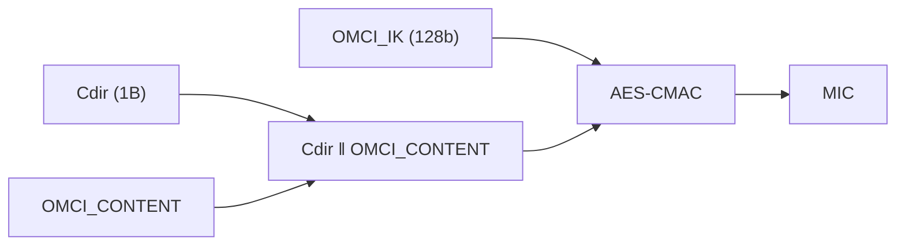

# OMCI 消息逐字节示例（Baseline / Extended / MIC）

> [消息格式](message-formats.md) 讲了字段定义，本篇用**实际字节**走一遍：Message Type 位编码、Baseline vs Extended 头、以及一个**下行 OMCI MIC（AES-CMAC）计算实例**。依据 G.988 §11.2、§A.2.x、附录 C.IV.11。

## 1. 两种格式头对照（G.988 §11.2）

| 字段 | 字节 | Baseline | Extended |
|------|------|----------|----------|
| Transaction Correlation Id (TCI) | 1–2 | 同 | 同 |
| Message Type (MT) | 3 | 同 | 同 |
| **Device Identifier** | 4 | **0x0A** | **0x0B** |
| Managed Entity Id（class+instance） | 5–8 | 4B | 4B |
| **Message contents length** | 9–10 | — | **2B（扩展独有）** |
| Message contents | — | 固定 32B（9–40） | 可变 |
| Trailer / MIC | — | OMCI trailer 41–48 | MIC |
| 总长 | | **固定 48B** | **可变，最大 1980B** |

> Baseline 固定 48B（不足补 0）；Extended 用「内容长度」字段支持可变长，最大 1980B（大表/批量更高效）。

## 2. Message Type（第 3 字节）位编码

```
bit:  8    7    6    5   | 4 3 2 1
      DB   AR   AK   --- | action (5位)
```

| 位 | 含义 |
|----|------|
| **DB** (bit8) | Destination/“DB”位（一般 0） |
| **AR** (bit7) | Acknowledge Request（请求需回复） |
| **AK** (bit6) | Acknowledgement（这是一条回复） |
| bits 5–1 | **action**（操作码：Get=9、Set=8、Create=4、Delete=6、Get next=10/0x0A …） |

示例：
- **Get 请求**：`AR=1, AK=0`, action=Get(9) → `0x49`（在 C.IV.11 实例中出现）。
- **Get response**：`AR=0, AK=1`, action=Get → `0x29`。
- **Get next 请求**：`AR=1, AK=0`, action=get next → `0x4A`。

## 3. Baseline Get 实例（来自 C.IV.11）

一条**下行 Get（ONU-G）**消息的内容：

| 字段 | 值 |
|------|-----|
| Transaction Correlation Id | `0x80 0x00` |
| Message Type | `0x49`（GET，AR=1） |
| Device Identifier | `0x0A`（Baseline OMCI） |
| Managed Entity Id | `0x01 0x00 0x00 0x00`（class=0x0100=ONU-G, instance=0x0000） |
| Message contents | `0x00 …`（Get 的属性掩码等，共 32B） |
| OMCI trailer[1:4] | `0x00 0x00 0x00 0x28` |

## 4. 下行 OMCI MIC（AES-CMAC）计算实例（C.IV.11）

XGS-PON 的 OMCI 完整性用 **AES-CMAC**（区别于 GPON 的 CRC-32 trailer）：

```
方向标识  Cdir = 0x01 (downstream)        // 上行为 0x02
OMCI_IK   = 0x184b8ad4 d1ac4af4 dd4b339e cc0d3370
MIC = AES-CMAC( OMCI_IK , (Cdir ‖ OMCI_CONTENT) )   // 取前若干字节
```



- **Cdir** 防方向反射攻击（上/下行用不同前缀）；
- **OMCI_IK** 由密钥层级派生（见 [密钥管理](../04-security/key-management-encryption.md)）；
- 收端用相同输入重算 MIC 比对，不符则丢弃并计 MIC error（见 [排障](../05-operations/troubleshooting.md) §4）。

> GPON（Baseline）历史上用 **CRC-32 trailer** 做差错检测；XG(S)-PON 升级为 **AES-CMAC MIC** 做密码学完整性——这是「检错」到「防篡改」的跃迁。

## 5. 读包小抄

1. 看第 4 字节定**格式**：`0x0A`=Baseline(48B 定长)，`0x0B`=Extended(看 9–10 长度)；
2. 看第 3 字节定**操作**：高 3 位 AR/AK 判请求/响应，低 5 位查 action；
3. 看 5–8 字节定**对象**：前 2B class（查 [ME 参考](me-reference.md)）、后 2B instance；
4. Baseline 末 8B 是 trailer（含 MIC/CRC）；Extended 末尾是 MIC。

## 来源

- **公有标准**：
  - ITU-T G.988 (2024) §11.2（Table 11.2-1 Baseline 固定 48B、Table 11.2-2 Extended 可变最大 1980B；Device identifier Baseline=0x0A/Extended=0x0B；Extended 含 Message contents length 2B）。
  - §A.2.6/A.2.7/A.2.38 等（Set response、Get、Get next response 的 Message Type 位：DB/AR/AK + action）。
  - 附录 **C.IV.11**（下行 OMCI MIC 实例：Cdir=0x01、TCI=0x8000、MT=0x49 GET、DevID=0x0A、ME ID=0x01000000 ONU-G、OMCI trailer[1:4]=0x00000028、OMCI_IK 给定、`MIC=AES-CMAC(OMCI_IK,(Cdir‖OMCI_CONTENT))`）。
- 说明：action 码取值与「读包小抄」为基于 §11.2.2 的归纳；逐字节实例引自 C.IV.11 原文。
