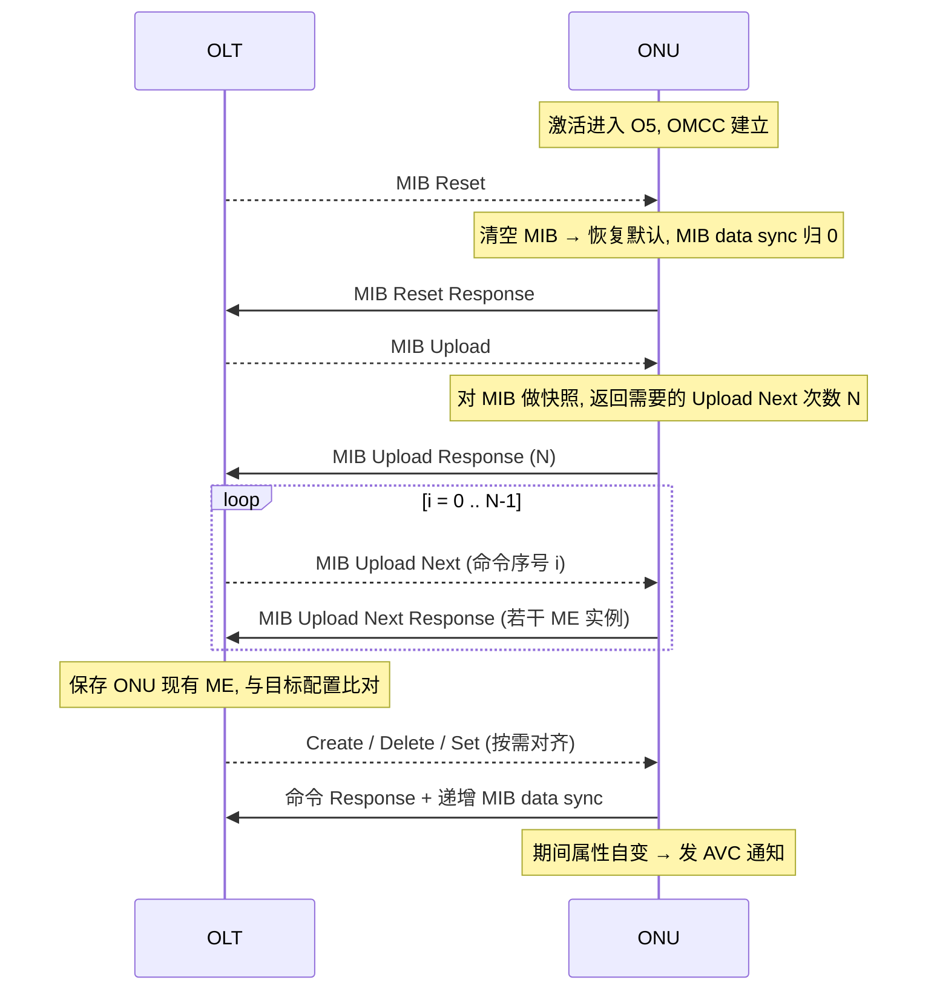
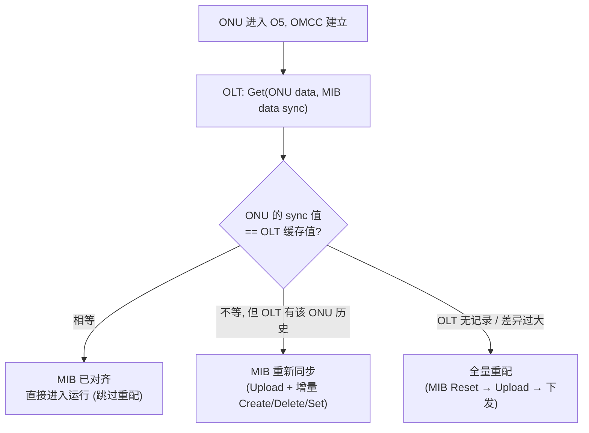
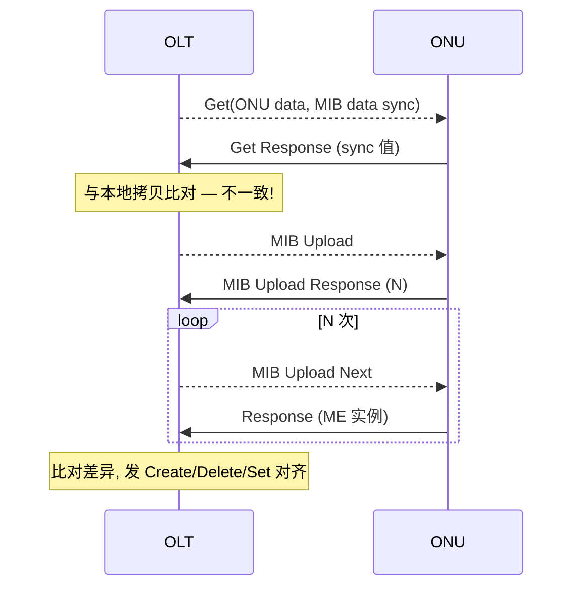

# MIB Upload 与 MIB 同步

> OMCI 的「数据库一致性」机制：OLT 与 ONU 各自维护一份 MIB（Management Information Base，即全部 ME 实例的集合）。**MIB data sync** 计数器用于检测两侧是否一致；不一致时通过 **MIB Upload / MIB Upload Next** 把 ONU 的 MIB 拉取到 OLT 对齐。依据 G.988 §I.1.3 / §I.1.4。

> 消息格式、MIC、操作类型见 [OMCI 规范总览](omci-spec.md)；本篇专注「上线对齐」流程。

## 1. ONU data ME 与 MIB data sync（G.988 §9.1.3）

- **ONU data ME**（Class 2）建模 MIB 本身，ONU **自动创建**，全网仅一个实例（ME ID = 0）。
- 关键属性 **MIB data sync**：一个**序列号**，OLT 据此判断「自己缓存的该 ONU MIB」与「ONU 实际 MIB」是否一致。
  - 每次成功的 **Create / Delete / Set**（会改变 MIB 的操作）后，两侧各自**递增** MIB data sync。
  - 只要序列号一致 → 认为 MIB 对齐；不一致 → 需要重新同步。

| 操作类型 | 是否影响 MIB data sync |
|----------|----------------------|
| Create / Delete | 是 |
| Set | 是（改变属性时） |
| Get / Get Next | 否（只读） |
| MIB Reset | 归零 |

## 2. 新 ONU 上线（New ONU bring-up，§I.1.4.2）

ONU 进入 O5、OMCC 建立后，OLT 把 ONU MIB **从零重建**：

要点：
- **MIB Reset**：OLT 先把 ONU MIB 清回默认状态、MIB data sync 归 0，确保从已知起点开始。
- **MIB Upload**：ONU 对当前 MIB 做**一致性快照**，并回复需要多少条 **MIB Upload Next** 才能传完。
- **MIB Upload Next**：命令**序号从 0 开始**（G.988 §A.2.15：消息类型 DB=0, AR=1, AK=0），逐条回传 ME 实例（baseline 格式每条固定，extended 格式可一次多带）。
- **对齐**：OLT 比对 ONU 现状与目标配置，发 Create/Delete/Set 把 ONU 配成期望状态（即 [HSI](provisioning-hsi.md)/[VoIP](provisioning-voip.md)/[IPTV](provisioning-iptv.md) 等业务下发）。
- **AVC**：同步/下发过程中若 ONU 属性自主变化（如光功率、链路状态），ONU 随时发 **Attribute Value Change** 通知。

## 3. 已有 ONU 上线（Old ONU bring-up，§I.1.4.1）与三种场景

对**已配置过**的 ONU 重新上线（如重启、光路恢复），OLT 不必无脑全量重配，而是先**比对 MIB data sync**（§I.1.3.1）：

| 场景 | 条件 | OLT 动作 |
|------|------|----------|
| ① 一致 | sync 值相等 | 认为 MIB 对齐，直接运行，**省去重配开销** |
| ② 重新同步 | sync 不等，OLT 有该 ONU MIB 拷贝 | MIB Upload 拉取 → 仅发**差异**的 Create/Delete/Set |
| ③ 全量重配 | OLT 无该 ONU 记录 / 无法对齐 | 走「新 ONU 上线」全流程 |

> 这套机制让**海量 ONU 重启后快速恢复**：大多数情况命中场景 ①/②，避免每次都全量重下发配置。

## 4. MIB 重新同步（运行期，§I.1.3.2）

运行期 OLT 也会**周期性**校验一致性（防止丢消息/ONU 侧异常导致漂移）：

## 5. 工程要点

- **快照一致性**：MIB Upload 期间 ONU 应基于**快照**回传，避免边传边变导致不一致；期间的变化通过 AVC 反映。
- **Get Next 与 MIB Upload Next 区别**：前者用于**单个 ME 的大属性/表**分片读取；后者用于**整库**遍历上传。
- **baseline vs extended**：extended 消息可在一条 MIB Upload Next Response 里带多个 ME，**显著减少**上传往返次数（大 MIB 的 ONU 上线更快）。
- 互通测试常单列 "OMCI channel establishment / MIB upload" 用例（见 [互通测试要点](../06-interop/test-plan-overview.md)）。

## 来源

- **公有标准**：
  - ITU-T G.988 (2024) §9.1.3（ONU data ME：建模 MIB、唯一实例 ID=0、MIB data sync 序列号语义）。
  - §I.1.3（MIB 同步原理）、§I.1.3.1（上线时比对 MIB data sync 的三种场景）、§I.1.3.2（Figure I.1.3.2-1 运行期 MIB resynchronization 流程）。
  - §I.1.4.1（Old ONU bring-up）、§I.1.4.2（Figure I.1.4.2-1 New ONU bring-up：MIB Reset→Upload→Create/Delete/Set→递增 MIB data sync）。
  - §11.2.2（消息类型表：Create/Delete/Set 影响 MIB data sync）、§A.2.15（MIB Upload Next：命令序号从 0 起，DB=0/AR=1/AK=0）。
- 说明：三场景判定与流程图为基于上述条款的归纳；逐字段编码以 G.988 附录 A/B 为准。
