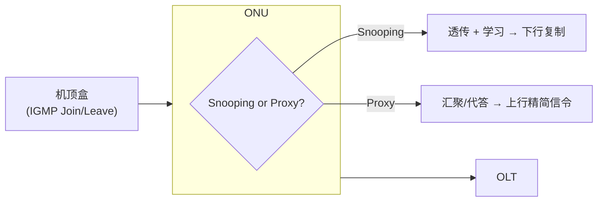
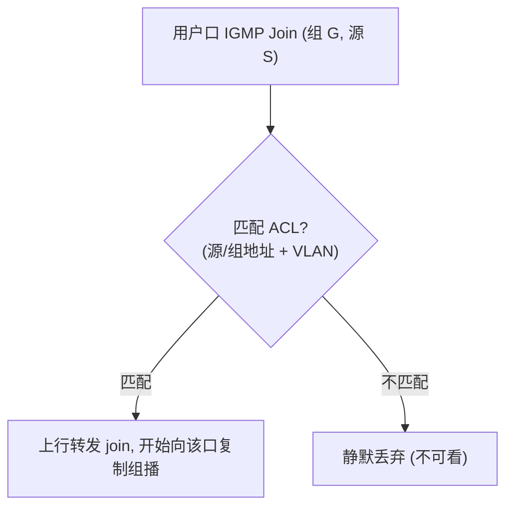
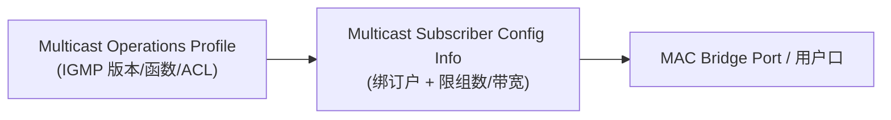

# 组播控制：IGMP / MLD（OMCI）

> IPTV 等组播业务的「控制面」：ONU 如何处理用户侧的 **IGMP（IPv4）/ MLD（IPv6）** 加入/离开、做 **snooping 或 proxy**、按 **ACL（访问控制表）** 限制可看频道。本篇深入 [IPTV 配置](provisioning-iptv.md) 的组播控制细节。依据 G.988 §9.3.27（Multicast Operations Profile）+ BBF TR-156 / TP-255。

> 组播 ME 全景与数据通道见 [IPTV 业务配置](provisioning-iptv.md)；本篇专注 IGMP/MLD 行为与 ACL。

## 1. snooping vs proxy

ONU 对用户侧组播信令有两种处理模式：

| 模式 | 行为 | 特点 |
|------|------|------|
| **IGMP/MLD Snooping** | 透传信令，**偷看**以学习哪个口要哪个组，据此做下行组播复制 | ONU 不主动应答，对上游透明 |
| **IGMP/MLD Proxy** | ONU 作为代理，**汇聚**用户的 join/leave 后向上游发，自己应答下游 query | 减少上行信令、隔离用户与网络 |

## 2. Multicast Operations Profile（§9.3.27）—— 组播策略

表达一套组播策略（MDU ONU 可有多套，按订户挂接）。其属性按 IETF 标准配置 snooping/proxy 行为：

| 属性 | 含义 | 参考 RFC |
|------|------|----------|
| **IGMP version** | 1/2/3（=3 表示用 IGMPv3） | RFC 2236 (v2) / RFC 3376 (v3) |
| **IGMP function** | snooping / proxy / … | — |
| Immediate leave | 收到 Leave 立即停止复制（单用户口优化） | — |
| Robustness | 健壮性系数（丢包容忍） | RFC 3376 |
| Query interval / Max response time | 查询/最大响应定时器 | RFC 3376 |
| **Dynamic ACL table** | 动态可加入的组（GEM port + VLAN + 组地址范围） | — |
| **Static ACL table** | 静态始终允许的组 | — |
| **Lost groups list table** | 有 active join 但**无下行流**的组（源失效/上游误配） | — |

> MLD（IPv6 组播监听发现）是 IGMP 的 IPv6 对应物，配置项类似（RFC 3810 MLDv2 / RFC 5519）。G.988 注：MLD 有时被泛称在 IGMP 缩写内。

## 3. 访问控制表（ACL）—— 谁能看哪些频道

ACL 是组播「鉴权」核心，决定某用户口可加入哪些组：

- **Dynamic ACL table / Static ACL table**：每条含 **GEM port、VLAN ID、源地址范围、组地址范围、最大同时组数、Imputed bandwidth** 等。
- **匹配并放行**（TR-156 R-76/R-84）：
  - ONU **必须**支持按 **源地址匹配 + 组地址匹配 + VLAN 成员** 限制每个用户口可接受的 IPv4 组播组；
  - 用户口收到的 IGMP 报文里的组**与列表匹配** → 上行转发；**不匹配** → 把发往 multicast-VLAN 的那份**静默丢弃**。

- **Lost groups list**：已 join 但收不到下行流的组——用于诊断「订了频道却黑屏」（源故障或上游误配），ONU join 后应等合理时间再判定 lost。

## 4. Multicast Subscriber Config Info —— 把策略绑到订户

- **Multicast Subscriber Config Info ME**：把 Multicast Operations Profile **指针**绑定到某用户口/桥端口。
  - **ME type 属性**：=0 表示关联 **MAC bridge port config data**。
  - **Max simultaneous groups**：该口同时可复制的最大组数（0=不限）。
  - **Max multicast bandwidth**：该口组播带宽上限（按推算值约束）。
  - 可挂 **802.1p mapper service profile** 做组播流的优先级映射。

## 5. 与数据通道的一致性

控制面（ACL 的 GEM port/VLAN）必须与数据面（[Multicast GEM IW TP](provisioning-iptv.md) 的 GEM port、VLAN 过滤）**一致 provision**，否则行为未定义（G.988 明确指出 inconsistent provisioning 后果未定义）。

## 6. 工程要点

- **版本协商**：IGMPv3 支持 SSM（指定源组播），ACL 才能按「源+组」精确控制；v2 只能按组。
- **Immediate leave**：单户口可开（换台快）；共享口慎开（会误停别人）。
- **黑屏排查**：先查 Lost groups list（有 join 无流）→ 再查 ACL 是否放行 → 再查上游组播 VLAN/源。
- **带宽**：Max multicast bandwidth + Max simultaneous groups 防止某口把组播带宽吃满。

## 来源

- **公有标准 / 规范**：
  - ITU-T G.988 (2024) §9.3.27（Multicast Operations Profile：IGMP version、snooping/proxy、robustness、query/max-response、Dynamic/Static ACL table、Lost groups list；按 RFC 2236/3376/3810/5519 配置）、Multicast Subscriber Config Info（ME type=0 关联 MAC bridge port、Max simultaneous groups、Max multicast bandwidth、802.1p mapper 指针）、控制面与数据面一致性要求。
  - BBF TR-156（R-76：按源/组地址 + VLAN 成员限制每口可接受组；R-84：匹配则转发、不匹配则静默丢弃）。
  - BBF TP-255 §6.3.17（Dynamic ACL Table 中的单个组播组测试，Mandatory）。
  - IETF RFC 2236（IGMPv2）/ RFC 3376（IGMPv3）/ RFC 3810（MLDv2）/ RFC 5519。
- 说明：snooping/proxy 行为与排查流程为基于上述条款的归纳；逐属性字段以 G.988 §9.3.27 原文为准。
