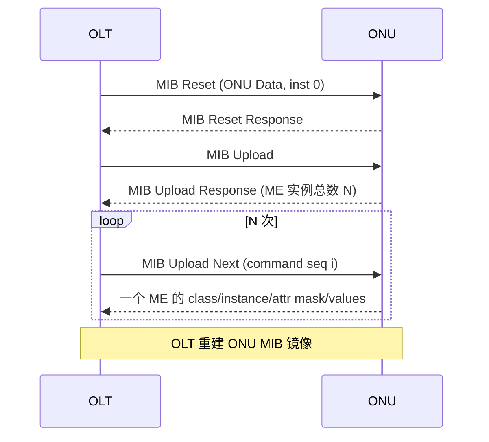

# OMCI 规范总览

> OMCI（ONU Management and Control Interface，ITU-T G.988）的协议层面总览：消息格式（baseline / extended）、消息类型与动作位、操作语义、OMCI trailer / MIC，以及 MIB 同步机制。建模层面（ME 与业务链路）见 [HSI 配置 ⭐](provisioning-hsi.md) 与 [ME 速查](me-reference.md)。

## 1. OMCI 在协议栈中的位置

OMCI 是 OLT/vOMCI 管理 ONU 的**应用层协议**，承载在专用的 **OMCC（ONU Management and Control Channel）** 上 —— 即一个 PTI=OMCC 的 GEM/XGEM Port（见 [GPON 帧结构](../01-protocol-stack/gpon-g984/frame-structure.md) GEM 头）。ONU 激活进入 **O5** 且 OMCC 建立后，OMCI 才能工作。

```mermaid
flowchart LR
    OLT["OLT / vOMCI"] -->|OMCI 请求 (AR=1)| ONU
    ONU -->|OMCI 响应 (AK=1)| OLT
    ONU -->|自主通知 (告警/AVC)| OLT
    OLT -.承载于.- OMCC["OMCC = 专用 GEM Port (PTI=OMCC)"]
```

## 2. 两种消息格式

G.988 §11.2 定义两种格式：

### Baseline（基线，固定 48 字节，Table 11.2-1）

| 字节 | 长度 | 字段 |
|------|------|------|
| 1-2 | 2 | Transaction Correlation Identifier（事务关联 ID，TCI） |
| 3 | 1 | Message Type（消息类型，含 DB/AR/AK 位 + 动作码） |
| 4 | 1 | Device Identifier（设备标识：**0x0A = baseline**） |
| 5-8 | 4 | Managed Entity Identifier（= Entity Class 2B + Entity Instance 2B） |
| 9-40 | 32 | Message Contents（消息内容） |
| 41-48 | 8 | OMCI Trailer（含 MIC，4 字节 CRC-32） |

### Extended（扩展，可变长，Table 11.2-2）

| 字节 | 长度 | 字段 |
|------|------|------|
| 1-2 | 2 | Transaction Correlation Identifier |
| 3 | 1 | Message Type |
| 4 | 1 | Device Identifier（**0x0B = extended**） |
| 5-6 | 2 | Managed Entity Class |
| 7-8 | 2 | Managed Entity Instance |
| 9-10 | 2 | Message Contents Length（消息内容长度） |
| 11.. | 可变 | Message Contents |
| 末 8 | 8 | OMCI Trailer / MIC |

> Extended 格式包长可变，**最大 1980 字节**，单条消息能携带更多属性（baseline 受 32 字节内容限制，常需多条 Get/MIB Upload Next 拼接）。Device Identifier 区分二者：`0x0A` baseline、`0x0B` extended。

## 3. Message Type 字节（Byte 3）

```
 bit:  8     7     6     5  4  3  2  1
      +----+----+----+------------------+
      | DB | AR | AK |  Message Type    |
      +----+----+----+------------------+
```

| 位 | 名称 | 含义 |
|----|------|------|
| 8 | DB | Destination Bit（保留/方向） |
| 7 | AR | **Acknowledge Request**：1 = 请求方期望对端回响应 |
| 6 | AK | **Acknowledgement**：1 = 本消息是一条响应 |
| 5-1 | Message Type | 动作码（Get / Set / Create / Delete / MIB Reset / MIB Upload ...） |

例（来自 G.988 附录 A 消息表）：
- 请求消息：`AR=1, AK=0`（如 MIB Upload Response 的对端请求）。
- 响应消息：`AR=0, AK=1`（如 MIB Reset 命令 `DB=0,AR=0,AK=1`，MIB Upload Next）。
- 自主通知（Alarm / AVC / Test Result）：ONU 主动发，无需请求。

## 4. 核心操作（Action）

| 操作 | 作用 |
|------|------|
| MIB Reset | 清空 ONU MIB 到出厂默认（目标 ME = ONU Data，实例 0） |
| MIB Upload / MIB Upload Next | OLT 同步 ONU 当前全部 ME 实例（先 Upload 取数量，再逐条 Upload Next） |
| Create / Delete | 创建/删除 OLT 可创建的 ME |
| Set | 写属性（按 attribute mask 选属性） |
| Get / Get Next | 读属性 / 读表属性（table attribute） |
| Get All Alarms / Get All Alarms Next | 读全部告警状态 |
| Set Table | 写表属性（extended） |
| Reboot | 重启 ONU |
| Test / Test Result | 发起测试 / 上报结果 |
| Alarm / Attribute Value Change (AVC) | ONU 自主上报告警 / 属性变化 |

### Attribute Mask（属性掩码）

Get/Set 用一个 **16-bit attribute mask** 选择操作哪些属性：bit 15（MSB）对应属性 1，bit 14 对应属性 2，依此类推。`gopon` 的实现可直接对照：

```127:136:/home/mingheh/project/gopon/common/omci/me_spec.go
// AttrMaskFromNames builds the 16-bit attribute mask from attribute names.
func (s MESpec) AttrMaskFromNames(names ...string) uint16 {
	var mask uint16
	for _, n := range names {
		if a, ok := s.AttrByName(n); ok {
			mask |= 1 << (16 - a.Index)
		}
	}
	return mask
}
```

## 5. OMCI Trailer 与 MIC

- Baseline 的 41-48 字节为 **OMCI trailer**：含 CPCS-UU/CPI、length 字段与 **MIC（4 字节 CRC-32）**。
- MIC 用于检测消息传输错误。带安全增强的部署可使用 OMCI_IK（OMCI Integrity Key）做更强的完整性保护。

## 6. MIB 同步（OLT ↔ ONU 一致性）

MIB 视图漂移是现网常见故障根因。标准机制：



- 若 MIB Upload Next 的 command sequence number 越界，ONU 回 entity class 0 / instance 0 / attr mask 0（字节 9-40 全 0）。
- 单个 ME 属性放不下一条消息时，按 attribute mask 拆到多条 Upload Next。
- **MIB Data Sync** 计数器用于快速判断 OLT/ONU 视图是否一致（不一致则触发全量 upload）。

## 7. 工程实现佐证

`gopon` 的 OMCI 框架把 ME / 属性 / 属性掩码完整建模（与 §9 ME 定义、§11 消息格式呼应）：

```36:48:/home/mingheh/project/gopon/common/omci/me_spec.go
// MESpec describes a Managed Entity class (G.988 clause 9).
type MESpec struct {
	Class       ClassID
	Name        string
	Description string
	Attributes  []AttrSpec
	// AutoCreate is true for MEs the ONU creates itself at boot ...
	AutoCreate bool
	// MaxInstances is the maximum number of instances (0 = unlimited).
	MaxInstances int
}
```

## 延伸阅读

- [OMCI HSI 业务配置链路 ⭐](provisioning-hsi.md)（ME 建模实战）
- [ME 速查表](me-reference.md)
- [GPON 帧结构](../01-protocol-stack/gpon-g984/frame-structure.md)（OMCC GEM 承载）

## 来源

- **公有标准**：ITU-T G.988 (2024, Amd1) §11.2：Table 11.2-1（Baseline OMCI message format：TCI / Message type / Device identifier / ME identifier / Message contents 32B / OMCI trailer 8B）、Table 11.2-2（Extended，可变长 ≤1980B）；附录 A 消息表（A.3.17 MIB Reset、A.3.15 MIB Upload Next、A.2.13 MIB Upload、A.2.14 MIB Upload Response 等：Message type 的 DB/AR/AK 位、Device identifier 0x0A/0x0B、attribute mask、MIC 4 字节）。
- **工程实现**：`gopon/common/omci/me_spec.go`（MESpec、AttrSpec、AttrMaskFromNames 属性掩码）。
