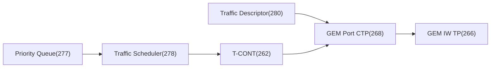

# OMCI 开通速查 Cookbook（HSI / VoIP / IPTV / 组播）

> 把 [HSI](provisioning-hsi.md) / [VoIP](provisioning-voip.md) / [IPTV](provisioning-iptv.md) / [组播](multicast-control.md) 的开通流程汇成「照着敲」的 **ME 操作序列**：每步标注操作（Create/Set）、ME 类（class id）、关键属性与指向关系。配合 [datapath 全景](datapath-l2-model.md) 食用。

> ⚠️ 本篇是**速查骨架**，属性细节以各业务专章与 [ME 参考](me-reference.md) / G.988 为准；不同厂商可选用 MAC Bridge 或 802.1p Mapper 两种 L2 模型（见 [datapath](datapath-l2-model.md)）。

## 0. 通用前置：MIB 复位与基线

```text
1. MIB Reset           → ONU-Data (2)               # 清空 MIB, 计数器归零
2. (ONU 自建 ME 已存在)  ONU-G(256) ONU2-G(257)
                        ANI-G(263) UNI-G(264)
                        PPTP Ethernet UNI(11) ...    # 仅 Get, 不创建
3. MIB Upload / Get     → 读回 ONU 已有 ME 清单       # 见 mib-upload-sync
```

> 凡是 **AutoCreate** 的 ME（ONU-G/ANI-G/UNI-G/PPTP UNI）只能 Get/Set；其余业务 ME 由 OLT **Create**（见 [OMCI 白盒](code-walkthrough.md) §3）。

## 1. 上行通道骨架（所有业务共用）

```text
# T-CONT 绑定 + GEM 通道 + 调度
Set    T-CONT (262)                  Alloc-ID = <动态分配>
Create Traffic Descriptor (280)      CIR/PIR/CBS/PBS, color mode
Create GEM Port Network CTP (268)    Port-ID, T-CONT pointer→(262),
                                     Traffic Descriptor pointer→(280)
Create GEM Interworking TP (266)     points→ GEM CTP(268),
                                     interworking option = MAC bridge / 802.1p mapper
Create Priority Queue (277)          (多数 ONU 自建; 设权重/关联 T-CONT)
Create Traffic Scheduler (278)       policy = strict / WRR  (可选层)
```



## 2. HSI 上网（最常见）

```text
# L2 模型 A: MAC Bridge
Create MAC Bridge Service Profile (45)
Create MAC Bridge Port Config Data (47)   每个桥端口一份:
        - 一端 TP type=PPTP Eth UNI → UNI(11)
        - 一端 TP type=GEM IW TP   → (266)
Create VLAN Tagging Filter Data (84)       per-port VLAN 过滤
Create Ext. VLAN Tagging Op Config Data(171)
        - 关联 PPTP UNI; 配 filter/treatment 表 (打/剥/改 VLAN, P-bit)
Set    PPTP Ethernet UNI (11)              administrative state = unlock
```

- 关键链路：`UNI(11) → Ext VLAN(171) → MAC Bridge(45/47) → GEM IW(266) → GEM CTP(268) → T-CONT(262)`（见 [HSI 专章](provisioning-hsi.md)）。
- 业务区分靠 **VLAN/P-bit**（见 [VLAN/QoS 建模](vlan-qos-modeling.md)）。

## 3. VoIP 语音

```text
# 在通用上行骨架基础上 + 语音 ME
Create VoIP Voice CTP (138)                points→ 语音媒体/信令配置
Create SIP User Data (153)  或  MGC(155)   SIP/H.248 二选一
Create SIP Agent Config Data (150)         代理/注册服务器、域
Create VoIP Media Profile (142)            编解码(G.711/G.729)、jitter
Create TCP/UDP Config Data (136)           本地端口、ToS/DSCP
Create Network Address (137) / VLAN        信令/媒体 VLAN
Set    PPTP POTS UNI (53)                  unlock; 配铃流/阻抗
```

- 语音口走 **专用 GEM Port + T-CONT**（多为 Fixed/HRT，保时延），与 HSI 分流（见 [VoIP 专章](provisioning-voip.md)）。

## 4. IPTV / 组播

```text
# 单播部分同 HSI; 组播额外:
Create Multicast GEM Interworking TP (281) 组播专用 GEM 通道
Create Multicast Operations Profile (309)  IGMP/MLD 版本、模式(snooping/proxy)、
                                           timers, robustness, rate
Create Multicast Subscriber Config Info(310) 绑定 UNI/桥端口→(309),
                                           Max groups, Max multicast BW
Set    Ext VLAN / ACL                       动态/静态 ACL, 允许的组地址范围
```

- 组播流走**下行共享** GEM，ONU 做 IGMP snooping/proxy 受控转发（见 [组播控制](multicast-control.md) / [IPTV 专章](provisioning-iptv.md)）。

## 5. 收尾与校验

```text
Set    各 UNI administrative state = unlock   # 放业务
Get    各 ME 运行状态 / AVC                    # 确认 operational
Test   ANI-G(263) 光线路监测                   # 确认光层 (见 test-avc-operations)
观察   告警位图 / DBA 授权 / 业务流量            # 见 troubleshooting / qos-scheduling-cases
```

## 6. 常见顺序坑

| 坑 | 现象 | 对策 |
|----|------|------|
| 先 Create 引用方再建被引用 ME | Create 返回「未知实例」 | 先建被指向 ME（TD→GEM CTP→IW…自底向上） |
| 忘记 unlock UNI | 配置全对但无流量 | 最后 Set administrative state=unlock |
| VLAN filter/treatment 顺序错 | 标签处理异常 | 按 [VLAN 建模](vlan-qos-modeling.md) 的处理序 |
| 语音/IPTV 复用 HSI 的 T-CONT | QoS 抢占、时延抖 | 按业务分配独立 T-CONT/优先级 |

## 来源

- **公有标准**：ITU-T G.988（各 ME 类号与属性：ONU-Data 2、PPTP Eth UNI 11、MAC Bridge SP 45 / Port 47、VLAN Tagging Filter 84、Ext VLAN Tagging Op 171、T-CONT 262、GEM IW TP 266、GEM Port CTP 268、Priority Queue 277、Traffic Scheduler 278、Traffic Descriptor 280、Multicast GEM IW TP 281、Multicast Operations Profile 309、Multicast Subscriber Config 310、VoIP 系列 136/137/138/142/150/153/155、PPTP POTS UNI 53 等）。
- **本库专章**：[HSI](provisioning-hsi.md) / [VoIP](provisioning-voip.md) / [IPTV](provisioning-iptv.md) / [组播](multicast-control.md) / [VLAN-QoS](vlan-qos-modeling.md) / [datapath](datapath-l2-model.md)。
- 说明：本篇为**操作序列骨架**（class id 取自 G.988），便于开通/抓包对照；逐属性与厂商差异以专章与 G.988 原文为准。
