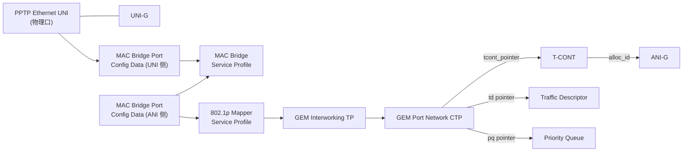
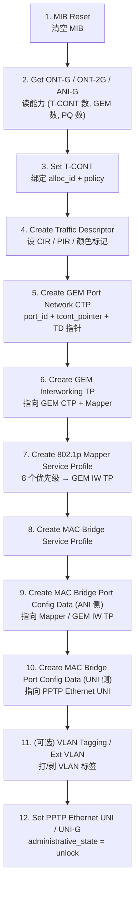

# OMCI HSI 上网业务配置链路 ⭐

> 本篇白盒化 HSI（High Speed Internet，即宽带上网）业务的 OMCI 配置全流程：从 **MIB Reset** 开始，逐个创建/设置 Managed Entity（ME），直到打通「UNI 以太口 ↔ T-CONT 上行带宽」的完整数据通路。这是 OMCI 开发的重头戏。

## 1. OMCI 与 ME 模型基础

**OMCI（ONU Management and Control Interface，G.988）** 是 OLT/vOMCI 对 ONU 做配置管理的协议，跑在一条专用的 **OMCC GEM Port** 上（激活进入 O5 后建立）。

OMCI 把 ONU 的能力建模成一组 **Managed Entity（ME）**：每个 ME 有一个 **Class ID**、一个 **Instance ID（Managed Entity ID）**，以及一组**属性（Attribute）**。OLT 通过几类 OMCI 操作管理 ME：

| 操作 | 作用 |
|------|------|
| `MIB Reset` | 清空 ONU 的 MIB，回到出厂默认 ME 集合 |
| `MIB Upload` / `MIB Upload Next` | 读取 ONU 当前全部 ME（同步用） |
| `Create` / `Delete` | 创建/删除可被 OLT 创建的 ME |
| `Set` | 修改属性 |
| `Get` / `Get Next` | 读取属性 / 表属性 |

ME 分两类：

- **AutoCreate（ONU 自建）**：ONU 启动时自动实例化，OLT 不能创建，只能 Get/Set。如 `ONT-G`、`ONT-2G`、`ANI-G`、`UNI-G`、`PPTP Ethernet UNI`。
- **OLT 创建**：必须由 OLT 显式 `Create`。如 `T-CONT`（实例已存在但需 Set 绑定 Alloc-ID）、`GEM Port Network CTP`、`GEM Interworking TP`、`802.1p Mapper`、`MAC Bridge`、`Traffic Descriptor` 等。

> ME 的关键关联通过**指针属性（pointer）** 实现：一个 ME 的某个属性存放另一个 ME 实例的 Managed Entity ID，从而把整条链路「串」起来。

## 2. HSI 业务的数据通路

HSI 业务要建立的，是用户 UNI 以太口到上行 T-CONT 的一条双向通路。L2 数据平面建模（L2-OCM，G.988 Figure II.1.2.1-1）的核心链路：



要点（来自 G.988 Figure 8.2.2-7 与 II.1.2.x 的 L2-OCM 模型）：

- **上行方向**：UNI 收到的以太帧 → MAC Bridge → 按 802.1p 优先级经 Mapper 分流 → GEM IW TP → GEM Port Network CTP（映射到具体 XGEM Port-ID）→ T-CONT（按 Alloc-ID 上行调度）。
- **T-CONT** 通过 `alloc_id` 与 OLT 侧 DBA 关联（见 [DBA 章节](../03-dba/tcont-types.md)）。
- **Traffic Descriptor** 定义该 GEM/T-CONT 的 CIR/PIR 等速率约束，由 GEM Port Network CTP 的上行/下行 TD 指针引用。

## 3. 配置链路（从 MIB Reset 到 Traffic Descriptor）

下面是 OLT 下发 HSI 业务的典型 ME 操作序列。顺序很重要：**被指向的 ME 必须先存在**，否则指针属性指向空实例会失败。



### 逐步说明

1. **MIB Reset**：把 ONU MIB 清空到出厂默认（只剩 AutoCreate 的 ME）。通常配合一次 `MIB Upload` 让 OLT 同步当前实例。
2. **读能力**：`Get` `ONT-G`、`ONT-2G`、`ANI-G` —— 拿到 T-CONT 总数（`ANI-G.total_tcont_number`）、GEM Port 总数、Priority Queue 总数（`ONT-2G`），决定可用资源上限。
3. **T-CONT**：实例由 ONU 自带，OLT `Set` 其 `alloc_id`（绑定 OLT 侧分配的 Alloc-ID）与 `policy`（调度策略）。
4. **Traffic Descriptor**：`Create`，配置 CIR / PIR（G.988 速率字段，单位 bit/s）、颜色标记模式等，供后续 GEM CTP 引用。
5. **GEM Port Network CTP**：`Create`，关键属性见下表，把 XGEM Port-ID 绑定到 T-CONT 与 Traffic Descriptor。
6. **GEM Interworking TP**：`Create`，把 GEM CTP 适配到上层服务（以太/802.1p），其 `interworking_option` 表明这是 802.1p mapper 互通。
7. **802.1p Mapper Service Profile**：`Create`，建立 8 个 P-bit（0..7）到不同 GEM IW TP 的映射（HSI 通常只用 1 个，多 GEM 用于区分业务/优先级）。
8. **MAC Bridge Service Profile**：`Create`，作为二层转发的「虚拟网桥」。
9. **MAC Bridge Port Config Data（ANI 侧）**：`Create`，`tp_type` 指向 802.1p Mapper 或 GEM IW TP，把网桥连到上行 GEM 通道。
10. **MAC Bridge Port Config Data（UNI 侧）**：`Create`，`tp_type` 指向 `PPTP Ethernet UNI`，把网桥连到用户物理口。
11. **VLAN（可选）**：用 `VLAN Tagging Filter Data` 或 `Extended VLAN Tagging Operation Config Data` 做 VLAN 透传/打标/剥标，承载运营商 S-VLAN/C-VLAN 规划。
12. **解锁 UNI**：`Set` `PPTP Ethernet UNI` / `UNI-G` 的 `administrative_state = 0 (unlock)`，业务正式放通。

### GEM Port Network CTP 的关键指针（链路如何串起来）

`gopon` 的 ME 注册表清晰列出了 GEM Port Network CTP（Class 268）的属性，正是把整条链路串起来的「枢纽」：

```238:250:/home/mingheh/project/gopon/common/omci/me_g988.go
	Register(MESpec{
		Class: ClassGemPNCTP, Name: "GEM Port Network CTP", AutoCreate: false,
		...
			{Name: "port_id_value", Index: 1, Type: AttrUint16, ...},
			{Name: "tcont_pointer", Index: 2, Type: AttrPointer, ...},
			{Name: "direction", Index: 3, Type: AttrUint8, ...},
			{Name: "traffic_management_pointer_upstream", Index: 4, Type: AttrPointer, ...},
			{Name: "traffic_descriptor_profile_pointer_downstream", Index: 5, Type: AttrPointer, ...},
			{Name: "priority_queue_pointer_downstream", Index: 7, Type: AttrPointer, ...},
			{Name: "traffic_descriptor_profile_pointer_upstream", Index: 9, Type: AttrPointer, ...},
			...
	})
```

- `port_id_value`：该 GEM 的 XGEM Port-ID。
- `tcont_pointer`：指向承载本 GEM 上行流量的 **T-CONT** 实例。
- `traffic_descriptor_profile_pointer_upstream/downstream`：指向 **Traffic Descriptor**，施加 CIR/PIR。
- `priority_queue_pointer_downstream`：指向下行 **Priority Queue**。

## 4. 涉及的核心 ME 速查

| ME | Clause (G.988) | 创建者 | 在 HSI 中的角色 |
|----|----------------|--------|----------------|
| ONT-G | 9.1.1 | ONU 自建 | 设备级信息（vendor、SN、状态） |
| ONT-2G | 9.1.2 | ONU 自建 | 能力上报（PQ 数、GEM 数、scheduler 数） |
| ANI-G | 9.2.1 | ONU 自建 | PON 侧接口（T-CONT 数、SR/DBA 上报能力、光功率） |
| UNI-G / PPTP Ethernet UNI | 9.5.x | ONU 自建 | 用户物理口 |
| T-CONT | 9.2.2 | Set | 上行带宽容器（绑 Alloc-ID + policy） |
| Traffic Descriptor | 9.2.x | Create | CIR/PIR 速率约束 |
| GEM Port Network CTP | 9.2.3 | Create | XGEM Port → T-CONT / TD / PQ 的枢纽 |
| GEM Interworking TP | 9.2.4 | Create | GEM ↔ 上层服务适配 |
| 802.1p Mapper Service Profile | 9.3.10 | Create | P-bit → GEM 映射 |
| MAC Bridge Service Profile | 9.3.1 | Create | 二层转发实体 |
| MAC Bridge Port Config Data | 9.3.4 | Create | 网桥端口（UNI 侧 / ANI 侧各一） |
| VLAN Tagging Filter Data | 9.3.11 | Create | VLAN 过滤 |
| Extended VLAN Tagging Op | 9.3.12/13 | Create | VLAN 打标/剥标/转换 |
| Priority Queue | 9.2.x | ONU 自建 | 上/下行队列 |

> `gopon` 的 OMCI ME 注册表（`me_g988.go`）实际登记了约 21 个 G.988 ME（ONT-G、ONT-2G、ANI-G、UNI-G、T-CONT、GEM Port Network CTP 等），可作为属性级对照。完整 ME 速查见 [me-reference.md](me-reference.md)。

## 5. 多 UNI 与组播扩展

- **多 UNI**：每个 UNI 复制一套「单 UNI L2-OCM」，但**上行队列和 T-CONT 总数不变**（G.988 Figure II.1.2.2-1）。
- **组播（IPTV 用）**：通过 `Multicast GEM Interworking TP` + `Multicast Operations Profile` + `Multicast Subscriber Config Info` 承载下行组播，与单播 GEM IW TP 并存于同一 MAC Bridge。详见 [provisioning-iptv.md](provisioning-iptv.md)。

## 6. 调试提示

- **顺序错误**：先 Create 被指向的 ME（TD、GEM CTP、Mapper），再 Create 指向它的 ME（GEM IW TP、Bridge Port）。指针指向不存在的实例会回 `Create`/`Set` 失败。
- **administrative_state**：UNI/ANI 默认 lock，配置完务必 unlock。
- **MIB 一致性**：配置前后做 `MIB Upload Next` 对账，避免 OLT 与 ONU 视图漂移（这是现网常见故障根因）。

## 延伸阅读

- [ME 速查表](me-reference.md)
- [VoIP 业务配置](provisioning-voip.md)
- [IPTV 业务配置](provisioning-iptv.md)
- [T-CONT 类型与 DBA](../03-dba/tcont-types.md)

## 来源

- **公有标准**：
  - ITU-T G.988 (2024, Amd1) Table 8-1 "Managed entities of the OMCI"（ME 清单与 clause 号）。
  - G.988 Figure 8.2.2-7（1:M map-filtering：GEM CTP → GEM IW TP → 802.1p Mapper → MAC Bridge Port → VLAN Tagging → PPTP UNI）。
  - G.988 Figure II.1.2.1-1 / II.1.2.2-1（单 UNI / 多 UNI L2-OCM 业务模型：Traffic Descriptor / T-CONT / GEM CTP / GEM IW TP / Priority Queue / MAC Bridge / VLAN 的连接关系）。
  - G.988 Figure 9.3-1（支持二层的 ME 关系图：MAC Bridge、802.1p Mapper、VLAN Tagging Filter、Extended VLAN、Traffic Descriptor 指针关系）。
- **工程实现**：`gopon/common/omci/me_g988.go`（ME 注册表，含 GEM Port Network CTP / T-CONT / ANI-G / ONT-2G 的属性与指针定义）、`gopon/common/omci/me_spec.go`（ME / 属性 / 属性掩码框架）。liteaggregator `src/glob/models/`（OLT 侧 ME 模型实现）。
