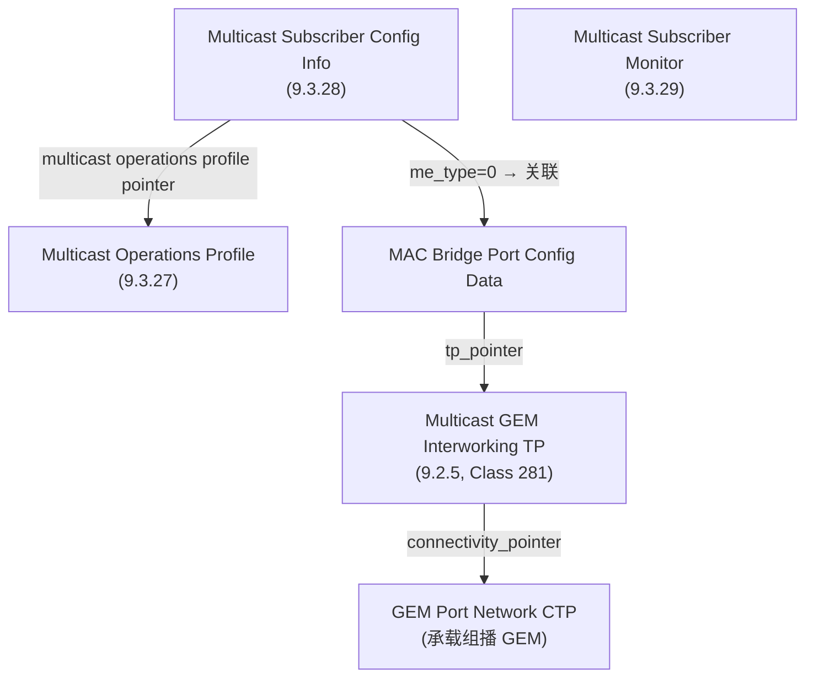
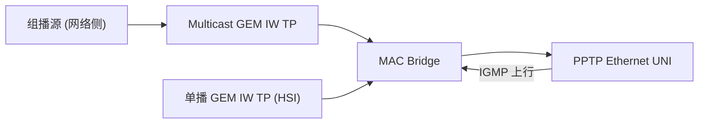
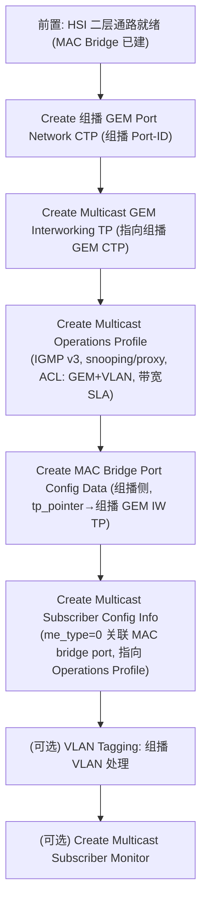

# OMCI IPTV 组播业务配置链路

> IPTV（组播视频）业务的 OMCI 配置。核心是下行**组播**承载 + **IGMP/MLD snooping/proxy**。本篇梳理组播 ME 组成、关系、配置流程与一致性约束。

## 1. 组播业务的特点

- **下行组播流**：一份内容（频道）在 PON 上只发一份，由 ONU 复制给请求该频道的用户口 —— 节省带宽。
- **上行 IGMP/MLD**：用户点播/退出频道的 IGMP（IPv4）/ MLD（IPv6）报文经单播通道回送，ONU 做 **snooping**（监听）或 **proxy**（代理）后据此控制组播转发。

## 2. 核心 ME

| ME | Clause / Class | 创建者 | 角色 |
|----|----------------|--------|------|
| Multicast GEM Interworking TP | 9.2.5 / **281** | OLT Create | 组播流与 GEM 层的互通点（从 GEM 包重建组播比特流） |
| Multicast Operations Profile | 9.3.27 | OLT Create | 组播策略：IGMP 版本、snooping/proxy、ACL、带宽 SLA |
| Multicast Subscriber Config Info | 9.3.28 | OLT Create | 每用户组播策略（关联 MAC bridge port） |
| Multicast Subscriber Monitor | 9.3.29 | OLT Create | 组播监控/统计 |

> EPON ONU 对应的是 **L2 Multicast GEM Interworking TP（9.2.18）**，概念类似但按 MAC 地址过滤。

## 3. Multicast Operations Profile（9.3.27）关键属性

| 属性 | 作用 |
|------|------|
| ME ID | 实例标识（0 / 0xFFFF 保留） |
| **IGMP version** | IGMP 版本；按 BBF TR-156 要求**置 3（IGMPv3）** |
| IGMP function（snooping/proxy） | 监听 or 代理模式 |
| Dynamic access control list table | 动态 ACL：含 **GEM port + VLAN** 字段，定义允许的组播组范围 |
| Static access control list table | 静态 ACL：预置允许的组播组 |
| Max multicast bandwidth / Bandwidth enforcement | 基于带宽的组播 SLA |
| Robustness / Querier IP / Query interval | IGMP 协议参数（参 RFC 2236/3376/3810/5519） |

> 一致性约束（重要）：ACL 表里的 **GEM port 与 VLAN** 必须与组播流实际经过的 **GEM Port Network CTP** 及 **VLAN Tagging Filter** 配置一致，否则行为未定义。

## 4. 与 HSI 通路的关系

- 组播 GEM IW TP 与单播（HSI）GEM IW TP **并存于同一 MAC Bridge**（G.988 L2-OCM 模型 Figure II.1.3.1.1-1）。
- 「incidental broadcast」（偶发广播）由独立的 GEM IW TP (null) 承载。
- 组播下行通常单向；用户 IGMP 上行经单播 T-CONT 回送。

## 5. 配置流程

- **Multicast Subscriber Config Info** 的 `ME type` 属性置 **0**，表示关联到一个 **MAC Bridge Port Config Data ME**。

## 6. 调试提示

- 频道点不开：先看 **ACL（GEM port + VLAN）是否与组播 GEM CTP / VLAN filter 一致**（最常见根因）。
- IGMP 版本不匹配：Operations Profile 的 IGMP version 与上游/STB 不一致。
- 超出 SLA：max multicast bandwidth / bandwidth enforcement 限制了同时频道数。
- 统计排障用 **Multicast Subscriber Monitor**。

## 延伸阅读

- [OMCI HSI 配置链路 ⭐](provisioning-hsi.md)（二层通路与组播并存）
- [OMCI 规范总览](omci-spec.md)
- [ME 速查表](me-reference.md)

## 来源

- **公有标准**：ITU-T G.988 (2024, Amd1)：
  - §9.2.5 Multicast GEM Interworking TP（G-PON，Class 281：组播流与 GEM 互通；OLT 创建；默认单 GEM 端口承载全部组播，IPv4/IPv6 multicast address table 第一条含全 DA 范围 224.0.0.0–239.255.255.255）。
  - §9.2.18 L2 Multicast GEM Interworking TP（EPON 对应 ME，按 MAC 过滤）。
  - §9.3.27 Multicast Operations Profile（组播策略：IGMP 版本、snooping/proxy，RFC 2236/3376/3810/5519；dynamic/static ACL 含 GEM port+VLAN；max multicast bandwidth / bandwidth enforcement）。
  - 一致性约束与 IGMPv3（BBF TR-156 要求 IGMP version=3）、Multicast Subscriber Config Info 的 ME type=0 关联 MAC bridge port config data。
  - Table 11.2.4-1（ME class 281 = Multicast GEM interworking termination point）。
- **工程实现**：`gopon/common/omci/me_g988.go`（MAC Bridge / GEM CTP / VLAN ME 框架，组播 ME 可按此扩展）。
