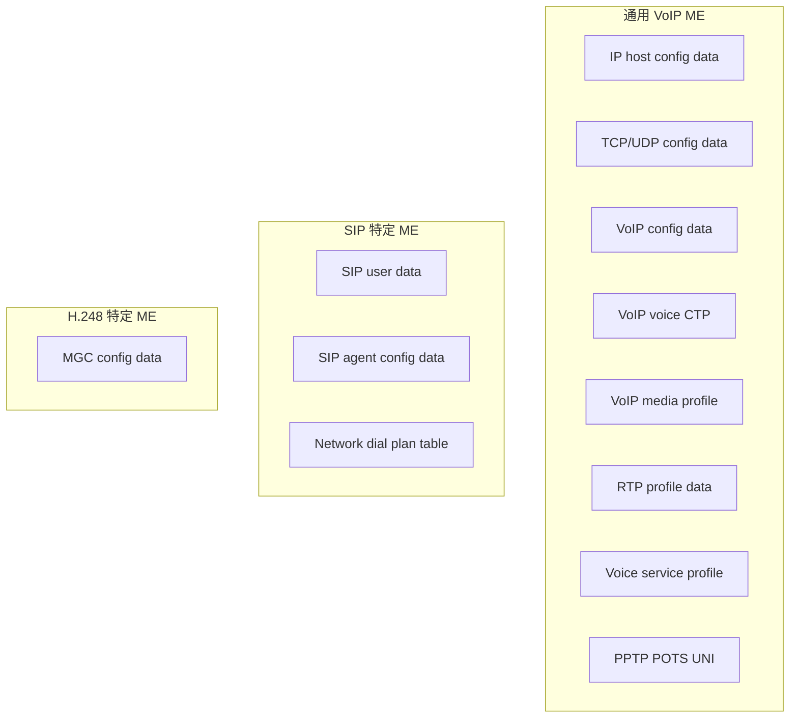
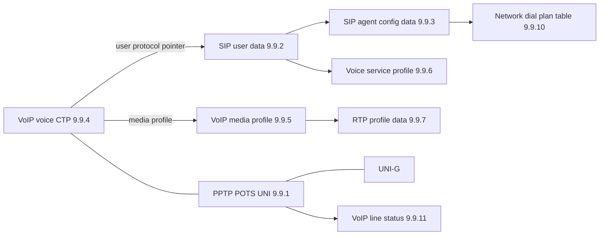
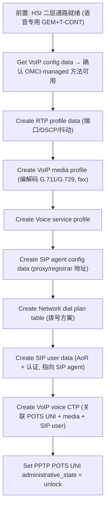

# OMCI VoIP 业务配置链路

> VoIP（语音）业务的 OMCI 配置。在 HSI 数据通路之上，叠加一组**通用 VoIP ME** 与**信令协议特定 ME**（SIP 或 ITU-T H.248）。本篇梳理 ME 组成、关系图与配置要点。

## 1. 两种管理模式

ONU 的语音业务有两种被管理方式（G.988 §11.4.6）：

- **OMCI 管理（OMCI-managed）**：OLT 经 OMCI 直接下发 SIP/H.248 配置（账号、proxy、拨号方案）。
- **非 OMCI 管理（non-OMCI / IP-path managed）**：ONU 通过 ACS（TR-069）等带外方式获取语音配置，OMCI 只读状态。

判定方式：ONU 自建 **VoIP config data ME**，OLT 读其 **available VoIP configuration methods** 属性发现 ONU 支持的管理方法，再据此 provisioning。

## 2. ME 组成（G.988 §I.1.4）

| ME | Clause | 创建者 | 角色 |
|----|--------|--------|------|
| PPTP POTS UNI | 9.9.1 | ONU 自建 | 模拟话机口 |
| VoIP voice CTP | 9.9.4 | OLT Create | 把 POTS UNI 关联到信令（SIP/MGC）与媒体 profile |
| VoIP media profile | 9.9.5 | OLT Create | 编解码（G.711/G.729）、fax、抖动缓冲 |
| Voice service profile | 9.9.6 | OLT Create | 语音业务通用参数 |
| RTP profile data | 9.9.7 | OLT Create | RTP 端口范围、DSCP、抖动目标 |
| SIP user data | 9.9.2 | OLT Create | SIP 用户账号（AoR、认证） |
| SIP agent config data | 9.9.3 | OLT Create | SIP proxy/registrar/outbound proxy 地址、定时器 |
| Network dial plan table | 9.9.10 | OLT Create | 拨号方案 |
| MGC config data | 9.9.16 | OLT Create | H.248/MEGACO 网关控制器（H.248 模式用） |
| VoIP config data | 9.9.18 | ONU 自建 | 发现可用语音管理方法 |
| VoIP line status | 9.9.11 | ONU 自建 | 线路状态（摘机/注册/故障） |

> 需要长字符串的 ME（如 AoR、proxy URI）指向 **Large string ME**；需要网络地址的 ME 指向 **Network address ME**。

## 3. ME 关系（G.988 Figure 9.9-1）

核心枢纽是 **VoIP voice CTP（9.9.4）**：它「把一个 PPTP POTS UNI 关联到一个 VoIP media profile，以及一个 SIP user data 或 MGC config data ME」。每个被 VoIP 服务的 PPTP POTS UNI 需要一个 VoIP voice CTP。

## 4. 与 HSI 通路的关系

VoIP 的**承载面**复用 [HSI 二层通路](provisioning-hsi.md)（GEM → T-CONT），但通常：

- 用**独立的 GEM Port + T-CONT** 承载 SIP 信令与 RTP 媒体；
- T-CONT 选**高优先级类型**（Fixed/Type 1 或 Assured/Type 2），保证低时延零抖动（见 [T-CONT 类型 ⭐](../03-dba/tcont-types.md)）；
- 语音 VLAN 与 HSI VLAN 分开规划。

## 5. 配置流程（SIP 模式，OMCI 管理）

H.248 模式：用 **MGC config data（9.9.16）** 替代 SIP 三件套（SIP agent / user data / dial plan）。

## 6. Global vs Per-UNI ME（G.988 §8.2.8）

| 范围 | ME |
|------|----|
| Global（全局，每 ONU 一份） | VoIP config data (9.9.18)、SIP config portal (9.9.19) |
| Per-UNI（每语音口一份） | PPTP POTS UNI (9.9.1)、UNI-G、VoIP voice CTP、SIP user data、VoIP line status |

## 7. 调试提示

- 注册失败优先看 **VoIP line status (9.9.11)**：注册状态、最近错误码。
- 单通/无声多为 **RTP profile / media profile** 编解码或端口/防火墙问题。
- 信令不通查 **SIP agent config data** 的 proxy/registrar 地址与 Network address ME。

## 延伸阅读

- [OMCI HSI 配置链路 ⭐](provisioning-hsi.md)（承载面基础）
- [OMCI 规范总览](omci-spec.md)
- [T-CONT 类型 ⭐](../03-dba/tcont-types.md)（语音 T-CONT 选型）

## 来源

- **公有标准**：ITU-T G.988 (2024, Amd1)：
  - §I.1.4 "Voice services"（通用 VoIP ME 与 SIP 特定 ME 分组清单）。
  - §9.9 "Voice services"、Figure 9.9-1（POTS/VoIP 的 ME 关系与 clause 号 9.9.1~9.9.20）。
  - §9.9.4 VoIP voice CTP（关联 POTS UNI ↔ media profile ↔ SIP user data / MGC config data；OLT 创建；每 POTS UNI 一个）。
  - §8.2.8（VoIP service：IP-path managed / OMCI managed 的 SIP 与 H.248 模型，Global vs Per-UNI ME，Figure 8.2.8-1~6）。
  - §11.4.6.1（Common provisioning：VoIP config data 由 ONU 自建，OLT 读 available VoIP configuration methods）。
- **工程实现**：`gopon/common/omci/me_g988.go`（PPTP UNI / UNI-G 等关联 ME 框架，VoIP 专有 ME 可按此扩展）。
