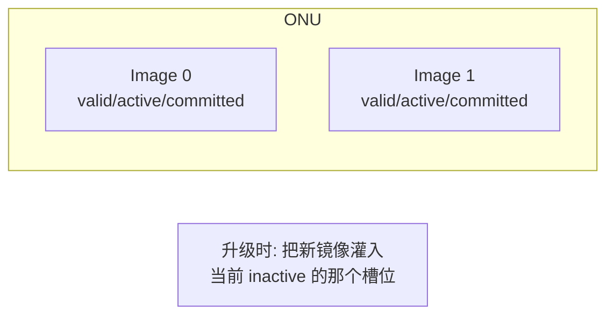
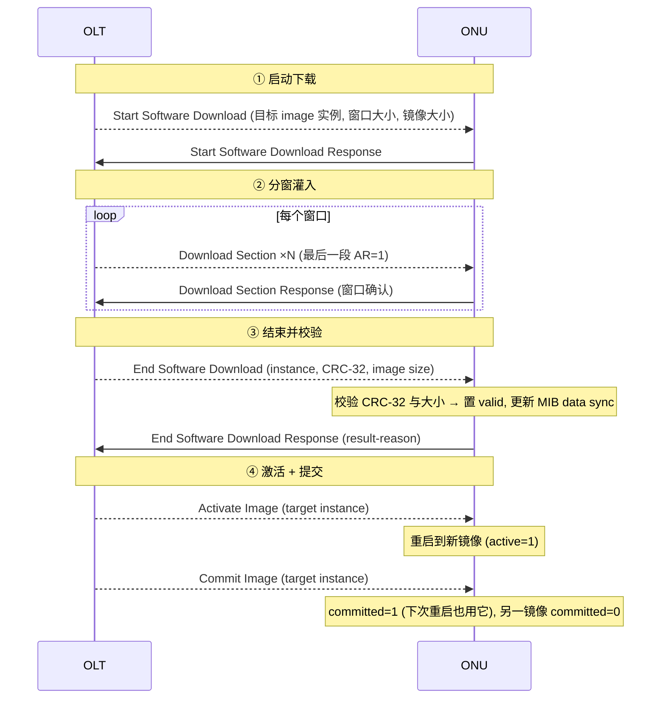
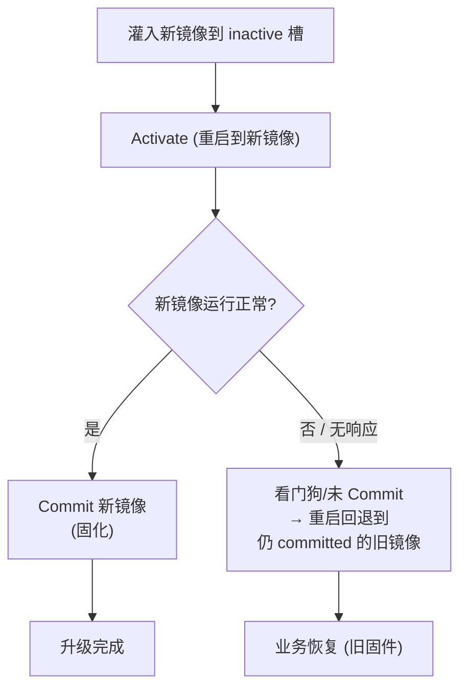

# OMCI 软件升级（Software Image）

> ONU 固件升级由 OMCI 承载：OLT 把镜像分段（Download Section）灌入 ONU 的非易失存储，校验后**激活（Activate）**、**提交（Commit）**。靠**双镜像（image 0 / 1）+ committed/active/valid 三个布尔位**实现「升级失败可回退」的高可靠机制。依据 G.988 §I.3 与 Software image ME（§9.1.4）。

> 消息格式见 [OMCI 规范](omci-spec.md)；本流程发生在 [MIB 已同步](mib-upload-sync.md) 之后的运行期。

## 1. 双镜像与三个状态位（§9.1.4）

每个可独立管理的软件实体（ONU 整机或某 circuit pack），ONU **自动创建两个 Software image ME**：实例 **0** 与 **1**。每个镜像有三个布尔属性：

| 属性 | 含义 |
|------|------|
| **valid** | 镜像内容已校验为可执行代码 |
| **active** | 当前正在运行的镜像 |
| **committed** | **重启后**默认加载运行的镜像 |

约束：**任一时刻最多一个 active、最多一个 committed**。

> **设计精髓**：永远往「非活动槽」灌新固件，灌坏了也不影响正在运行的镜像；激活新镜像后若异常，可回退到另一个仍 committed 的旧镜像——**双 Bank 升级**。

## 2. 升级四阶段

### ① Start Software Download
OLT 指定目标镜像实例、**下载窗口大小**（一次发多少 Download Section 再等确认）和镜像总大小。

### ② Download Section（A.2.25）
- 镜像被切成**段（section）**，按**窗口**发送：窗口内中间段 **AR=0（不要求逐段响应）**，**窗口最后一段 AR=1**，ONU 回一个 **Download Section Response（A.2.26）** 确认整窗。
- 窗口机制兼顾**吞吐**（不必每段都 ack）与**可靠**（每窗校验、可重传）。

### ③ End Software Download
- 携带 **CRC-32** 与 **image size**；ONU 校验通过则置该镜像 **valid=1** 并**更新 MIB data sync**。
- **Busy 处理**（Fig I.3.2.1-3）：CRC/大小都对，但 ONU 暂时无法提交时，回 **result-reason 0110（device busy）**，OLT **延时后重试** End Software Download，直到 ONU 就绪。

### ④ Activate / Commit（A.2.29）
- **Activate Image**：加载目标（原 inactive）镜像并**重启**到它（active=1）；若对**已 active** 镜像执行，则为**软重启**（不重新从 NV 加载）。仅对 **valid** 镜像有效。
- **Commit Image**：把目标镜像 **committed=1**、另一镜像 **committed=0**——决定**下次重启**用哪个。

## 3. 失败回退（为什么双镜像很重要）

- 关键：**先 Activate 验证、后 Commit 固化**。若 Activate 后新镜像跑挂或 OLT 失联，由于尚未 Commit，下次重启会回到旧 committed 镜像——**升级失败不变砖**。

## 4. 工程要点

- **窗口大小调优**：窗口越大吞吐越高，但单窗重传代价越大；现场常按链路质量折中。
- **批量升级**：可对**多个 software image ME**（实例号 255 = 多实例下载）或多 ONU 协调升级，注意 OLT 侧分批避免风暴。
- **与 MIB data sync 联动**：End Software Download 成功会改 MIB（valid 位），故递增 MIB data sync，下次上线对齐时可感知（见 [MIB 同步](mib-upload-sync.md)）。
- **互通**：TR-309/TR-255 含软件下载用例，验证窗口/CRC/激活提交时序。

## 来源

- **公有标准**：
  - ITU-T G.988 (2024) §9.1.4（Software image ME：双镜像 0/1，committed/active/valid 语义，最多一个 active/committed）。
  - §I.3.1（软件升级概述）、Figure I.3.2.1-3（Busy response handling：result-reason 0110=device busy 重试）。
  - 消息编码：§A.2.25（Download section：AR=x，窗口内 AR=0 / 窗口末 AR=1）、§A.2.26（Download section response）、§A.2.29 / §A.3.29（Activate image / Commit image / End software download，DB=0/AR=0/AK=1）。
- 说明：四阶段时序与回退流程为基于上述条款的归纳；逐字段编码与 result-reason 全集以 G.988 附录 A 为准。
