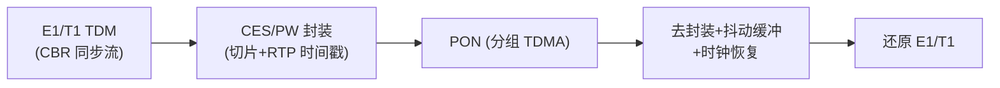
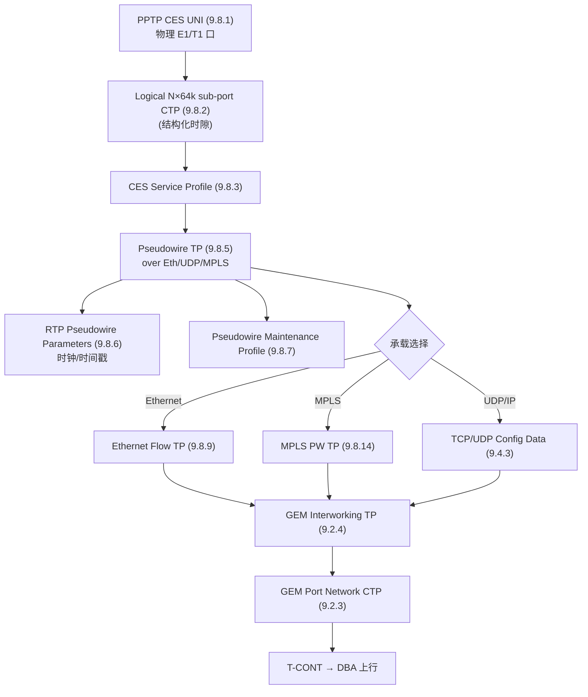

# TDM 业务与伪线（Pseudowire）

> 传统 **TDM 业务（E1/T1、N×64k）** 与 **ATM** 要在分组化的 PON 上承载，靠**伪线（Pseudowire, PW）/ 电路仿真（CES, Circuit Emulation Service）**：把 TDM 比特流封进分组（over Ethernet / UDP-IP / MPLS）跨 PON 传输，对端还原时钟与帧。OMCI 用 §9.8 一组 ME 建模。依据 G.988 §8.2.9 / §9.8。

> 这是「PON 也能做专线/基站回传」的关键能力；以太/HSI 主干见 [HSI 配置链路 ⭐](provisioning-hsi.md)。

## 1. 为什么需要伪线

PON 上行是**分组化 TDMA**，而 E1/T1 是**恒定比特率（CBR）的同步 TDM**。直接放是不行的——需要：

- **封装**：把 TDM 帧切片塞进分组（PW 载荷）；
- **时钟恢复**：接收端从分组到达节奏 + RTP 时间戳重建原始时钟（避免滑码）；
- **抖动吸收**：抖动缓冲补偿 PON 调度引入的时延抖动。

## 2. 三种承载方式

伪线 TP（§9.8.5）支持三种底层传输（**Underlying transport** 属性）：

| 取值 | 承载 | 说明 |
|------|------|------|
| 0 | **Ethernet（MEF 8）** | TDM over Ethernet（MEF 8/SAToP/CESoETH） |
| 1 | **UDP/IP** | TDM over UDP/IP |
| 2 | **MPLS** | TDM over MPLS PW |

**Service type**：透明比特管道（unstructured/SAToP）或结构感知封装（structured，识别 N×64k 时隙）。

## 3. TDM 伪线 CES 的 ME 链路（§8.2.9 Fig 8.2.9-1）

| ME | Class | 作用 |
|----|-------|------|
| PPTP CES UNI | 9.8.1 | 物理 E1/T1/DS1 端口终结 |
| Logical N×64 sub-port CTP | 9.8.2 | 结构化的 N×64kbit/s 时隙 |
| CES Service Profile | 9.8.3 | CES 服务参数 |
| **Pseudowire TP** | 9.8.5 | 伪线核心：承载选择、service type |
| RTP Pseudowire Parameters | 9.8.6 | RTP 时间戳/时钟恢复参数 |
| Pseudowire Maintenance Profile | 9.8.7 | 抖动缓冲、OAM/告警门限 |
| Ethernet Flow TP | 9.8.9 | over-Ethernet 承载 |
| MPLS PW TP | 9.8.14 | over-MPLS 承载 |

## 4. ATM 伪线与 Ethernet 伪线

- **ATM 伪线**（Fig 8.2.9-2）：`PPTP ATM UNI → … → PW ATM Config Data (9.8.15) → GEM IW TP → GEM CTP`，沿用 ITU-T G.983.2 的 ATM ME 与 Traffic Descriptor。
- **Ethernet 伪线**（Fig 8.2.9-3）：`PPTP UNI → Ethernet Flow TP → PW Ethernet Config Data (9.8.17) / Ethernet PW Parameters (9.8.18) → MPLS PW TP（over MPLS）或直接 over Eth → GEM IW TP`。

## 5. 与数据通道、DBA 的衔接

- 伪线最终汇入 **GEM Port Network CTP → T-CONT**，由 [DBA](../03-dba/dba-algorithms.md) 调度上行。
- TDM 是 **CBR**，对时延/抖动极敏感，应绑到 **Fixed/Assured（HRT）T-CONT**（见 [T-CONT 类型](../03-dba/tcont-types.md)），保证恒定带宽与最小抖动。
- 端到端在 [数据通道全景](datapath-l2-model.md) 中的位置：它是一种特殊的「UNI 侧业务流」，但 UNI 是 TDM 而非以太。

## 6. 工程要点

- **时钟方案**：自适应时钟恢复 / 差分时钟（依赖公共参考，如 PON 的 ToD/1PPS，见 [测距与激活](../01-protocol-stack/gpon-g984/ranging-activation.md)）；移动回传需高精度。
- **抖动缓冲折中**：缓冲大→抗抖动但增时延；缓冲小→低时延但易滑码/丢帧。
- **带宽预留**：CES 必须用 Fixed/Assured 带宽，不能放任 Best-Effort，否则语音/同步业务受损。
- **退网场景**：5G 回传多走以太/IP，TDM 伪线主要用于存量 2G/3G 基站、专线、PDH 互联。

## 来源

- **公有标准**：
  - ITU-T G.988 (2024) §8.2.9（Pseudowire service：Fig 8.2.9-1 TDM PW CES、8.2.9-2 ATM PW、8.2.9-3 Ethernet PW）、§9.8（TDM services MEs：Fig 9.8-1）、§9.8.1 PPTP CES UNI、§9.8.2 Logical N×64k sub-port CTP、§9.8.3 CES Service Profile、§9.8.5 Pseudowire TP（Underlying transport 0=Ethernet/MEF8、1=UDP-IP、2=MPLS；service type 透明/结构化；OLT 创建删除）、§9.8.6 RTP Pseudowire Parameters、§9.8.7 Pseudowire Maintenance Profile、§9.8.9 Ethernet Flow TP、§9.8.14 MPLS PW TP、§9.8.15 PW ATM Config Data、§9.8.17/18 Ethernet PW。
  - ITU-T G.983.2（ATM PON ME，ATM 伪线引用）。
  - MEF 8（CES over Ethernet）。
- 说明：时钟/抖动工程要点为归纳；逐属性以 G.988 §9.8 原文为准。
