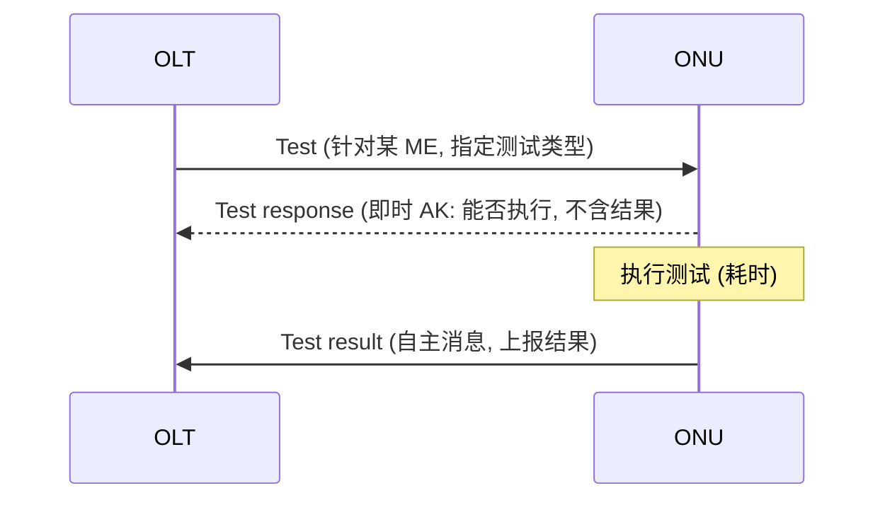

# OMCI 远程诊断：Test / Test response / Test result 与 AVC

> 除了配置（Create/Set/Get），OMCI 还提供**远程诊断**：OLT 下发 **Test** 命令触发 ONU 自检或线路测试，ONU 用 **Test response** 即时确认能力，随后用 **Test result** 异步上报结果；属性变化则由 **AVC** 自主通知。依据 G.988 §A.1.5、§11.2.2（消息类型表）、§A.2.39/A.3.39（Test result 格式）。

> OMCI 消息格式（baseline/extended）见 [消息格式](message-formats.md)；告警机制见 [告警与 PM](../05-operations/alarms-and-pm.md)。

## 1. 三条消息的关系（§A.1.5）

| 消息 | MT | 方向 | 作用 |
|------|----|------|------|
| **Test** | 18 | OLT→ONU | 触发自检或针对 ME 的具体测试 |
| **Test response** | — | ONU→OLT | 即时 AK：报告 ONU **能否运行**该测试，**不含结果**；成功即意味稍后会有 Test result |
| **Test result** | **27** | ONU→OLT | 自主消息，上报测试**结果** |

- **关联**：受请求测试的 Test result，其 **Transaction Correlation Identifier (TCI)** 与发起 Test 的消息**相同**；**自触发**（ONU 自发自检）的 Test result，**TCI=0**。

## 2. Test result 的几种格式（§A.2.39 / §A.3.39）

| 格式 | 适用 ME | 内容 |
|------|---------|------|
| **Self-test 结果** | ONU-G、circuit pack，或任何支持自检的 ME | 自检通过/失败 |
| **Vendor-specific（通用格式）** | 任何支持的 ME | 厂商自定义结果 |
| **POTS 测试结果** | POTS 相关 ME | MLT（金属线路测试）、拨号音 draw-break 等电话线测试 |
| **光线路监测（Optical line supervision）** | **ANI-G**、RE ANI-G、PPTP RE UNI、RE 上/下行放大器 | 光功率、回损等光层测试 |

> 光线路监测测试是排查光层故障的利器：可远程读 ONU 的收/发光、配合 [告警速查](alarm-reference.md) 的 ANI-G 告警定位光路问题。

## 3. 典型用途

- **ONU 自检**：对 ONU-G/circuit pack 发 self-test，验证硬件健康（开局/巡检）。
- **POTS 线路测试**：对语音口做 MLT，判断用户线开路/短路/外来电压（见 [VoIP 开通](provisioning-voip.md)）。
- **光功率诊断**：对 ANI-G 做光线路监测，读收发光、定位弱光/断纤。
- **Reach Extender**：对 RE 放大器测试，验证中继健康。

## 4. AVC（Attribute Value Change，属性值变化通知）

- **机制**：当 ME 中**支持 AVC** 的属性发生变化时，ONU **自主**上报 AVC 消息（无需 OLT 轮询）。
- **典型可 AVC 属性**：运行状态（operational state）、告警相关计数、光功率读数、动态发现的能力等。
- **价值**：OLT 不必频繁 Get 轮询即可感知状态翻转——事件驱动，省管理带宽。

## 5. 三类自主消息小结

OMCI 的「自主（autonomous）上行消息」共三类，构成 ONU→OLT 的事件通道：

| 自主消息 | 触发 | 见章节 |
|----------|------|--------|
| **Alarm** | 故障置位/清除 | [告警与 PM](../05-operations/alarms-and-pm.md) / [告警速查](alarm-reference.md) |
| **AVC** | 属性值变化 | 本篇 §4 |
| **Test result** | 测试完成（含自触发） | 本篇 §1–2 |

## 来源

- **公有标准**：
  - ITU-T G.988 (2024) §A.1.5（Test / Test response / Test result 三者关系：Test 触发自检或具体测试；Test response 即时 AK 报告能否运行、不含结果；Test result 自主上报）。
  - §11.2.2 Table 11.2.2-1 OMCI message types（MT 18 Test、MT 26 Get next、MT 27 Test result 等）。
  - §A.2.39 / §A.3.39 Test result（TCI 关联规则：请求测试沿用发起 TCI，自触发 TCI=0；格式：self-test ONU-G/circuit pack、vendor-specific 通用格式、POTS MLT/拨号音、§A.x.39.5 光线路监测 ANI-G/RE ANI-G/PPTP RE UNI/RE 放大器）。
  - AVC：G.988 自主属性值变化通知（各 ME Notifications 标注哪些属性支持 AVC）。
- 说明：MT 编号与格式分类以 G.988 §11.2.2 与 §A.x.39 原文为准；用途（§3）为工程归纳。
