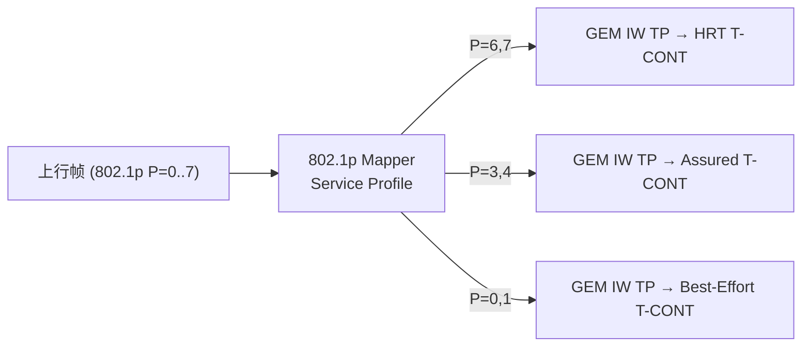
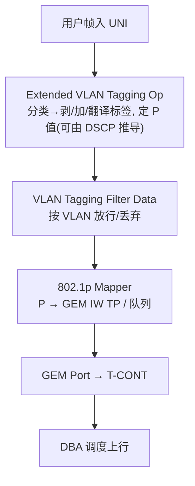

# VLAN 与 QoS 建模（OMCI）

> 用户业务在 ONU 上要做 **VLAN 分类/打标/翻译** 与 **QoS 优先级映射**。OMCI 用一组 ME 表达这些规则，核心是 **Extended VLAN Tagging Operation Configuration Data**（增强 VLAN 操作）与 **802.1p Mapper Service Profile**（优先级到队列映射）。本篇梳理这套建模。依据 G.988 §9.3.11/12/13 与 §9.3.x mapper。

> ME 速查见 [ME 速查表](me-reference.md)；HSI 主干见 [HSI 配置链路 ⭐](provisioning-hsi.md)。

## 1. 三个 VLAN 相关 ME 及其先后顺序


| ME | Class | 作用 | 说明 |
|----|-------|------|------|
| **Extended VLAN Tagging Operation Config Data** | 171 | VLAN 分类 + 打标/翻译/剥离 | §9.3.13，**新实现首选** |
| VLAN Tagging Operation Config Data | 78 | 旧版简单打标 | §9.3.12，已不推荐 |
| **VLAN Tagging Filter Data** | 84 | 按 VLAN 过滤 | §9.3.11，挂在 MAC bridge port 上 |

> 顺序（上行）：**打标在前、过滤在后、再桥接**；下行做对称逆操作。

## 2. Extended VLAN Tagging Operation（§9.3.13）—— 核心

这是 PON 上 VLAN 处理的「主力 ME」，靠一张 **Received Frame VLAN Tagging Operation Table** 表达规则。

### 2.1 规则 = 过滤部分 + 处理部分

每条表项 = **过滤（前 8 字段）** + **处理（后 7 字段）**。上行每个包**按列表顺序逐条匹配，第一条命中即生效**。

三类规则（按收到帧的标签数分开匹配，互不串用）：

| 类别 | 适用帧 |
|------|--------|
| zero-tag | 无标签帧 |
| single-tag | 单标签帧 |
| double-tag | 双标签帧 |

> 单标签规则**不应**作用于双标签帧，即使「看起来」能匹配——三类逻辑上彼此独立。

### 2.2 过滤字段（Filter，匹配条件）

```
Word 1: Filter outer [priority | VID | TPID/DEI] + pad
Word 2: Filter inner [priority | VID | TPID/DEI] + 扩展准则 + Ethertype
```

- **outer/inner priority、VID、TPID/DEI**：分别匹配外层/内层标签的 802.1p 优先级、VLAN ID、TPID/DEI。
- **Filter Ethertype / 扩展准则**：可按 EtherType（如 IPoE/PPPoE）等额外条件分类。

### 2.3 处理字段（Treatment，命中后怎么做）

```
Tags to remove (剥几层标签: 0/1/2)
Word 3: Treatment outer [priority | VID | TPID]
        Treatment inner [priority | VID | TPID/DEI]
```

关键编码（节选 G.988 §9.3.13）：

| 处理项 | 取值含义（示例） |
|--------|------------------|
| Tags to remove | 先剥 0/1/2 层标签，再按下面规则加标签 |
| **Treatment inner priority** | `0..7` 用作 P 值；`8` 从外层优先级拷贝；`9` 从收到帧外层优先级拷贝；**`10` 由 DSCP 经「DSCP→P-bit 映射」推导**；`15` 不加内层标签 |
| **Treatment inner VID** | `0..4094` 用作 VID；`4096` 拷贝收到帧内层 VID；`4097` 拷贝外层 VID |
| **Treatment inner TPID/DEI** | `000` 拷贝 TPID（及 DEI，若有）… |

> **QoS 落点**：`Treatment priority = 10` + **DSCP to P-bit mapping** 属性，实现「按 IP DSCP 决定 802.1p 优先级」——这是把 L3 QoS 映射到 L2 的标准手段。

### 2.4 关联位置与方向（code points）

- 通过 **code point** 指定本 ME 关联在 **ANI 侧** 还是 **UNI 侧**（与 MAC bridge port 的位置相关；如 0/1/5/6/11 等）。
- **方向语义**：
  - 关联 **UNI 侧**：上行**入向（ingress）** 规则；当 `downstream mode=0` 时也作下行**出向（egress）** 逆操作。
  - 关联 **ANI 侧**：上行**出向（egress）** 规则；`downstream mode=0` 时作下行**入向（ingress）** 规则。
- **Enhanced mode**：是否支持增强分类由 **ONU3-G** ME 的 Enhanced mode 属性指示；`Received frame VLAN tagging operation table max size` 指示表容量。

## 3. 802.1p 优先级到队列：802.1p Mapper Service Profile

- **802.1p Mapper Service Profile**（Class 130）：把 **8 个 802.1p 优先级（0–7）** 各映射到一个 **GEM Interworking TP / 队列**，实现「不同优先级走不同 T-CONT/调度等级」。
- 与 [DBA T-CONT](../03-dba/tcont-types.md) 联动：高优先级 P 映射到 HRT/Assured T-CONT，低优先级映射到 Best-Effort，形成端到端 QoS。



## 4. 典型上行处理链（整合）



## 5. 工程要点

- **规则顺序敏感**：表是「首次命中」语义，规则排序错误会导致分类错乱；调试先看命中的是哪条。
- **新旧 ME**：新实现一律用 Extended（§9.3.13），别用已废弃的 §9.3.12。
- **三类标签隔离**：zero/single/double-tag 规则分桶，配置时注意帧实际标签数。
- **端到端 QoS**：VLAN 优先级（L2）+ DSCP（L3）+ Mapper→T-CONT（PON 调度）三者要一致规划，避免优先级在某一跳被「抹平」。

## 来源

- **公有标准**：
  - ITU-T G.988 (2024) §9.3.13（Extended VLAN tagging operation config data：Received frame VLAN tagging operation table = 8 过滤字段 + 7 处理字段、首次命中、zero/single/double-tag 三类；Figure 9.3.13-1 布局；Treatment inner priority 含 10=由 DSCP 经 DSCP→P-bit 映射推导、15=不加标签；Treatment inner VID 4096/4097 拷贝；code point 关联 ANI/UNI 与 downstream mode 方向语义；Enhanced mode via ONU3-G；table max size）。
  - §9.3.12（VLAN tagging operation config data，已不推荐）、§9.3.11（VLAN tagging filter data，挂 MAC bridge port，过滤在桥侧）。
  - 802.1p Mapper Service Profile（§9.3.x，8 优先级→GEM IW TP/队列）。
- **工程实现**：`gopon/common/omci/me_g988.go`（VLAN 相关 ME 注册）；`liteaggregator` 业务建模。
- 说明：处理字段取值为 §9.3.13 节选；全集与逐位布局以 G.988 原文 Figure 9.3.13-1 为准。
