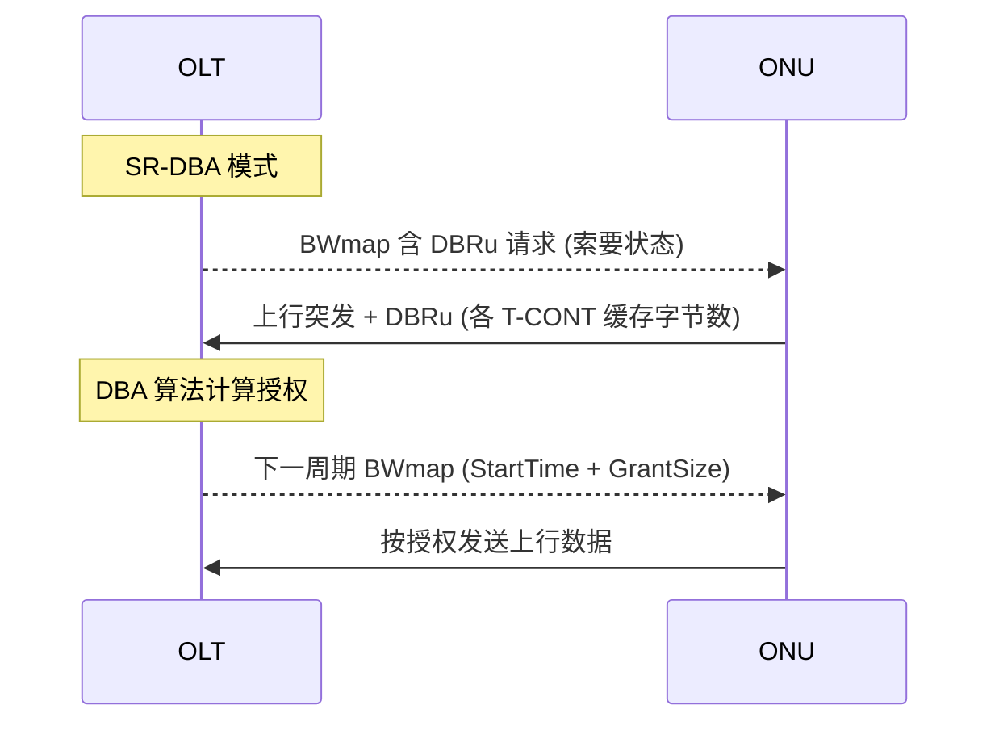
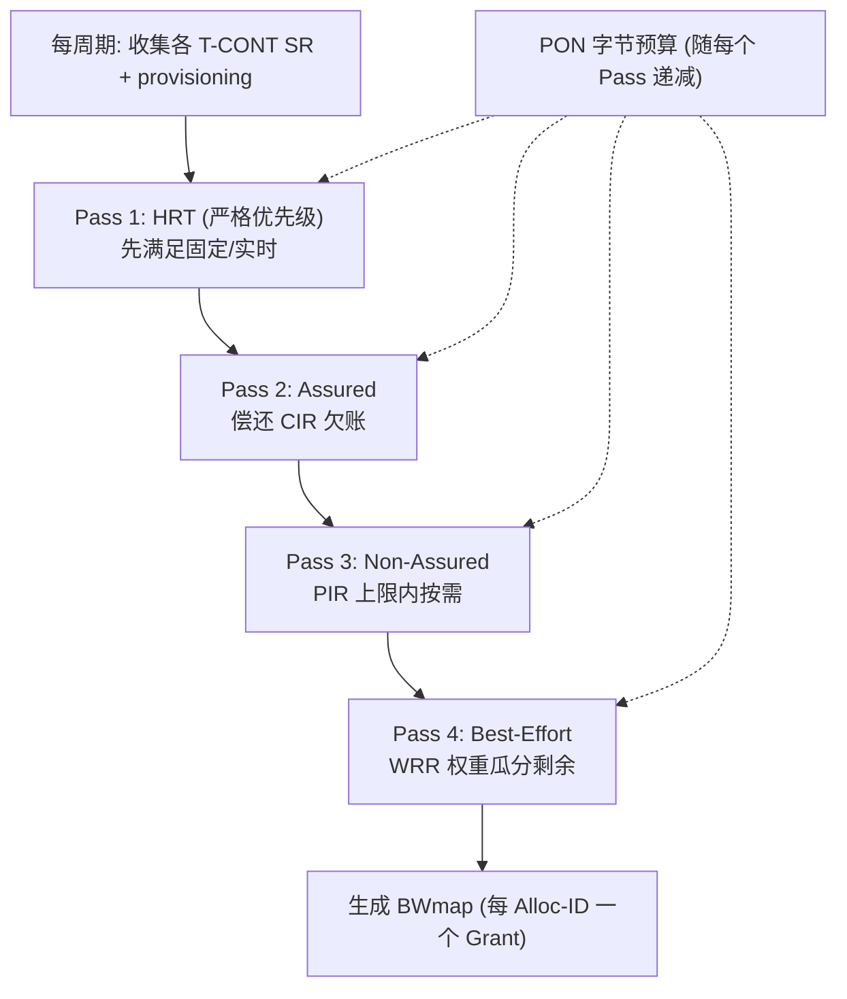

# DBA 动态带宽分配算法原理 ⭐

> 本篇梳理 DBA（Dynamic Bandwidth Assignment）的核心调度逻辑：SR-DBA 与 NSR-DBA（TM-DBA）的区别、状态上报（DBRu/SR）与带宽授权（BWmap）的闭环，以及一个真实的分级调度内核（HRT → Assured → Non-Assured → Best-Effort）是怎样运转的。

## 1. DBA 解决什么问题

PON 上行是**共享 TDMA** 信道：OLT 必须决定「哪个 ONU 的哪个 T-CONT，在哪个时隙，发多少字节」。相对静态分配，DBA 根据 ONU 的**实时活动**自适应分配，带来两大收益（G.9807.1 C.7.2）：

1. **更高接入密度**：带宽利用率提升 → 同一 PON 可挂更多用户；
2. **更好业务体验**：支持突发型业务的峰值速率超过静态可分配的水平。

```mermaid
flowchart LR
    ONU["ONU<br/>各 T-CONT 缓存"] -->|DBRu / Status Report| OLT
    OLT -->|DBA 算法| SCHED["上行调度器"]
    SCHED -->|BWmap (授权)| ONU
    OLT -.->|观察空闲 XGEM 帧| TM["流量监测 (TM)"]
    TM --> SCHED
```

## 2. 两种活动指示方法：SR-DBA vs NSR-DBA

OLT 推断 ONU 缓存占用有两种机制（G.9807.1 C.7.2.3）：

| 方法 | 机制 | 别名 | 标准定位 |
|------|------|------|----------|
| **SR-DBA** | ONU **显式上报**缓存占用（OLT 索要，ONU 用 DBRu/Status Report 回复） | Status Reporting DBA | 信令格式标准化，保证多厂商互通 |
| **NSR-DBA** | OLT **观察**上行空闲 XGEM 帧模式，与 BWmap 对比反推需求 | TM-DBA (Traffic Monitoring) | OLT 侧实现，算法私有 |

标准要点：

- XGS-PON OLT **应支持 TM 与 SR 的组合**；XGS-PON ONU **必须支持 SR**，并按 OLT 指示发送上行 DBA 报告。
- **SR 信令是 TC 层规范的固有部分**（在带内，详见 G.9807.1 C.8.1.2.2）；而**调度算法本身、TM-DBA 的完整规范、BWmap 的生成逻辑都不在标准范围内，由 OLT 厂商实现**。

> 这正是「PON 工程师核心壁垒」所在：标准只规定了**接口与信令**（SR 报告格式、BWmap 格式），把**调度算法**留给厂商 —— 算法是真正的差异化竞争力。



## 3. DBA 闭环的三要素

| 要素 | 方向 | 内容 |
|------|------|------|
| **Status Report / DBRu** | 上行 | 每个活跃 T-CONT 的待发字节数（缓存深度） |
| **DBA 算法** | OLT 内部 | 在 PON 容量约束下，把字节预算按契约公平分给各 T-CONT |
| **BWmap** | 下行 | 每个 Alloc-ID 的授权：StartTime（何时发）+ GrantSize（发多少） |

## 4. 一个真实分级调度内核

下面以 `gopon` 移植自 `liteaggregator` 生产代码的 `swbwm` 内核为例，看一个**按 policy class 分级**的 DBA 是怎样运转的。它实现了：跨周期 rate-count（CIR 欠账）、四类 policy 分桶、per-ONU FEC 开销预留、per-PON BWmap 记账。

### 4.1 调度顺序：按 PolicyClass 分级



策略类与标准 T-CONT 类型的对应见 [tcont-types.md](tcont-types.md)。核心思想：**多遍（multi-pass）调度，每遍处理一个 PolicyClass，PON 字节预算随之收缩** —— 高优先级先吃，吃饱后剩余的才轮到低优先级。

### 4.2 简化版调度逻辑（DBA-lite）

`gopon` 还有一个教学用的 `Schedule`，把核心算法浓缩成三步，注释本身就是一份算法说明：

```36:60:/home/mingheh/project/gopon/common/dba/scheduler.go
// Schedule runs one DBA cycle for one ONU. ...
//
//  1. Convert every CIR to a cycle-byte budget (cir_bps × cycle_len ÷ 8).
//     This is the *guaranteed* allocation: it is awarded even if the
//     SR shows no demand, because in G-PON every CIR T-CONT also gets
//     an idle frame opportunity.
//  2. Compute remaining demand per T-CONT (SR.BytesPending minus the
//     CIR allocation, floored at 0).
//  3. Walk T-CONTs in weight-descending order (policy 2 / WRR weights
//     drive the sort; strict-priority T-CONTs get weight 255 implicit).
//     Each gets up to (remaining_demand, pir_cycle_budget) until the
//     PON's per-cycle byte budget is exhausted.
```

三步拆解：

1. **保证分配（CIR 切片）**：把每个 T-CONT 的 CIR 换算成「每周期字节预算」(`cir_bps × cycle ÷ 8`)，**即使 SR 显示无需求也照给** —— 因为 CIR 类 T-CONT 在 GPON 里也会拿到空闲帧机会。
2. **计算超额需求**：`remaining = SR.BytesPending − CIR分配`（下取 0）。
3. **按权重降序分配**：严格优先级（policy=0）隐式权重 255 排最前，WRR（policy=2）按权重排序；每个 T-CONT 在 `(剩余需求, PIR 上限)` 之间取量，直到 PON 周期字节预算耗尽。

授权上限受 **PIR 天花板**与 **PON 容量**双重约束：

```99:131:/home/mingheh/project/gopon/common/dba/scheduler.go
	for _, p := range order {
		cir := bpsToBytes(p.CirBps)
		pir := bpsToBytes(p.PirBps)
		...
		// Guaranteed CIR slice.
		grant := cir
		// Remaining demand above CIR.
		remaining := demand[p.AllocID]
		if remaining > cir {
			extra := remaining - cir
			// PIR ceiling.
			if grant+extra > pir {
				extra = pir - grant
				...
			}
			grant += extra
		}
		// PON-level cap.
		if spent+grant > ponBudget {
			grant = ponBudget - spent
		}
		spent += grant
		...
	}
```

### 4.3 优先级权重的统一表达

不同 policy 用一个「有效权重」函数统一排序，体现了「严格优先级 > 实时 > WRR」的层次：

```157:176:/home/mingheh/project/gopon/common/dba/scheduler.go
func effectiveWeight(p TcontProfile) int {
	switch p.Policy {
	case 0:
		// strict priority: always first
		return 255 + int(p.Weight)
	case 2:
		w := int(p.Weight)
		if w == 0 {
			w = 1
		}
		return w
	default:
		// "hard real time" and anything else: between SP and WRR.
		w := int(p.Weight)
		if w == 0 {
			w = 1
		}
		return 100 + w
	}
}
```

## 5. 周期与 FEC 开销

- **DBA 周期**：生产 OLT 的 DBA 通常按 **125 µs（G.984 帧时间）** 运行；`gopon` 仿真栈为了便于观察用了更慢的周期，但换算逻辑（bps ↔ bytes/cycle）一致。
- **FEC 开销预留**：上行启用 FEC（如 **RS(248,216)**，开销 ≈ (248−216)/216 ≈ **14.8%**）时，调度器要从 PON 预算里**预留**这部分，否则授权的「净荷字节」会因 FEC 编码膨胀而超出物理容量。swbwm 内核按 per-ONU burst profile 推导 FEC 比例并预留。

## 6. 与帧/PLOAM 的关系

- BWmap 承载在下行帧头部；StartTime/GrantSize 直接驱动 ONU 在 O5 状态下的上行突发（见 [激活状态机](../01-protocol-stack/gpon-g984/activation-state-machine.md) 中的 Data grant 事件）。
- DBRu 标志位由 BWmap 的 grant allocation structure 控制（`DBRu` flag）。

## 延伸阅读

- [T-CONT 类型与带宽参数 ⭐](tcont-types.md)
- [GPON 帧结构](../01-protocol-stack/gpon-g984/frame-structure.md)

## 来源

- **公有标准**：
  - ITU-T G.9807.1 (2023) C.7.2 "Dynamic bandwidth assignment overview"（DBA 收益、显式/隐式活动指示）。
  - G.9807.1 C.7.2.3 "DBA methods"（SR-DBA 与 TM-DBA 定义；OLT 应支持 TM+SR 组合，ONU 必须支持 SR；调度算法与 BWmap 生成由厂商实现）。
  - G.9807.1 Annex A.9.3（DBA 总体要求、SR/TM 两种方法、参考模型与差异度量）。
  - BBF TR-156 Appendix A（Traffic Descriptor 与严格优先级 / 加权调度示例）。
  - 缩略语：DBRu (Dynamic Bandwidth Report, upstream)、BWmap (Bandwidth Map)、SR/TM-DBA、CIR/PIR/BE/NA（G.9807.1 §4）。
- **工程实现**：`gopon/common/dba/scheduler.go`（DBA-lite 三步算法、PIR/PON-cap 约束、effectiveWeight 优先级）、`gopon/common/dba/swbwm/allocator.go`（HRT/Assured/Non-Assured/Best-Effort 多遍分级调度、RS(248,216) FEC 开销预留、跨周期 rate-count）；liteaggregator `src/glob/swbwm`、`modular_dba`、`unified_dba`、`dba_xglob`（生产级 DBA 内核来源）。
