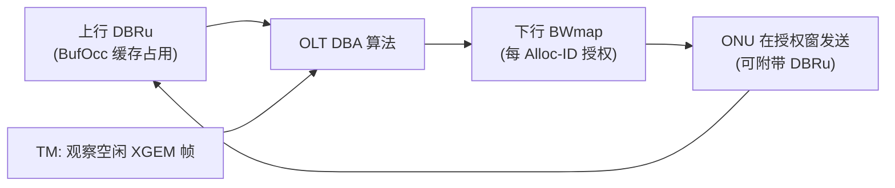

# DBRu 与 BWmap 字段级格式

> DBA 的两个关键 on-wire 结构：上行 **DBRu（Dynamic Bandwidth Report upstream）** 携带缓存占用上报（SR-DBA 的「需求输入」），下行 **BWmap** 携带授权（DBA 的「分配输出」）。本篇补齐 XGS-PON 的字段级定义（G.9807.1 §C.8）。XG-PON（G.987.3）相同。

> 概念与调度逻辑见 [DBA 算法原理 ⭐](dba-algorithms.md)；本篇专注 wire format。

## 1. 闭环中的位置



- **SR-DBA**：OLT 用 BWmap 的 **DBRu flag** 索要上报；ONU 在被授权的上行突发里**捎带（piggyback）** 一个 DBRu。
- **TM-DBA（NSR）**：OLT 不索要上报，而是**观察上行是否填充空闲 XGEM 帧**，与 BWmap 比对来推断占用（见 §4）。

## 2. DBRu 结构（G.9807.1 §C.8.1.2.2）

DBRu 是「分配开销（allocation overhead）」，**是否出现由 BWmap 中该 allocation 的 DBRu flag 控制**。固定 **4 字节**：

```
 0                   1                   2                   3
+-------------------------------------------+-------------------+
|              BufOcc (3 bytes)              |    CRC (1 byte)   |
+-------------------------------------------+-------------------+
```

| 字段 | 长度 | 含义 |
|------|------|------|
| **BufOcc**（buffer occupancy） | 3B | 该 Alloc-ID 名下**所有缓冲**聚合的待发 SDU 量，以 **4 字节为单位**表示 |
| **CRC** | 1B | 保护 DBRu 结构的循环冗余校验 |

### 2.1 BufOcc 的计量规则（C.8.1.2.2.1）

BufOcc 报告的是 SDU 流量总量（以 4B 为单位）。单个长度为 `L` 字节的 SDU 对上报值的贡献 `W`：

- 直觉：把每个 SDU 的字节数**按 4 字节向上取整**（`⌈L/4⌉`），并计入封装开销，使 OLT 能据此授权「够用」的带宽。
- 关键点：上报的是**逻辑缓存深度**，与 ONU 内部真实队列/XGEM 端口结构无关——这正是 [DBA 抽象](dba-algorithms.md)（C.7.2.1）把每个 Alloc-ID 当作**单一逻辑缓冲**的体现。

> 即：BufOcc 回答 OLT 一个问题——「这个 Alloc-ID 现在还有多少（以 4B 计）数据等着发？」

## 3. BWmap 与 allocation 结构

下行 BWmap 是若干 **allocation structure** 的数组，每个对应一次对某 Alloc-ID 的上行授权。每个 allocation structure 关键字段（G.9807.1 §C.8）：

| 字段 | 含义 |
|------|------|
| **Alloc-ID** | 被授权的分配实体 |
| **StartTime** | 上行突发的起始时刻（字时间） |
| **GrantSize / StopTime** | 授权的长度 |
| **DBRu flag** | 置位则要求 ONU 在本次突发**捎带 DBRu** |
| **FWI** | Forced Wake-up Indication，唤醒省电 ONU（见 [省电](../05-operations/power-management.md)） |
| **burst profile 指示等** | 选择上行突发 PHY 参数 |

> GrantSize=0 + 仅置 PLOAMu/DBRu，是**纯信令授权**（如测距 grant、索要上报），见 [测距与激活](../01-protocol-stack/gpon-g984/ranging-activation.md)。

## 4. SR vs TM 两种活动推断（C.7.2.3）

| 方法 | 占用推断 | 优点 | 缺点 |
|------|----------|------|------|
| **SR-DBA**（status reporting） | 显式 DBRu 上报 | 准确、响应快 | 占用少量上行开销 |
| **TM-DBA**（traffic monitoring，即 NSR） | OLT 观察**空闲 XGEM 帧模式**与 BWmap 比对 | 零上报开销、对 ONU 透明 | 推断滞后、精度低 |

G.9807.1 要求 OLT **同时支持 SR 与 TM 的组合**，并按 C.7.2.2 的功能在「高效且公平」的前提下完成 DBA。

## 5. DBA 功能要求（C.7.2.2）

对每个 Alloc-ID 及其契约参数，DBA 闭环要做四件事：

1. **推断**逻辑上行缓存占用状态（SR 或 TM）；
2. 在契约参数（CIR/PIR 等）范围内**更新**瞬时分配带宽；
3. 按更新后的带宽**下发授权**（BWmap）；
4. **管理** DBA 运行（公平性/效率度量：整体利用率、单 ONU 性能达标）。

## 来源

- **公有标准**：
  - ITU-T G.9807.1 (2023) §C.8.1.2.2（Allocation overhead：DBRu 4 字节，出现由 BWmap allocation 的 DBRu flag 控制）、§C.8.1.2.2.1（BufOcc 3 字节，按 4 字节单位聚合 Alloc-ID 名下全部缓冲的 SDU 量，单 SDU 贡献 W 计量规则）。
  - §C.7.2（DBA 概述）、§C.7.2.1（DBA 抽象：每 Alloc-ID 视为单一逻辑缓冲、互为对等）、§C.7.2.2（DBA 功能要求四步）、§C.7.2.3（SR vs TM 两方法，OLT 须支持二者组合）、§A.9.3（OLT 须支持 DBA）。
- 说明：BWmap allocation 结构字段为 §C.8 的归纳；BufOcc 贡献公式 `W` 的精确分段以 G.9807.1 C.8-1 原文为准。
