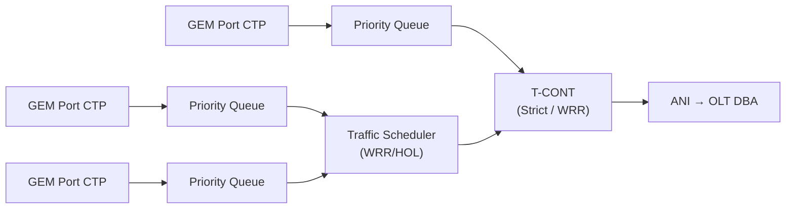

# 端到端 QoS 调度与带宽分配数值案例

> 把 [T-CONT 类型](tcont-types.md)、[DBA 算法](dba-algorithms.md) 与 [OMCI 数据通道](../02-omci/datapath-l2-model.md) 串成可算的例子：业务如何映射到队列/调度器/T-CONT，OLT 又如何在一条 PON 上把带宽分给多个 ONU。依据 G.984.3 §7.4.4（流量描述符）、G.988 附录 I/II（队列与调度器）、BBF TR-156 §5.2.4 / 附录 A。

## 1. 上行调度三级模型（G.988 附录 I）



- **Priority Queue** 的 `Traffic scheduler pointer` 决定挂到 **Traffic Scheduler** 还是直接挂 **T-CONT**；
- 调度纪律由 **T-CONT policy** + **Traffic Scheduler policy** 组合决定。

### 实现调度纪律的指针配置（Table I.3.3.1.1-1）

| 目标纪律 | T-CONT policy | 有 Traffic Scheduler? | TS policy | PQ 的 scheduler pointer |
|----------|---------------|----------------------|-----------|------------------------|
| **严格优先** | Strict priority | Don't care | Don't care | 指向 **T-CONT**（null TS） |
| **WRR** | （HOL） | Yes | Strict priority | 指向 **Traffic Scheduler** |

- 单 T-CONT 内可有**多队列 + 队间调度**（如 MDU：每 UNI 一队列，避免某用户独占某流量类带宽，G.988 §II.3.3）。

## 2. 流量描述符参数（G.984.3 §7.4.4 / TR-156 §5.2.4）

| 参数 | 含义 | TR-156 要求 |
|------|------|-------------|
| **Fixed (RF)** | 固定带宽，无条件预留 | R-44：基础描述符须支持、可配 |
| **Assured (RA)** | 保证带宽，有流量即给 | R-44 |
| **Max BW (Rm)** | 上限（PIR） | R-44 |
| **type NA / BE** | 非保证 / 尽力而为 | R-44 |
| **Pi、σi** | 扩展尽力而为权重/参数 | R-45：须支持、可配 |

> 对应 [T-CONT 类型](tcont-types.md)：Type1=Fixed、Type2=Assured、Type3=Assured+NonAssured、Type4=BE、Type5=全混合。

## 3. 案例 A：四类业务严格优先（TR-156 附录 A）

一条 PON，ONU1 配 4 个 Alloc-ID（4 个 T-CONT），严格优先：

| ONU | Alloc-ID | 优先级 | 业务示例 |
|-----|----------|--------|----------|
| 1 | 300 | 1（最高） | VoIP（Fixed/HRT） |
| 1 | 400 | 2 | IPTV（Assured） |
| 1 | 500 | 3 | 企业专线（Assured） |
| 1 | 600 | 4（最低） | HSI 上网（BE） |
| 2 | 700 / 800 | … | 另一 ONU |

- OLT DBA 先满足高优先 Alloc-ID，再把剩余带宽给低优先——VoIP 永远优先于上网。

## 4. 案例 B：DBA 带宽分配算例（概念）

设一条对称 10G XGS-PON，上行可用净带宽 ≈ 9 Gbps（扣 [FEC/开销](../01-protocol-stack/fec-principles.md)），挂 3 个 ONU：

| ONU | Fixed | Assured | Max(PIR) | 说明 |
|-----|-------|---------|----------|------|
| A | 1.0G | 1.0G | 4.0G | 企业，强保证 |
| B | 0 | 2.0G | 6.0G | IPTV |
| C | 0 | 0 | 8.0G | 纯上网 BE |

**分配逻辑（SR-DBA，按 [DBA 算法](dba-algorithms.md)）**：

```
1) 先发 Fixed:        A=1.0G                      → 已用 1.0G
2) 再按需发 Assured:  A 有流量→+1.0G, B→+2.0G      → 已用 4.0G
3) 剩余 5.0G 分 Non-Assured/BE（按权重/PIR 上限）:
   A 还能到 4.0G(还差2.0G), B 到6.0G(还差4.0G), C 到8.0G
   剩余 5.0G 按需+公平分配, 受各自 PIR 封顶
4) DBRu 报告缓冲占用→下个周期 BWmap 动态调整
```

- **关键**：Fixed/Assured 必先满足（保证 SLA），剩余才进入竞争；任何 ONU 不超其 **PIR**。
- ONU 通过 **DBRu** 上报缓冲占用，OLT 据此在下一 [BWmap](dbru-bwmap-format.md) 周期重算（见 [DBA 算法](dba-algorithms.md) 的收敛/公平性）。

## 5. 端到端对齐要点

- **下行**：OLT 侧分类/调度（不在 OMCI 范围），但 ONU 侧队列应与上行 QoS 一致；
- **标签到队列**：UNI 报文经 [VLAN/QoS 建模](../02-omci/vlan-qos-modeling.md) 的 P-bit/DSCP 映射决定进哪个 GEM Port→队列；
- **队列到 T-CONT**：经 Priority Queue→Traffic Scheduler→T-CONT，最终由 DBA 授权上行；
- 全链路一致才能保证 VoIP/IPTV 的端到端时延与带宽（见 [datapath 全景](../02-omci/datapath-l2-model.md)）。

## 来源

- **公有标准 / BBF**：
  - ITU-T G.988 附录 I（队列/调度器配置：Priority Queue `Traffic scheduler pointer`、Table I.3.3.1.1-1 调度纪律↔指针；显式调度器配置 §I.3.4.2；ONU2-G 指示 flexible scheduler）、附录 II.3.3（MDU 多队列/T-CONT、每 UNI 一队列）。
  - ITU-T G.984.3 §7.4.4.3（流量描述符 Fixed/Assured/Max BW、type NA/BE；扩展 BE 参数 Pi/σi）。
  - BBF TR-156（§5.2.4 Traffic Management：R-44 基础描述符须支持可配、R-45 扩展 BE 参数；附录 A 四类严格优先 Alloc-ID 例 ONU1 300/400/500/600、ONU2 700/800）。
- 说明：案例 A 引自 TR-156 附录 A；案例 B 数值为说明性算例（工程归纳），分配优先级逻辑与描述符语义以标准为准。
