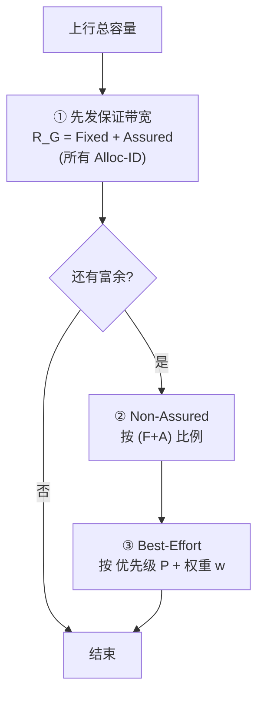

# DBA 参考模型与性能度量

> ITU-T 不规定 DBA 的具体算法（那是厂商壁垒），但**规定了一个「理想分配」参考模型**和**一组性能指标**，用来判定任何实现是否「公平且高效」。本篇梳理 G.9807.1 §C.7.3（带宽分量模型）与 §C.7.4（性能度量：稳态偏差、恢复时间、收敛时间）。

> T-CONT 类型与 Traffic Descriptor 概念见 [T-CONT 类型 ⭐](tcont-types.md)；调度内核见 [DBA 算法 ⭐](dba-algorithms.md)；DBRu/BWmap 格式见 [DBRu/BWmap](dbru-bwmap-format.md)。本篇是它们的「理论基准」。

## 1. Traffic Descriptor 的通用形式（§C.7.1.1）

每个 Alloc-ID 的带宽契约用一个六元组描述：

```
D = ( R_F , R_A , R_m , x_AB , P , w )
```

| 参数 | 含义 |
|------|------|
| **R_F** Fixed bandwidth | 预留带宽，**无论有无流量都保留** |
| **R_A** Assured bandwidth | 有需求时**保证**提供的带宽 |
| **R_m** Maximum bandwidth | 该 Alloc-ID 的**上限**（PIR） |
| **x_AB** | 额外带宽资格（三态）：`none` / `NA`(non-assured) / `BE`(best-effort) |
| **P** | best-effort 的优先级 |
| **w** | best-effort 的权重 |

> 对照 [T-CONT 类型](tcont-types.md)：T-CONT 1≈纯 Fixed，T2≈Assured，T3≈Assured+Non-Assured，T4≈Best-Effort，T5≈全混合。

## 2. 已分配带宽的分量（§C.7.3.3）

任一时刻分配给 Alloc-ID 的带宽 `R'(t) ≥ 0` 由**保证分量**与**额外分量**组成：

```
R'(t) = R'_G(t)              ; x_AB = None
R'(t) = R'_G(t) + R'_NA(t)   ; x_AB = NA   (非保证)
R'(t) = R'_G(t) + R'_BE(t)   ; x_AB = BE   (尽力而为)
```

- **保证带宽 R'_G** = Fixed + Assured（按需提供，优先满足）。
- **额外带宽**：保证分量分配完后，链路**富余容量**再按规则发放：
  - **Non-Assured（§C.7.3.5）**：按各 Alloc-ID 的 **(Fixed+Assured) 之和成比例**分配（rate-proportional）。
  - **Best-Effort（§C.7.3.6）**：按 **优先级 P + 权重 w** 分配剩余容量。



> 这正是 [DBA 算法](dba-algorithms.md) 多趟调度内核（HRT→Assured→Non-Assured→Best-Effort）的**理论出处**。

## 3. 性能度量（§C.7.4）—— 如何判定「够好」

ITU 用三个可测指标约束实现的质量。带宽测量都以 **K 个连续帧的平均**（K 足够大以平滑帧间抖动）为准。

### 3.1 稳态分配偏差（§C.7.4.1）

系统稳定（活动与需求不变）时：

> 每个**未饱和** Alloc-ID 的稳态分配带宽，应 **≥ 其 Fixed + Assured**，且与按 §C.7.3 参考模型算出的动态值偏差在**约 10%** 以内。

### 3.2 Assured 带宽恢复时间（§C.7.4.2）

> 某 Alloc-ID 因需求不足而暂未拿到 Assured，**当它把需求重新提到 ≥ Fixed+Assured** 起，到**实际拿满 Fixed+Assured** 止的**最坏时间**。衡量 DBA「重新供给保证带宽」有多快。

### 3.3 DBA 收敛时间（§C.7.4.3）

> 系统中**任一 ONU 发生一次活动/负载变化**起，到 OLT 把所有未饱和 ONU 的分配调整到**≥ Fixed+Assured 且在参考动态值约 20% 以内**止的**最坏时间**。衡量 DBA 对突发变化的整体响应速度。

| 指标 | 衡量什么 | 参考界 |
|------|----------|--------|
| 稳态偏差 | 静态下分配是否贴合理想 | ~10% |
| Assured 恢复时间 | 保证带宽回供速度 | 最坏时间 |
| 收敛时间 | 对变化的整体响应 | ~20% |

## 4. 公平性的两种诠释

参考模型支持把同一套机制 provision 成不同**公平策略**：

| 策略 | provision 方式（§C.7.3.5/6） |
|------|------------------------------|
| **速率成比例**（rate-proportional） | 额外带宽资格设 NA；按各自 (F+A) 比例分富余 |
| **优先级+权重**（priority/weighted） | 额外带宽资格设 BE；同优先级内按权重 w，跨优先级严格优先 |

> 即：要「按签约比例公平」就用 Non-Assured；要「高优先业务优先 + 同级按权重」就用 Best-Effort。运营商按 SLA 选择。

## 5. 工程要点

- **参考模型≠实现**：标准只给「理想答案 + 容差」，厂商算法只要落在容差内即算合规——这给了实现优化空间，也是壁垒所在。
- **未饱和才考核**：指标只约束**未饱和**（需求 < 可得）的 Alloc-ID；饱和流（需求无限）天然被 PIR/容量截断。
- **K 帧平均**：单帧 BWmap 可能波动，考核看多帧平均，避免对瞬时调度过苛。
- **测量落地**：互通/性能测试用这些定义做 Pass/Fail（见 [互通测试](../06-interop/test-plan-overview.md)）。

## 来源

- **公有标准**：
  - ITU-T G.9807.1 (2023) §C.7.1.1（Traffic descriptor 形式 D=(R_F,R_A,R_m,x_AB,P,w)）、§C.7.3.3（已分配带宽分量：保证 R_G=Fixed+Assured + 额外 NA/BE）、§C.7.3.5（Non-Assured 按 F+A 比例）、§C.7.3.6（Best-Effort 按优先级+权重）、§C.7.4.1（稳态分配偏差 ~10%）、§C.7.4.2（Assured 恢复时间）、§C.7.4.3（收敛时间 ~20%）、§A.9.3（OLT 须支持 DBA，含参考模型）。
- **工程实现**：`gopon/common/dba/scheduler.go`、`dba/swbwm/allocator.go`（保证→额外的多趟分配映射）。
- 说明：分量分配流程与公平性诠释为基于参考模型的归纳；精确方程（C.7-6a/b/c、C.7-14 等）与容差以 G.9807.1 原文为准。
