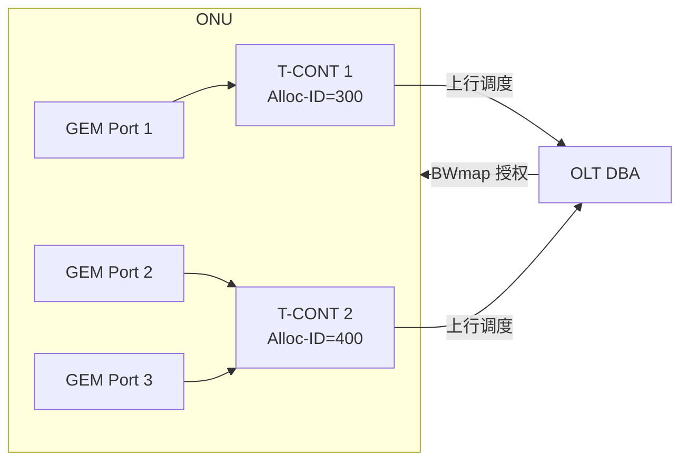

# T-CONT 类型与带宽参数 ⭐

> 本篇梳理 T-CONT（Transmission Container）这一上行调度的基本单元：5 种类型、它们对应的带宽参数（Fixed / Assured / Non-Assured / Best-Effort），以及如何通过 OMCI Traffic Descriptor 把这些参数下发到 ONU。

## 1. 什么是 T-CONT

在 PON 上行方向，多个 ONU 共享同一根光纤，OLT 通过 **DBA** 把上行时隙分配给各 ONU。分配的**基本单元**就是 **T-CONT**：

- 每个 T-CONT 由一个**全 PON 唯一**的 **Alloc-ID** 标识；
- OLT 为每个 Alloc-ID 关联一个 **Traffic Descriptor**，定义其 DBA 处理方式（优先级、权重、保证/最大带宽）；
- 一个 ONU 可有多个 T-CONT，分别承载不同 QoS 等级的业务（如 HSI、VoIP、IPTV）；
- 业务流（GEM Port）通过 OMCI 的 `GEM Port Network CTP.tcont_pointer` 绑定到 T-CONT（见 [OMCI HSI 配置](../02-omci/provisioning-hsi.md)）。



## 2. 五种 T-CONT 类型

T-CONT 的类型由其带宽参数组合决定。带宽参数（G.984.3 扩展带宽分配模型）：

- **Fixed (RF)**：固定带宽，无论有无流量都预留（低时延、强实时）。
- **Assured (RA)**：保证带宽，有需求时一定满足。
- **Maximum (RM)**：峰值/最大带宽上限。
- **Best-Effort / Non-Assured**：剩余带宽按优先级/权重瓜分。

| 类型 | 别名 | 带宽构成 | 典型业务 | 时延特性 |
|------|------|----------|----------|----------|
| **Type 1** | Fixed | 仅 RF（固定预留） | TDM / E1 / 强实时 VoIP | 最低时延、零抖动 |
| **Type 2** | Assured | 仅 RA（保证，非固定预留） | 关键数据、企业专线 | 低时延 |
| **Type 3** | Assured + Non-Assured | RA + 可超额到 RM | 视频、突发型业务 | 中等 |
| **Type 4** | Best-Effort | 仅 BE（≤ RM，无保证） | HSI 上网 | 尽力而为 |
| **Type 5** | Mixed | RF + RA + NA + BE 组合 | 综合业务 ONU | 混合 |

> 直观理解：**Type 1 牺牲带宽利用率换确定性**（即使没流量也占着）；**Type 4 牺牲确定性换利用率**（有剩余才给）；Type 2/3/5 在两者之间。DBA 调度时通常 **Fixed > Assured > Non-Assured > Best-Effort** 的优先级降序。

## 3. Traffic Descriptor：把参数下发到 ONU

带宽参数通过 OMCI 的 **Traffic Descriptor ME** 配置，并由 `GEM Port Network CTP` 的 TD 指针引用。BBF TR-156 Appendix A 给出了 G.984.3 扩展模型的 Traffic Descriptor 字段：

> 对 Alloc-ID = *i*，traffic descriptor 定义 `(RF, RA, RM, XAB, P_i, w_i)`：
> - `RF` 固定带宽、`RA` 保证带宽、`RM` 最大带宽；
> - `XAB` 资格指示（eligibility indicator，如 BE）；
> - `P_i` 优先级、`w_i` 权重。

### 调度语义（TR-156 两个例子）

- **严格优先级（Strict Priority）**：低优先级 T-CONT 当且仅当所有高优先级 T-CONT 都被满足后，才能分到带宽。
- **优先级 + 权重（Weighted）**：同优先级的 T-CONT 按权重比例瓜分剩余带宽。例如 `P=2` 的两个 Alloc-ID，权重分别为 150 和 1，则前者拿到约 **150 倍**于后者的带宽。

| 例 | RF | RA | RM | 调度 |
|----|----|----|----|------|
| TR-156 Table 2 | 0 | 0 | 1 Gbps | 4 优先级严格优先级 |
| TR-156 Table 3 | 0 | 0 | 1 Gbps | 优先级 + 权重（150:1）|

## 4. 工程实现佐证

`gopon` 把 T-CONT 的带宽契约建模为 `TcontProfile`，字段与标准一一对应（CIR=Assured 量级、PIR=Maximum 量级、policy=调度策略）：

```9:25:/home/mingheh/project/gopon/common/dba/scheduler.go
// TcontProfile is the per-T-CONT bandwidth envelope the scheduler
// honours. Glob fills this in by snooping `omci.downstream` for Set
// ops on T-CONT (class 262) and Traffic Descriptor (class 280) MEs
// targeting the same instance.
//
// CIR / PIR are in bits-per-second (matches G.988's Traffic
// Descriptor wire layout). ...
type TcontProfile struct {
	AllocID  uint16
	Policy   uint8 // 0=null/strict-priority, 1=hard-real-time, 2=WRR
	Weight   uint8 // populated when policy=WRR; defaults to 1
	CirBps   uint64
	PirBps   uint64
	Reason   string // free-form trace ("vendor override applied", ...)
}
```

注意：注释明确说明 OLT 侧通过**监听 `omci.downstream` 上对 T-CONT（class 262）和 Traffic Descriptor（class 280）的 Set 操作**来填充这个 profile —— 这正是 [OMCI 配置](../02-omci/provisioning-hsi.md) 与 DBA 的连接点。

生产级的 `liteaggregator` 把 T-CONT 按 **policy class** 分桶（与标准的 Fixed/Assured/Non-Assured/BE 对应），`gopon` 的 swbwm 移植保留了这套分类：

```134:158:/home/mingheh/project/gopon/common/dba/swbwm/allocator.go
// PolicyClass groups T-CONTs by liteaggregator's policy_level — the
// ...
type PolicyClass uint8

const (
	ClassHardRealTime PolicyClass = iota // policy=0 in OMCI (strict priority)
	ClassAssured                         // policy=1 (CIR-only)
	ClassNonAssured                      // PIR ceiling, no CIR (between 1 and 2)
	ClassBestEffort                      // policy=2 + WRR
)
```

| 标准类型 | swbwm PolicyClass | 含义 |
|----------|-------------------|------|
| Fixed / Type 1 | ClassHardRealTime | 严格优先级，类固定预留 |
| Assured / Type 2 | ClassAssured | 只保证 CIR |
| Non-Assured / Type 3 | ClassNonAssured | 有 PIR 上限、无 CIR |
| Best-Effort / Type 4 | ClassBestEffort | PIR + WRR 权重瓜分 |

## 延伸阅读

- [DBA 算法原理 ⭐](dba-algorithms.md)
- [OMCI HSI 业务配置链路](../02-omci/provisioning-hsi.md)

## 来源

- **公有标准**：
  - BBF TR-156 Issue 4 Appendix A："Each T-CONT is assigned an Alloc-ID ... the OLT associates each Alloc-ID with a traffic descriptor"；Traffic Descriptor 字段 `(RF, RA, RM, XAB, P_i, w_i)`；Table 2（4 优先级严格优先级）、Table 3（优先级+权重 150:1）。
  - ITU-T G.984.3 扩展带宽分配模型（Fixed/Assured/Non-Assured/Best-Effort）。
  - ITU-T G.9807.1 §4 缩略语：CIR (Committed Information Rate)、PIR (Peak Information Rate)、BE (Best Effort)、NA (Non-Assured)。
- **工程实现**：`gopon/common/dba/scheduler.go`（TcontProfile）、`gopon/common/dba/swbwm/allocator.go`（PolicyClass 分桶）；liteaggregator `src/glob/swbwm`、`modular_dba`、`unified_dba`（生产级 DBA 内核）。
