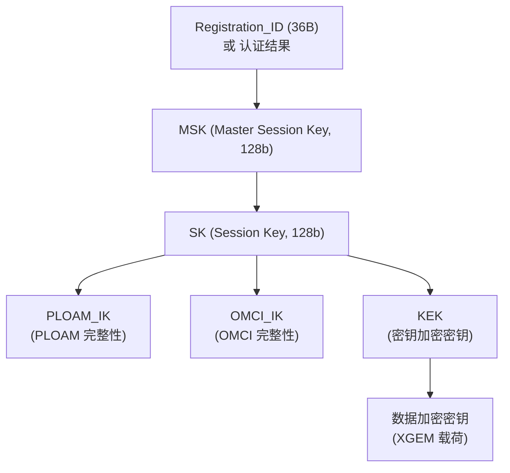
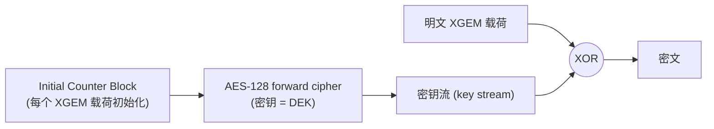
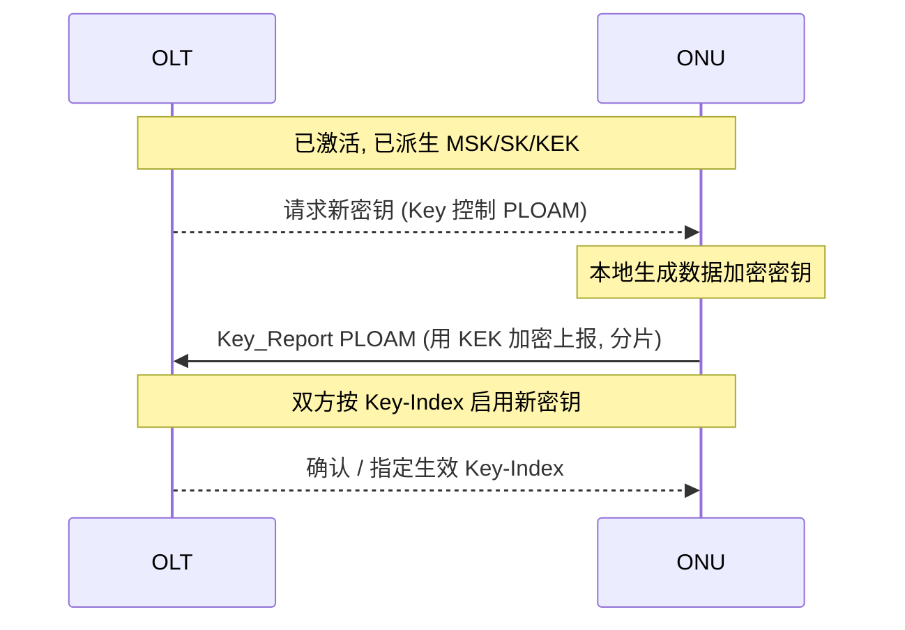

# 密钥层次与加密 ⭐

> XGS-PON（G.9807.1 Annex C.15）的安全体系：从主会话密钥 **MSK** 派生出会话密钥 **SK**，再派生出 PLOAM/OMCI 完整性密钥与数据加密密钥；用 **AES-128-CTR** 加密 XGEM 载荷，用 **MIC（基于 AES-CMAC）** 保护 PLOAM/OMCI 完整性。XG-PON（G.987.3）机制相同。

## 1. 安全目标与威胁模型

PON 下行是**广播**：所有 ONU 物理上都能收到全部下行 XGEM 帧。

```mermaid
flowchart TD
    OLT -->|下行广播 (所有人可收)| ONU1
    OLT -->|同一束光| ONU2
    OLT -->|同一束光| ONU3
    ONU2 -. 能窃听发往 ONU1 的帧 .-> ONU1
```

| 威胁 | 对策 |
|------|------|
| 窃听下行用户数据 | **XGEM 载荷 AES-CTR 加密**，密钥按 ONU 隔离 |
| 篡改/伪造 PLOAM、OMCI | **MIC** 完整性校验（AES-CMAC） |
| 伪造 OLT 或 ONU（中间人） | 可选**双向认证**（OMCI 或 802.1X） |
| 组播（IPTV）密钥分发 | 广播/组播密钥（broadcast key） |

## 2. 密钥层次（Key Hierarchy）



### 2.1 MSK —— 主会话密钥（C.15.3.2）

MSK 是 OLT 与某 ONU 共享的 128 位值，是后续所有密钥派生的起点。

- **基于注册的派生**（registration-based）：

```
MSK = AES-CMAC( (0x55)₁₆ , Registration_ID , 128 )
```

  - `(0x55)₁₆` = 16 字节、全 `0x55` 的默认密钥；
  - `Registration_ID` = Registration PLOAM 消息中的 36 字节值（可为 ONU 专属，或公开的默认值）。
- **基于认证的派生**：若启用双向认证，MSK 由认证过程产生（见 §6）。

### 2.2 SK —— 会话密钥（C.15.3.3）

SK 把 MSK 绑定到本次 OLT↔ONU 安全关联的上下文：

```
SK = AES-CMAC( MSK , (SN | PON-TAG | 0x53657373696f6e4b) , 128 )
```

信息串共 **24 字节**，是三部分拼接：

| 元素 | 来源 | 长度 |
|------|------|------|
| SN（ONU 序列号） | 上行 `Serial_Number_ONU` PLOAM octets 5–12（C.11.3.4.1） | 8B |
| PON-TAG | 下行 `Burst_Profile` PLOAM octets 26–33（C.11.3.3.1） | 8B |
| `0x53657373696f6e4b` | ASCII 字符串 `"SessionK"` 的十六进制 | 8B |

由 SK 进一步派生 **OMCI_IK / PLOAM_IK / KEK** 等（各自用不同的常量串做 AES-CMAC，类似 SK 的派生模式）。

## 3. XGEM 载荷加密：AES-128-CTR（C.15.4.1）

XGEM **载荷**用 **AES-128（FIPS-197）计数器模式（CTR，SP800-38A）** 加密；XGEM 头不加密（含 Key-Index 等寻址信息）。



- **CTR 模式**：用密钥对一串 **计数器块（counter block）** 做前向加密，得到密钥流，再与明文 **逐位异或**。解密相同（异或对合）。
- 每个 XGEM 载荷字段以一个 **初始计数器块（initial counter block）** 初始化，并按 SP800-38A 标准递增函数对整个计数器块递增。
- 计数器块通常由帧定位信息（如超帧计数 SFC / XGEM 序号等）构造，保证**每帧不同**（CTR 模式安全性的前提：计数器不可重用）。
- **Key-Index**：XGEM 头中的 Key-Index 字段指示用哪把密钥；支持密钥无缝切换（新旧两套并存，切换瞬间不丢帧），以及单播 vs 广播密钥的区分。

> **为什么用 CTR 而非 CBC**：CTR 可并行、无需填充、与突发对齐友好，适合高速 PON 流水线。

## 4. PLOAM / OMCI 完整性：MIC

管理消息用 **MIC（Message Integrity Check）** 防篡改，基于 **AES-CMAC**：

| 消息 | MIC 位置 | 密钥 |
|------|----------|------|
| PLOAM（48B） | 末尾 8 字节（octets 41–48） | **PLOAM_IK** |
| OMCI | 帧尾 MIC | **OMCI_IK** |

- 发送方对消息内容算 CMAC，截取为 MIC 附在尾部；接收方重算并比对，不符则丢弃。
- **激活早期**（尚无 MSK 时）用**默认完整性密钥**计算 MIC（见 BBF TR-309 注册测试：「PLOAM MIC 用默认 PLOAM integrity key 计算」），完成密钥协商后切换为派生的 PLOAM_IK/OMCI_IK。
- 详见 [PLOAM 字段级编码](../01-protocol-stack/xgspon-g9807/ploam-messages.md) 与 [OMCI 规范](../02-omci/omci-spec.md)。

## 5. 密钥协商流程（Key Control / Report）

加密密钥（DEK）由 **ONU 生成、上报给 OLT**（而非 OLT 下发），避免密钥在下行广播中暴露：



- ONU 用 **KEK** 加密后上报密钥，OLT 解密得到 DEK。
- 通过 **Key-Index** 协调新旧密钥切换时机，做到**无缝换钥（rekeying）**，不中断业务。
- 组播（IPTV）使用**广播密钥**，使多个 ONU 能解同一组播流（见 [IPTV 配置](../02-omci/provisioning-iptv.md)）。

## 6. 双向认证（可选，C.15.2.2）

定义两种**安全双向认证**机制（系统级可选）：

| 机制 | 标准位置 |
|------|----------|
| 基于 OMCI 的认证 | G.9807.1 Annex C.C |
| 基于 IEEE 802.1X 的认证 | G.9807.1 Annex C.D |

- 二者都做**双向**认证：OLT 认证 ONU，ONU 也认证 OLT（防伪基站/伪 ONU）。
- 若系统支持且运营商启用，OLT 在 **ONU 激活完成后、用户数据传输前**发起认证，之后可按策略**重认证**。
- 认证成功后生成的密钥材料用于派生 MSK（替代默认的注册派生），安全性更强。

## 7. 速查表

| 项 | 算法 / 值 | 标准 |
|----|-----------|------|
| 载荷加密 | AES-128-CTR | C.15.4.1 |
| 密钥派生 | AES-CMAC | C.15.3 |
| MSK（注册派生） | AES-CMAC((0x55)₁₆, Registration_ID, 128) | C.15.3.2 |
| SK | AES-CMAC(MSK, SN\|PON-TAG\|"SessionK", 128) | C.15.3.3 |
| PLOAM MIC | 8B，PLOAM_IK | C.11.3 |
| OMCI MIC | OMCI_IK | G.988 §11 |
| 默认密钥 | (0x55)₁₆ / 默认 IK（激活早期） | C.15 / TR-309 |

## 来源

- **公有标准**：
  - ITU-T G.9807.1 (2023) Annex C.15：C.15.2.2（双向认证两机制：OMCI / 802.1X，激活后用户数据前发起）、C.15.3.2（MSK = AES-CMAC((0x55)₁₆, Registration_ID, 128)；Registration_ID 36B）、C.15.3.3（SK = AES-CMAC(MSK, SN|PON-TAG|"SessionK", 128)；SN 取自 Serial_Number_ONU octets 5–12，PON-TAG 取自 Burst_Profile octets 26–33；并派生 OMCI_IK 等）、C.15.4.1（XGEM 载荷 AES-128-CTR，FIPS-197 / SP800-38A，初始计数器块逐帧初始化与递增）。
  - ITU-T G.9807.1 §C.6.3（TC 信息流中的 Security key mgmt 模块）。
  - ITU-T G.988 §11（OMCI MIC / OMCI_IK）。
  - BBF TR-309 Issue 3（注册测试：PLOAM MIC 使用默认 PLOAM integrity key；KEK/MSK 缩写定义）。
- 说明：密钥层次图与 Key Control/Report 时序为基于上述条款的原理性归纳；PLOAM/OMCI 各密钥的精确派生常量、Key 相关 PLOAM 的逐字段编码以 G.9807.1 / G.988 原文为准。
