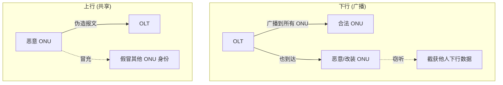

# PON 安全威胁模型与防护汇总

> PON 是**共享广播介质**：下行数据广播到所有 ONU、上行可来自任一 ONU。这天然带来**窃听**与**冒充**两大威胁。本篇汇总威胁模型与对应防护，串起加密、认证、流氓 ONU、完整性各章。依据 G.9807.1 §C.15.1（威胁模型）、§A.9.2、§C.19.1（流氓）、§C.14.2.3（应急快照）。

> 密钥/加密/MIC 细节见 [密钥管理与加密](key-management-encryption.md)；流氓 ONU 见 [rogue-onu](../05-operations/rogue-onu.md)；MIC 失败排障见 [troubleshooting](../05-operations/troubleshooting.md)。

## 1. 威胁模型（§C.15.1 / §A.9.2）

| 威胁 | 来源 | 后果 |
|------|------|------|
| **窃听 / 监听（snooping）** | 下行广播到所有 ONU | 改装 ONU 可收**所有用户**的下行数据 |
| **冒充 / 欺骗（impersonation/spoofing）** | 上行可来自任一 ONU | 改装 ONU 伪造报文**假冒**其他 ONU |
| **盗用业务（theft of service）** | 伪造身份/SN | 蹭网、越权使用带宽 |
| **拒绝服务（DoS）** | 流氓 ONU 乱发 | 干扰他人上行（见 §4） |

## 2. 防护手段对照

| 威胁 | 防护 | 机制 | 章节 |
|------|------|------|------|
| 窃听 | **下行载荷加密** | AES-128-CTR（XGEM 载荷），密钥仅授权 ONU 持有 | [密钥管理](key-management-encryption.md) |
| 冒充 | **认证/识别** | ONU 序列号 / Registration-ID；（可选）更强双向认证 | [密钥管理](key-management-encryption.md) §认证 |
| 篡改/重放 | **消息完整性 MIC** | PLOAM/OMCI 用 AES-CMAC + 方向标识 Cdir | [消息示例](../02-omci/message-examples.md) §4 |
| 流氓干扰 | **检测与隔离** | LOBi/DFi、Disable_Serial_Number | [rogue-onu](../05-operations/rogue-onu.md) |

> §A.9.2 强调：认证机制**是否启用由运营商决定**（标准给能力，部署看策略）；至少包含 ONU SN 和/或 Registration-ID 识别。

## 3. 加密为什么是「下行重点」

- 下行天然广播 → **必须加密**才能防同 PON 邻居窃听；
- 上行是 TDMA 点对点（ONU→OLT），物理上不广播给其他 ONU，窃听风险低，但**仍需完整性 + 认证**防冒充；
- XGS-PON 用 **AES-128-CTR**，计数器由 **SFC+IFC** 构造（见 [帧结构](../01-protocol-stack/xgspon-g9807/frame-structure.md) / [密钥管理](key-management-encryption.md)）。

## 4. 流氓 ONU（§C.19.1）

- **行为模型**：ONU **在错误的时隙上行**，干扰其他 ONU 的上行突发（根因多样，见 G-Sup.49）；
- OLT 检测到上行 **LOBi**；
- 缓解：定位（二分 Disable_Serial_Number）、隔离（见 [rogue-onu](../05-operations/rogue-onu.md)）。

## 5. 应急状态快照（§C.14.2.3）—— 事后取证

- ONU 在**与 OLT 通信受损/中断**时，记录一份**状态/缺陷/故障快照**；
- 作为 **Dying Gasp 序列**的一部分、或软件关断发射机时生成；
- 可**远程**或**换机后在实验室**取回 → 断链/掉线的「黑匣子」，对疑难故障与安全事件复盘极有价值。

## 6. 安全检查清单

1. 下行加密已启用、密钥定期轮换（Key Control/Report 正常）；
2. ONU 入网经 SN/Registration-ID 校验，非法 SN 不放行；
3. PLOAM/OMCI MIC 校验开启，持续 MIC error 触发告警（[排障](../05-operations/troubleshooting.md)）；
4. 流氓 ONU 检测（LOBi）与隔离预案就绪；
5. 应急快照功能可用，便于事后取证。

## 来源

- **公有标准**：
  - ITU-T G.9807.1 (2023) §C.15.1 Threat model（下行广播→改装 ONU 可收所有下行数据；上行任一 ONU→可伪造报文冒充其他 ONU）、§A.9.2 Authentication/identification/encryption（共享介质需防冒充/窃听；认证含 ONU SN 和/或 Registration-ID，启用与否由运营商定）、§C.19.1 Rogue ONU behaviour model（错误时隙上行干扰、OLT 检测 LOBi、根因见 G-Sup.49）、§C.14.2.3 Urgent ONU status snapshot record（通信受损时记录、属 dying gasp 序列、远程/实验室取回）。
- 说明：防护对照表与检查清单为工程归纳；威胁定义与机制以 G.9807.1 原文为准。
