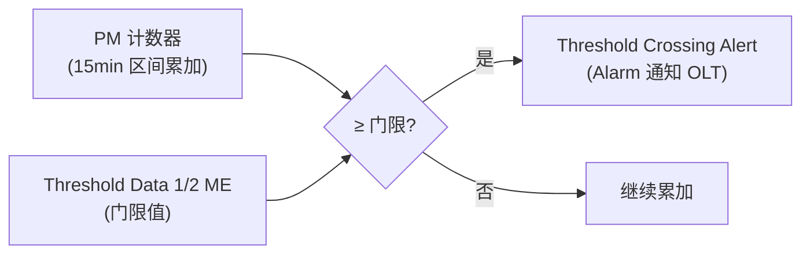

# 告警与性能监控（Alarms & PM）

> ONU 的运行态可观测性由 OMCI 承载：**告警（Alarm）**、**属性值变化（AVC）**、**测试结果（Test Result）** 三类自主通知，以及 **PM History Data ME + Threshold Crossing Alert（TCA）** 的性能监控体系。依据 G.988 §11.1（通知）与附录 I.4（通用 PM 架构）。

## 1. OMCI 的三类自主消息（Autonomous）

除 OLT 主动发起的 Get/Set/Create 等操作外，ONU 可**主动上报**三类异步通知（详见 [OMCI 规范](../02-omci/omci-spec.md)）：

| 通知 | 触发 | 典型用途 |
|------|------|----------|
| **Alarm** | ME 状态进入/离开告警 | LOS、LOF、设备故障、UNI down |
| **Attribute Value Change (AVC)** | 某可上报属性变化 | 光功率、序列号、链路状态变化 |
| **Test Result** | Test 操作完成 | 光模块自检、回环测试结果 |

每个 ME 的「Notifications」小节定义它支持哪些 Alarm 号、AVC 属性号、Test 结果。

## 2. 性能监控（PM）体系

### 2.1 PM History Data ME 的统一范式

PM 数据由一类 **「… performance monitoring history data」ME** 承载（G.988 §I.4 通用架构）。它们共享统一范式：

| 公共属性 | 含义 |
|----------|------|
| **Managed Entity ID** | 与被监控 ME **同 ID 隐式关联**（如 MAC bridge PM ↔ MAC bridge service profile） |
| **Interval End Time** | 最近一个**已结束的 15 分钟区间**标识（1 byte） |
| **Threshold Data 1/2 ID** | 指向 [Threshold Data 1/2 ME]，定义各计数器的门限 |
| **各类计数器** | 该对象的统计量（错误、丢包、冲突…），按 15 分钟区间累加 |

- 实例由 **OLT 创建/删除**，通常与被监控对象一一对应。
- **15 分钟区间**：电信标准的 PM 粒度；区间结束时计数器归档，OLT 周期性 Get/Get-Next 收集（也常配 24 小时历史）。

### 2.2 常见 PM ME 举例

| PM ME | 监控对象 | 典型计数器 |
|-------|----------|-----------|
| Ethernet PM history data 1/2/3 | 以太 UNI | FCS errors、碰撞、frames too long、buffer overflow、PPPoE 过滤帧 |
| MAC bridge PM history data | MAC 桥 | 桥转发统计 |
| FEC PM history data | PON 接口 | 纠正/不可纠正码字、误码 |
| XG-PON upstream/downstream management PM | XGTC 管理通道 | PLOAM MIC 错误数、OMCI MIC 错误数 |
| GEM port network CTP PM | GEM 端口 | 收发帧/丢帧 |
| IP host / RADIUS / PW ATM PM | 对应业务 | DHCP 错误、802.1X、伪线统计 |

## 3. 门限越界告警（TCA：Threshold Crossing Alert）

PM 计数器超过预设门限时，ONU 发 **TCA**（一种 Alarm）：

- 每个 PM ME 的「Notifications」表把 **Alarm 号 ↔ Threshold Value 属性号**绑定到 **Threshold Data 1 ME** 的对应门限属性。

  例（XG-PON upstream management PM，G.988 §9.2.17）：

  | Alarm 号 | TCA | 门限属性号 |
  |----------|-----|-----------|
  | 1 | PLOAM MIC error count | 1 |
  | 2 | OMCI MIC error count | 2 |

  例（Ethernet PM history data 2，§9.5.3）：FCS errors / excessive collision / late collision / frames too long / buffer overflow (rx/tx) / single collision …

## 4. 常见 PON 层告警（运维视角）

虽然部分由 OMCI ME 的 Alarm 上报，工程上常关注的 PON 物理/链路告警：

| 告警 | 含义 | 关联 |
|------|------|------|
| **LOS** (Loss of Signal) | 收不到光信号 | ONU 掉线/光路断 |
| **LOF** (Loss of Frame) | 帧失步 | 下行同步丢失 |
| **LODS** (Loss of Downstream Sync) | 下行同步丢失（XGS-PON） | 触发 O6 中间态，见[状态机](../01-protocol-stack/xgspon-g9807/activation-state-machine.md) |
| **SF/SD** (Signal Fail/Degrade) | 误码率超阈 | BER 越界 |
| **DG (Dying Gasp)** | ONU 掉电前最后告警 | 断电瞬间上报，便于 OLT 快速识别停电 vs 故障 |
| **DOWi / TIW** | 传输漂移越界 | 见[测距与激活](../01-protocol-stack/gpon-g984/ranging-activation.md) |

> **Dying Gasp** 尤为重要：ONU 在掉电瞬间用残余电力发出 DG（PLOAM/告警），让 OLT 区分「用户停电」与「设备故障/光路断」，避免误派障。

## 5. 工程要点

- **PM 采集策略**：OLT 周期性（15min/24h）Get-Next 拉取 PM 计数器，配合 TCA 做主动告警，二者互补。
- **MIC 错误计数**：PLOAM/OMCI MIC error count 持续增长往往意味着**密钥不同步**或链路被干扰（见 [安全](../04-security/key-management-encryption.md)）。
- **告警风暴抑制**：大量 ONU 同时掉电（区域停电）会触发 DG 风暴，OLT 侧需聚合去抖。

## 来源

- **公有标准**：
  - ITU-T G.988 (2024) §11.1（OMCI 通知：Alarm / AVC / Test Result）、附录 I.4（通用 PM 架构）。
  - G.988 各 PM History Data ME：§9.5.3 / §9.5.44（Ethernet PM history data 2/3 的 TCA 表）、§9.3.3（MAC bridge PM）、§9.2.17（XG-PON upstream management PM：PLOAM/OMCI MIC error count TCA）、§9.4.6（IP host PM2）、§9.3.17（RADIUS PM）、§9.8.16（PW ATM PM）、§9.16.11（TWDM channel OMCI PM）。公共属性：Interval End Time（最近完成的 15min 区间）、Threshold Data 1/2 ID、set-by-create、由 OLT 创建/删除。
  - LODS/Dying Gasp 等告警语义见 G.9807.1 Annex C（下行同步）/ G.984.3。
- 说明：第 4 节 PON 层告警为运维视角归纳；逐 ME 的 Alarm 号/属性以 G.988 各 ME 的 Notifications 表为准。
