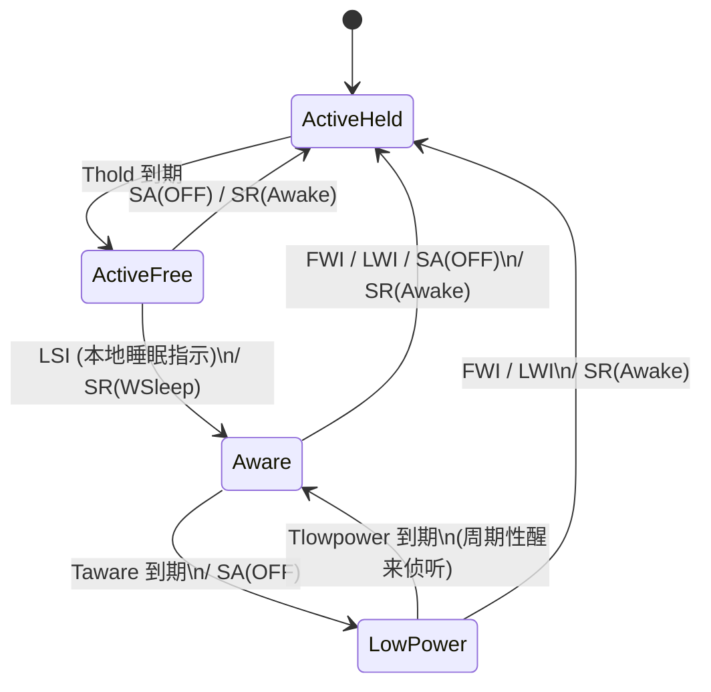
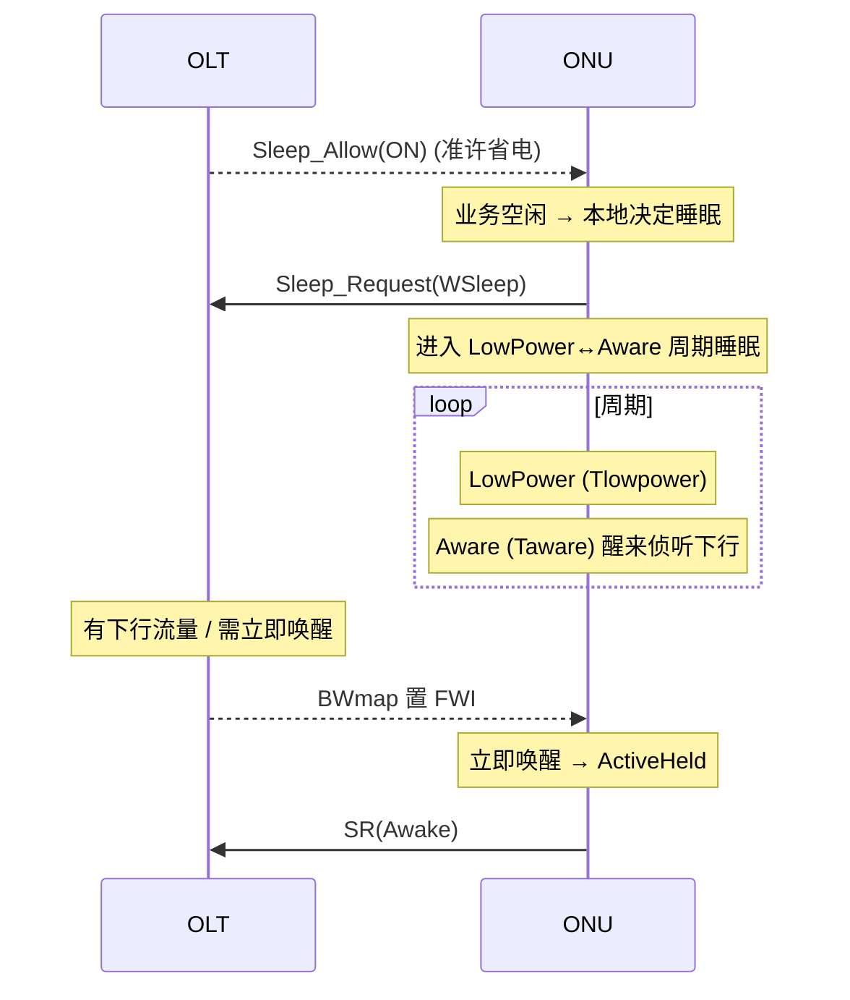

# ONU 省电（Power Management）⭐

> XGS-PON（G.9807.1 C.16）的 ONU 省电机制：通过 **Doze / Cyclic Sleep / Watchful Sleep** 三种模式，在业务空闲时关闭收/发电路，降低功耗、延长断电后备电池续航。核心是一套 **OLT↔ONU 协商的状态机**，由 PLOAM（Sleep_Request / Sleep_Allow）与 BWmap 中的 FWI 标志驱动。XG-PON（G.987.3）机制类似。

## 1. 为什么要省电

ONU 数量庞大，长期通电。G.9807.1 C.16 给出两个目标：

1. **首要目标——续命 lifeline 业务**：市电断电时，靠后备电池尽量长时间维持语音等关键业务（部分运营商要求断电后 **4–8 小时**可用）。空闲时关闭非关键接口电路以省电。
2. **次要目标——常态降耗**：任何时候都降低功耗、减少碳排放，但**不得牺牲业务质量与用户体验**。

> 思路：当 ONU 判断某接口空闲，就关掉对应电路，但保留「侦测到活动即唤醒」的能力。XGS-PON TC 层基于 G-Sup.45 机制，要求比 G.987 XG-PON 有更好的能效。

## 2. 三种省电模式

| 模式 | 收信机 Rx | 发信机 Tx | 适用 |
|------|-----------|-----------|------|
| **Doze（打盹）** | 常开 | 周期性关 | 下行有流量、上行空闲；可立即收下行 |
| **Cyclic Sleep（周期睡眠）** | 周期性关 | 周期性关 | 上下行都空闲；周期性醒来查看 |
| **Watchful Sleep（守望睡眠）** | 周期性关（守望下行） | 周期性关 | 统一 Doze+Sleep；XGS-PON 主力机制 |

XGS-PON 用**统一的守望睡眠状态机**承载三种意图：ONU 通过 `Sleep_Request` 的参数（Doze / Sleep / WSleep / Awake）告知 OLT 自己想进入哪种模式。

## 3. 省电状态机（G.9807.1 Figure C.16.1）

ONU 侧有 **4 个状态**（Table C.16.2）：

| # | 状态 | 含义 |
|---|------|------|
| 1 | **ActiveHeld** | 完全响应，转发下行、响应所有授权；**不允许**进入省电（Thold 计时器强制最小驻留）。进入时发 `SR(Awake)` |
| 2 | **ActiveFree** | 完全响应；是否进入省电是 ONU 的**本地决定** |
| 3 | **Aware** | 收发机都开；驻留 `Taware`，用于在睡眠周期之间「醒来侦听」 |
| 4 | **LowPower（Asleep）** | 低功耗；收/发按模式关闭，驻留 `Tlowpower` |

- **「绷紧 vs 放松」子图**：状态图顶点分为 tense（绷紧）与 relaxed（放松）两组；**只有跨越子图边界的转换才发出 PLOAM 消息**——这避免了每次睡/醒都发消息的开销。
- **周期睡眠循环**：进入低功耗后，ONU 在 `LowPower`（睡）与 `Aware`（醒来侦听）之间循环，直到被唤醒或被允许深睡。

## 4. 输入事件（Table C.16.3 / C.16.6）

| 事件 | 来源 | 含义 |
|------|------|------|
| `Sleep_Allow(ON)` | OLT 下行 PLOAM | OLT 准许 ONU 进入（守望）睡眠 |
| `Sleep_Allow(OFF)` | OLT 下行 PLOAM | OLT 收回省电许可，要求 ONU 保持清醒 |
| `FWI`（Forced Wake-up Indication） | BWmap 授权结构中的标志位 | OLT 要求 ONU **立即唤醒**并转入 ActiveHeld |
| `Sleep_Request(Doze/Sleep/WSleep)` | ONU 上行 PLOAM | ONU 告知 OLT 欲进入的省电模式 |
| `Sleep_Request(Awake)` = `SR(Awake)` | ONU 上行 PLOAM | ONU 已（重新）完全清醒 |
| `LSI` / `LWI` | ONU 本地 | 本地睡眠指示 / 本地唤醒指示（如检测到用户活动） |
| `Thold` / `Taware` / `Tlowpower` 到期 | 计时器 | 控制各状态最小/最大驻留时间 |

## 5. 一次典型的睡眠—唤醒交互

- **OLT 唤醒 ONU**：有下行突发或需要授权时，在 BWmap 授权结构中置 **FWI** 位，强制 ONU 立即醒来。
- **ONU 自唤醒**：检测到本地用户活动（LWI），自行回到 ActiveHeld 并发 `SR(Awake)`。
- **OLT 收回许可**：发 `Sleep_Allow(OFF)`，ONU 回到 ActiveHeld。

## 6. 工程要点

- **唤醒时延 vs 省电深度**：`Tlowpower` 越长越省电，但下行/授权的响应时延越大。需在功耗与时延间折中（语音等业务对时延敏感）。
- **lifeline 接口**：省电时优先保住语音口（POTS/VoIP），关闭 HSI/视频等非关键电路。
- **互通测试**：BBF TR-309 §（守望睡眠用例）验证 ONU 能正确进入 watchful sleep、OLT 能用 FWI 唤醒；用到 `Sleep_Allow`（SeqNo=unicast、Sleep Allow=1）与 `Sleep_Request` PLOAM。

## 来源

- **公有标准**：
  - ITU-T G.9807.1 (2023) §C.16（XGS-PON power management）：动机与目标（lifeline 续航、G-Sup.45 机制）、C.16.1.3.1 ONU 状态机、Table C.16.2（状态 ActiveHeld/ActiveFree/Aware/LowPower）、Table C.16.3（ONU 输入：Sleep_Allow ON/OFF、FWI、Thold/Taware/Tlowpower、LSI/LWI）、Table C.16.4（转换与输出，含 tense/relaxed 子图规则）、Table C.16.6（OLT 输入：Sleep_Request Doze/Sleep/WSleep/Awake）、Figure C.16.1（状态转换图）。
  - PLOAM 编码：G.9807.1 C.11.3.3.9（Sleep_Allow，下行）、C.11.3.4.5（Sleep_Request，上行）。
  - ITU-T G.988 §9.1.14（ONU dynamic power management control ME）。
  - BBF TR-309 Issue 3（watchful sleep 互通测试，引用 G.9807.1 C.16.1 / C.11.3.3.9 / C.11.3.4.5）。
- 说明：模式与状态机为基于上述条款的归纳；逐字段 PLOAM 编码与计时器取值以 G.9807.1 原文为准。
