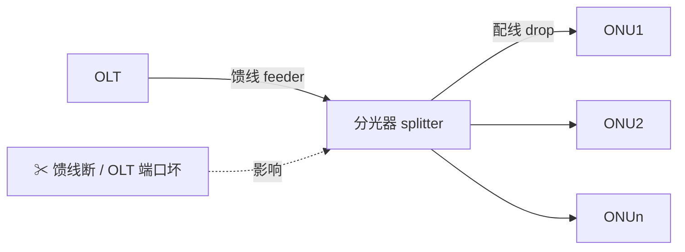
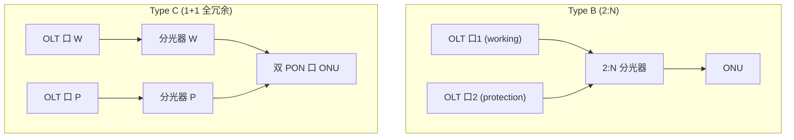
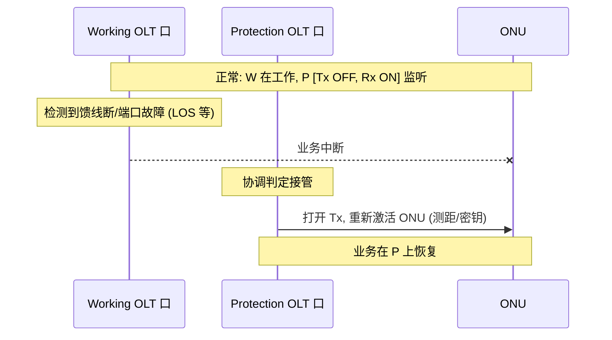

# PON 保护倒换（Protection Switching）

> PON 是点到多点共享：**馈线光纤（feeder）、OLT 端口/板卡、分光器、配线光纤** 任一失效都会影响多个用户。为提升高价值业务（IPTV、企业专线、移动回传）的可用性，PON 定义了 **Type A/B/C 三类保护**，靠冗余 + 自动倒换恢复业务。依据 ITU-T G.984.1（保护类型定义）与 G.9807.1 §A.11 / §C.18（XGS-PON 保护）。

## 1. 为什么要保护

- **共享段失效面大**：馈线或 OLT 端口故障 → 该 PON 下**所有 ONU** 同时中断。
- 运营商对住宅业务过去要求不高，但 XGS-PON 承载 IPTV/商业业务后，**服务可用性**变成硬指标（G.9807.1 §A.11）。

## 2. 三类保护（G.984.1 经典分型）

| 类型 | 冗余范围 | 倒换粒度 | 成本 | 典型场景 |
|------|----------|----------|------|----------|
| **Type A** | 仅**馈线光纤**冗余（OLT 单端口，双馈线 + 光开关） | 馈线倒换 | 低 | 只防馈线断纤 |
| **Type B** | **馈线 + OLT PON 端口/板卡**冗余（2:N 分光器，双馈线接两个 OLT 口） | OLT 侧倒换，ONU 不双备 | 中 | 主流：防馈线 + OLT 口/卡故障 |
| **Type C** | **全程 1+1**（馈线 + 分光器 + 配线 + ONU 双 PON 口全冗余） | 端到端倒换 | 高 | 关键业务、电信级专线 |

## 3. Type B 详解（G.9807.1 §C.18.1）

XGS-PON 标准重点规范 **Type B**（性价比最高）：

- **2:N 分光器**（取代常规 1:N）：OLT 侧有**两个**输入/输出口，两条**馈线**分别接到**两个不同的 OLT 端口**。
- **Single-parented（单归属）**：两个端口在**同一机箱**（理想在不同线卡），可共享同一 SNI。
- **Dual-parented（双归属）**：两个端口在**不同机箱**（理想地理上分离），防整机/机房级故障。
- **可恢复的故障**：馈线断、OLT PON 端口或板卡故障（端口在不同卡/机箱时）。

### OLT 端口状态机（Table C.18.1）

| 状态 | 语义 |
|------|------|
| **Initialisation (1)** [Tx: OFF, Rx: ON] | 端口被配为 Type B 保护一员，启动 `Tsstart` 定时器，**发射机关闭**（避免两路同时发光打架），只收 |
| **Pre-Protecting (2)** | 仅在多波长 PON（NG-PON2 ICTP，见 [NG-PON2](../01-protocol-stack/ngpon2-g989/overview.md)）下使用 |

- 关键：**保护端口默认 Tx 关闭**，只有在 working 失效、协调后才接管发光——避免两路同时上行/下行冲突。

## 4. 倒换流程（概念）

- Type B 倒换后，ONU 通常需在新端口上**重新激活**（重测距、重协商密钥），故倒换时间含激活时延；Type C（1+1）可做到更快的近无损倒换。
- 倒换决策依据：[告警](alarms-and-pm.md)（LOS/LOF/SF）、双归属下的 CT/OLT 间协调。

## 5. 工程要点

- **单归属 vs 双归属**：双归属抗机房级故障但成本/复杂度高（需跨机箱协调、共享 ONU 数据库）。
- **保护组配置**：working/protection 成对配置，保护端口默认静默（Tx OFF）防干扰。
- **倒换时间预算**：Type B 含重激活时延（百 ms~秒级）；对 SLA 严苛的业务考虑 Type C。
- **与 NG-PON2 的关系**：多波长下保护与**波长保护**（ICTP Wavelength Protection 用例）叠加。

## 来源

- **公有标准**：
  - ITU-T G.984.1（PON 保护架构 Type A/B/C 定义）。
  - ITU-T G.9807.1 (2023) §A.11（ODN 弹性与保护需求）、§C.18 XGS-PON system protection、§C.18.1（OLT coordination in Type B：Fig C.18.1 2:N 分光器、单/双归属、Table C.18.1 OLT 端口状态 Initialisation[Tx OFF/Rx ON]+Tsstart、Pre-Protecting 仅多波长用）、附录 A.III（四种倒换布置 Fig A.III.1）、§5.8（dual-homing 下 ODN 术语泛化）。
  - ITU-T G-Suppl.51（PON 保护补充）。
- 说明：Type A/B/C 对比与倒换时序为基于上述文档的归纳；Type B 状态机以 G.9807.1 §C.18.1 原文为准。
