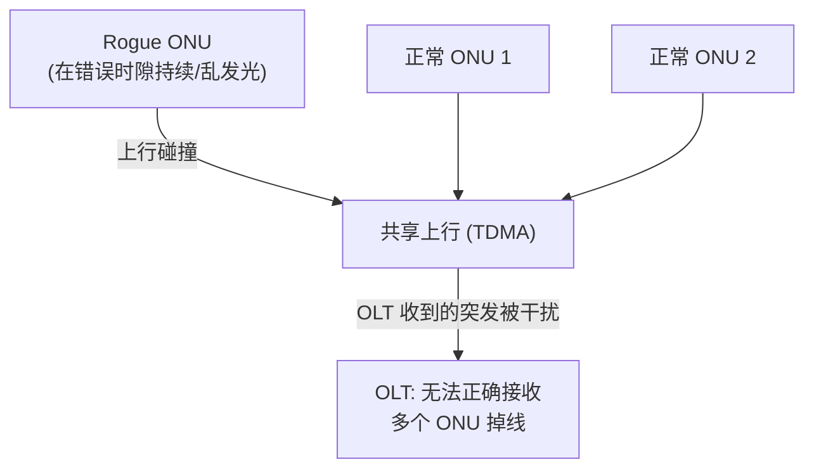
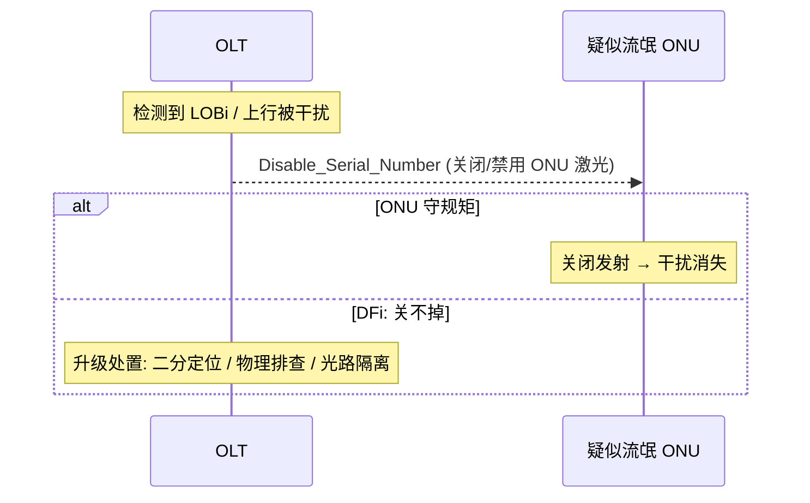
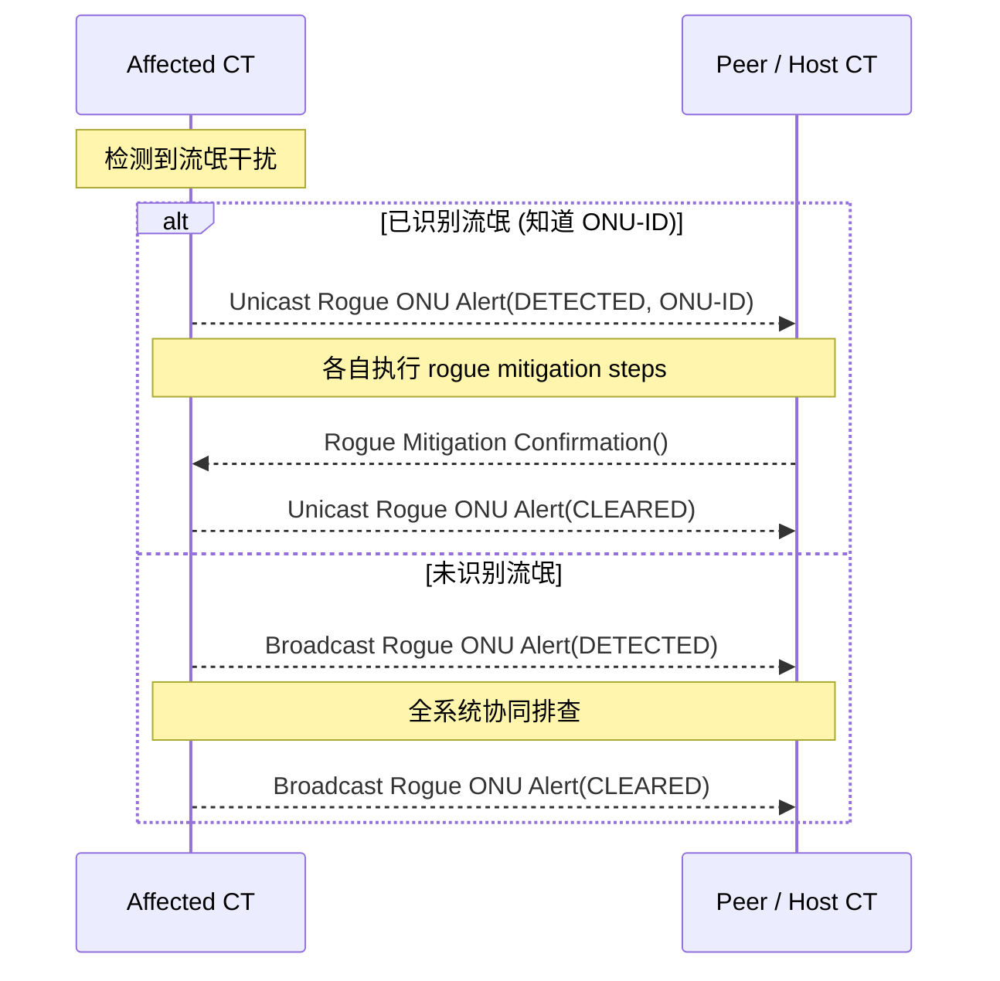

# 流氓 ONU（Rogue ONU）检测与隔离

> PON 上行是共享 TDMA：一个**行为异常的 ONU**（rogue ONU）若在**错误的时隙发光**，会干扰甚至阻断**整条 PON 上所有其他 ONU**的上行——这是 PON 最严重的故障之一。本篇梳理流氓行为模型、OLT/ONU 侧缺陷检测与隔离手段。依据 G.9807.1 §C.19 / §C.14，以及 NG-PON2 的 ICTP（TR-352）。

## 1. 为什么流氓 ONU 危害大

- 下行是广播、上行是分时：正常 ONU 只在 OLT 授权的时隙发光。**流氓 ONU 不守时隙**（持续发光 / 在他人时隙发光），导致 OLT 收到的上行突发**无法定界（delineate）**。
- 后果可能是**整条 PON 上行瘫痪**，且因 OLT 收不到流氓 ONU 的正常响应，**定位困难**。

## 2. 流氓行为模型（G.9807.1 §C.19.1）

> XGS-PON rogue ONU mitigation 针对的行为模型：**某 ONU 在上行错误时隙发送，干扰其他 ONU 的上行传输**。根因多样（参 G-Sup.49：激光器失控、固件 bug、定时丢失等）。OLT 据此检测到 **LOBi**（Loss of Burst）。

常见流氓类型（工程归纳）：

| 类型 | 表现 |
|------|------|
| 持续发光（CW rogue） | 激光器常开，整条上行被压制 |
| 错时隙发光 | 在别的 ONU 时隙发突发 |
| 超长突发 | 突发不按 grant 长度结束，溢出到相邻时隙 |
| 不可控 ONU | 收到 Disable 仍继续发（见 DFi） |

## 3. 缺陷检测（G.9807.1 §C.14.2）

### 3.1 OLT 侧（Table C.14.2）

| 缺陷 | 含义 | 检测条件 |
|------|------|----------|
| **LOBi**（Loss of Burst for ONU i） | 无法对来自 ONU i 的突发定界 | 连续 `Clobi` 个预期突发定界失败 |

- OLT 检测到 LOBi 后，**处置由 OLT 自行决定**，可能包括等待额外 soak time、尝试隔离等。

### 3.2 ONU 侧（Table C.14.2.2）

| 缺陷 | 含义 |
|------|------|
| **DFi**（Disable Failure of ONU） | ONU 在被尝试 disable 后**仍继续响应上行授权**（即「关不掉的 ONU」） |

- DFi 是流氓的恶化形态：连关闭指令都不响应，需更强力隔离（物理层 / 光路定位）。

## 4. 隔离与缓解手段

常用手段：
- **`Disable_Serial_Number` PLOAM**：OLT 命令指定 SN 的 ONU 关闭激光/禁用（也可广播 disable，再逐个 enable 做**二分定位**）。
- **二分法定位**：逐批 disable/enable ONU，缩小到具体流氓个体。
- **soak time / 重测距**：先观察是否瞬态（漂移导致），再决定隔离。
- **物理层兜底**：对 DFi（关不掉）只能靠现场断纤、光功率定位。

## 5. NG-PON2 多波长下的协同（TR-352 ICTP）

多波长系统里，流氓 ONU 可能干扰**多个波长通道 / 多个 CT**，需 CT 间通过 **ICTP** 协同处置（见 [NG-PON2](../01-protocol-stack/ngpon2-g989/overview.md)）：

- **已识别**（Fig 8-8）：单播 `Rogue ONU Alert(DETECTED, ONU-ID)` → 缓解 → `Rogue Mitigation Confirmation` → `Alert(CLEARED)`。
- **未识别**（Fig 8-7）：广播 `Rogue ONU Alert(DETECTED)`，各 CT 协同；清除后广播 `Alert(CLEARED)`。

## 6. 工程要点

- **与漂移区分**：先排除是 [传输漂移（DOWi）](../01-protocol-stack/gpon-g984/ranging-activation.md) 这种良性原因，再判定流氓，避免误隔离正常 ONU。
- **告警联动**：LOBi 通常伴随多 ONU 同时上行异常告警（见 [告警与 PM](alarms-and-pm.md)），可作为流氓的指示信号。
- **现网影响面**：隔离动作（广播 disable）会短暂影响全 PON，需谨慎并尽快二分收敛。

## 来源

- **公有标准**：
  - ITU-T G.9807.1 (2023) §C.19.1（XGS-PON rogue ONU 行为模型：错时隙上行干扰，OLT 检测 LOBi，根因参 G-Sup.49）。
  - §C.14.2.1（OLT 侧缺陷 Table C.14.2：LOBi = Loss of Burst，连续 Clobi 次定界失败）、§C.14.2.2（ONU 侧缺陷：DFi = Disable Failure，ONU 被 disable 后仍响应）。
  - `Disable_Serial_Number` PLOAM（G.9807.1 §C.11 / G.984.3 对应消息）。
  - BBF TR-352（NG-PON2 ICTP）§8：Figure 8-7（未识别流氓，Broadcast Rogue ONU Alert）、Figure 8-8（已识别流氓，Unicast Rogue ONU Alert + Rogue Mitigation Confirmation）。
- 说明：流氓类型表与隔离手段为工程归纳；逐缺陷参数（Clobi、soak time）与 PLOAM 编码以 G.9807.1 原文为准。
