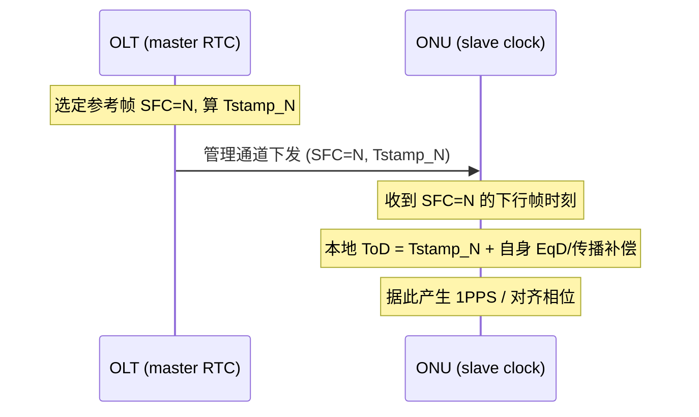

# PON 时间与频率同步（ToD / 1PPS / IEEE 1588）

> 移动回传（4G/5G 基站）要求**精确的频率与时间**。过去靠 T1/E1 接口提供，现在要在分组接口（Ethernet/PON）上传递。XGS-PON 把 **IEEE 1588（PTP）主/从功能分布在 OLT 与 ONU 之间**，并定义 TC 层的 **Time of Day（ToD）分发**，使 ONU 的 ToD 时钟达到 **±1 µs** 精度。依据 G.9807.1 §C.13.2、附录 A.IV / A.7.6。

## 1. 三种同步需求

| 类型 | 含义 | PON 如何提供 |
|------|------|--------------|
| **频率同步**（syntonization） | 时钟频率一致（如 ±50 ppb） | OLT 把 PON 线速率锁到网络时钟频率，ONU 从下行码流恢复频率 |
| **相位/时间同步**（ToD） | 绝对时刻一致（如 ±1 µs / ±1.5 µs） | TC 层 ToD 分发 + EqD 补偿 |
| **1PPS** | One Pulse Per Second，秒脉冲输出 | ONU 据恢复的 ToD 产生 1PPS 给外部设备 |

## 2. ToD 分发原理（G.9807.1 §C.13.2）

> 目标精度：ONU 的 ToD 时钟 **±1 µs**（更高精度待研究）。

核心思想：**OLT 有精确实时钟**（来源在标准范围外），它告诉 ONU——

> 「某个下行 PHY 帧，到达一个**假想的、均衡时延=0 且响应时间=0 的 ONU** 时，对应的 ToD 是多少。」

该下行 PHY 帧由**超帧计数 SFC = N** 唯一标识。每个 ONU 再用自己的 **均衡时延 EqD** 与传播/响应补偿，把这个公共参考换算成本地 ToD。



### ONU 时钟同步过程（§C.13.2.2）

1. OLT 选一个下行 PHY 帧作**时间参考**，由 **SFC=N** 标识，关联 `Tsend_N`（建议落在当前时间 **±10 s** 窗口内）。
2. OLT 计算 `Tstamp_N`（C.13-9 / C.13-10）：

```
Tstamp_N = Tsend_N + Δ_OLT
Δ_OLT    = Teqd + N_up + N_dn
```

- `Tsend_N`、`Tstamp_N` 均**参考到光接口**；
- `Teqd`/`N_up`/`N_dn` 为均衡时延与上/下行内部时延补偿项（见 [测距与激活](../01-protocol-stack/gpon-g984/ranging-activation.md)）。

> SFC 是连接 PHY 帧与绝对时间的「锚」——这也是 [帧结构](../01-protocol-stack/xgspon-g9807/frame-structure.md) 中 PSBd 携带 SFC 的用途之一（另一用途是 [AES-CTR 计数器](../04-security/key-management-encryption.md)）。

## 3. 与 IEEE 1588（PTP）的关系（附录 A.IV）


- XGS-PON 把 1588 **主/从功能分布**在 OLT 与 ONU：
  - **OLT 执行 slave port**（或从机框的同步功能取频率与时间），把 PON 线速率锁到网络时钟频率，并把 ToD 传给 ONU；
  - **ONU 侧**重建精确 RTC，对外可作 1588 master 或输出 1PPS+ToD（Fig A.1.11 Precision RTC service，跑在 OMCC / G.988 之上）。
- 应用（§A.7.6）：移动 cell site 回传，替代 T1/E1 的同步交付。

## 4. 误差预算要点

- **频率**：从下行连续码流恢复，PON 线速率锁到网络时钟。
- **时间**：主要误差来自 **EqD 测量精度**（XGS-PON EqD 精度 ±3 ns，见 [测距](../01-protocol-stack/gpon-g984/ranging-activation.md)）、内部时延标定、光纤不对称（上下行波长不同导致传播差）。
- 目标 ±1 µs 是 TC 层裸能力；端到端达 5G 的 ±1.5 µs（cTE）还需控制 ONU 出口抖动与不对称补偿。

## 5. 工程检查清单

- OLT 是否锁到了上游 PTP/SyncE/BITS 时钟源（频率源在线）；
- ToD 参考帧 SFC 与 Tstamp 是否按 ±10 s 窗口刷新；
- ONU EqD 是否稳定（漂移会直接劣化时间精度，见 [LODS/漂移](../06-interop/test-plan-overview.md)）；
- 光纤不对称补偿（fiber asymmetry）是否配置。

## 来源

- **公有标准**：
  - ITU-T G.9807.1 (2023) §C.13.2 Time of day distribution（ONU ToD 精度 ±1 µs；OLT 告知「零 EqD/零响应的假想 ONU」收到某下行帧的 ToD；该帧由 SFC=N 标识）、§C.13.2.2（ONU 时钟同步过程：选 SFC=N 参考帧、±10 s 窗口、`Tstamp_N = Tsend_N + Δ_OLT`，`Δ_OLT = Teqd + N_up + N_dn`，C.13-9/10，参考到光接口）。
  - ITU-T G.9807.1 附录 A.IV（Operation with IEEE 1588：OLT 执行 slave port、锁 PON 线速率到网络频率、传 ToD；ONU 侧 precision RTC，Fig A.1.11 跑在 OMCC/G.988 上）、§A.7.6（移动回传同步需求，替代 T1/E1）。
  - 缩略语：1PPS = One Pulse Per Second（§4）。
- 说明：误差预算（§4）与检查清单（§5）为基于标准的工程归纳；公式与精度数值以 G.9807.1 原文为准。
