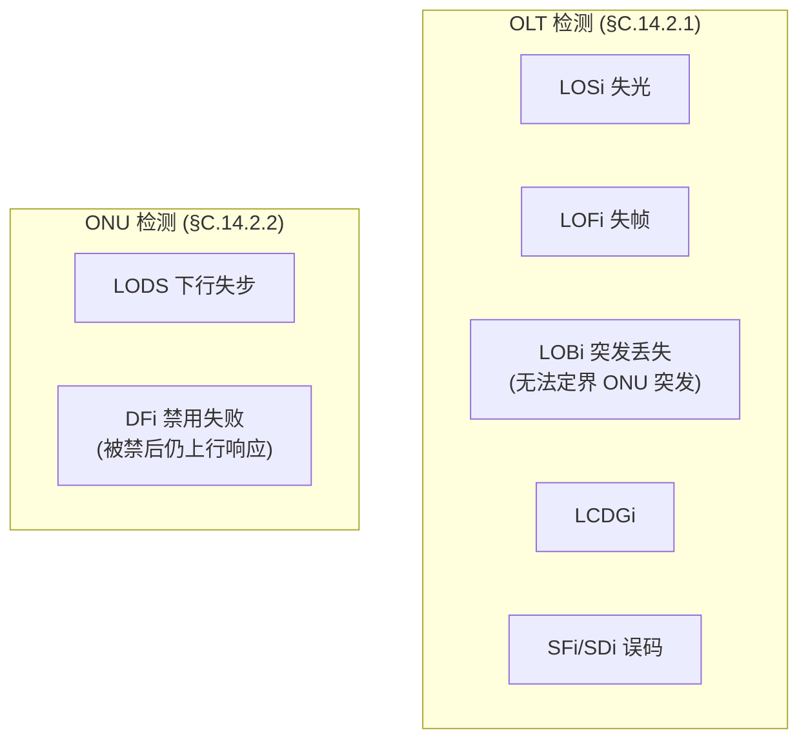
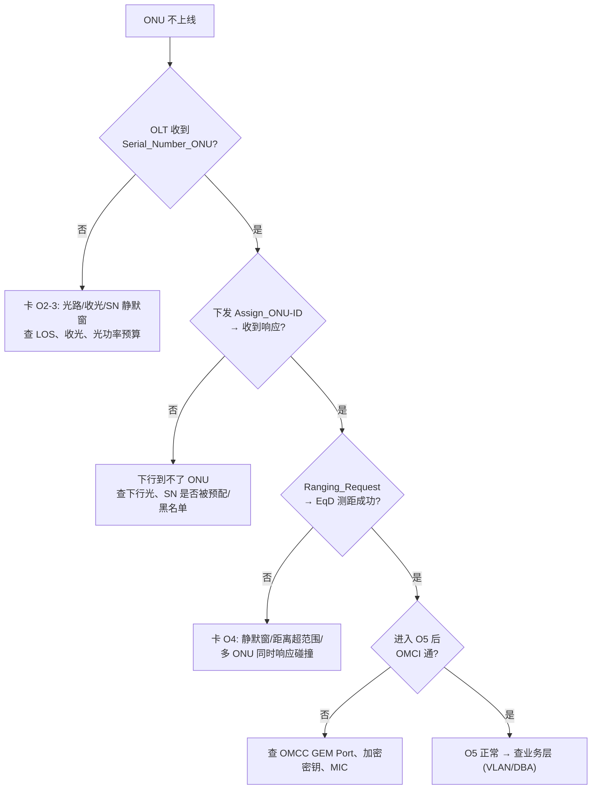

# PON 排障实战：缺陷分类、抓包点与决策树

> 把前面的协议知识收敛成**可操作的排障流程**：故障现象 → 看哪些 defect/alarm → 在哪抓包 → 如何二分定位。依据 G.9807.1 §C.14（OLT/ONU 缺陷表）、§C.15.8.4（MIC 失败）、G.988 告警、BBF TP-255 测试流程。

> 缺陷/告警背景见 [告警与 PM](alarms-and-pm.md) 与 [告警速查](../02-omci/alarm-reference.md)；流氓 ONU 见 [rogue-onu](rogue-onu.md)。

## 1. 缺陷分层（先分清「谁检测到」）

| 缺陷 | 检测方 | 触发 | 含义/动作 |
|------|--------|------|-----------|
| **LOSi** | OLT | 收不到 ONU 上行光 | 该 ONU 失联 |
| **LOFi** | OLT | 上行帧失步 | |
| **LOBi**（Loss of burst） | OLT | **任何原因**无法定界指定 ONU 的突发 | 动作由 OLT 定；收到该 ONU 一次计划突发即清除 |
| **LODS** | ONU | 下行同步丢失 | 进入 O6，启动恢复（见 [激活状态机](../01-protocol-stack/gpon-g984/activation-state-machine.md)） |
| **DFi**（Disable failure） | ONU/OLT | ONU 被禁后**仍响应上行** | 流氓嫌疑，OLT 采取缓解（见 [rogue-onu](rogue-onu.md)） |

## 2. 激活失败决策树（卡在哪个 O 态）

- **卡 O2/O3**：多为光路（[光功率预算](../01-protocol-stack/optical-power-budget.md)：收光过弱/过载）、序列号未识别、静默窗冲突。
- **卡 O4 测距**：距离超 OPL/DD 范围、静默窗内多 ONU 碰撞、EqD 漂移（见 [测距](../01-protocol-stack/gpon-g984/ranging-activation.md)）。
- **O5 但 OMCI 不通**：OMCC GEM Port 未建、密钥/MIC 失配（见 §4）。

## 3. Dying Gasp 排障（区分断纤 vs 掉电）

依 TP-255 掉电测试流程：

1. 拔 ONU 电源 → OLT 应在 **≤5 分钟**内报 **Dying Gasp**；
2. 复电 → **≤10 分钟**内 ONU 被重新激活并 operational；
3. 有电源键的 ONU 用电源键再测一遍。

> **判断逻辑**：收到 DG → **设备掉电**；只见 LOSi **无** DG → 多半**断纤/光路**。区域停电会引发 **DG 风暴**，OLT 侧需聚合去抖。

## 4. 加密/完整性失败（§C.15.8.4）

| 现象 | 可能原因 | 处置 |
|------|----------|------|
| **偶发 MIC failure** | 随机误码（与 BER 相关） | 罕见事件，查光层 BER |
| **持续 MIC failure** | 收发端**完整性密钥失配** | 安全威胁或认证/密钥流程故障，重协商密钥（见 [安全](../04-security/key-management-encryption.md)） |

- OLT 直接（上行 MIC 失败）或经 ONU 上报（下行）获知持续 MIC 失败。
- 持续 MIC 失败常伴 OMCI/PLOAM 不通——优先排查密钥同步。

## 5. 抓包/观测点

| 位置 | 看什么 |
|------|--------|
| **OLT PLOAM 日志** | 激活握手（SN/Assign-ID/Ranging）、状态翻转、deactivate 原因 |
| **OLT 告警/缺陷** | LOSi/LOFi/LOBi/SFi/SDi/DFi、收发光读数 |
| **OMCI 抓包** | MIB Reset/Upload、Create/Set 失败码、Test/AVC（见 [Test/AVC](../02-omci/test-avc-operations.md)） |
| **ONU 本地** | LODS、收光、Dying Gasp、自检结果 |
| **业务流量** | VLAN 标签、DBA 授权是否到位（见 [QoS 案例](../03-dba/qos-scheduling-cases.md)） |

## 6. 常见现象 → 首查项速查

| 现象 | 首查 |
|------|------|
| 单 ONU 不上线 | 收光/SN/距离（[光预算](../01-protocol-stack/optical-power-budget.md)） |
| 整 PON 全掉 | 馈线/OLT 端口/分光器（[保护倒换](protection-switching.md)） |
| 间歇掉线 | LODS/EqD 漂移/收光临界（[测距](../01-protocol-stack/gpon-g984/ranging-activation.md)） |
| 上线但无业务 | OMCI 配置/VLAN/DBA 授权 |
| 上线但慢/丢包 | DBA 带宽/队列调度/pre-FEC BER（[FEC](../01-protocol-stack/fec-principles.md)） |
| 其他 ONU 受连累 | 流氓 ONU（[rogue-onu](rogue-onu.md)） |

## 来源

- **公有标准 / BBF**：
  - ITU-T G.9807.1 (2023) §C.14.2.1 Table C.14.2（OLT 检测缺陷：LOBi「任何原因无法定界指定突发」、检测/清除条件）、§C.14.2.2（ONU 检测：DFi「被禁后仍响应上行」、缓解动作 OLT 定）、§C.15.8.4（MIC 失败：随机误码 vs 持续密钥失配，OLT 直接/经 ONU 获知）。
  - ITU-T G.988（告警与 Test/AVC）。
  - BBF TP-255（Dying Gasp 掉电测试：≤5 min 报 DG、≤10 min 重激活、电源键变体）。
- 说明：决策树与速查表为基于上述缺陷/告警定义的工程归纳；缺陷定义与超时数值以原文为准。
