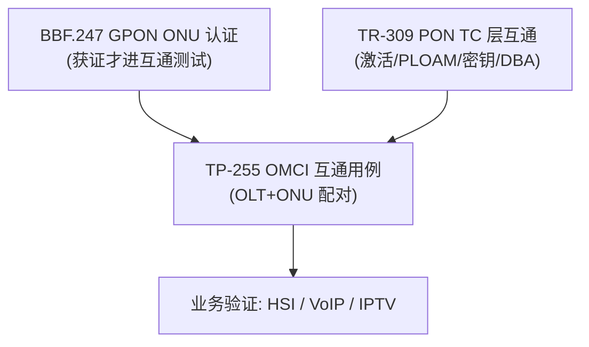

# ONU 一致性与互联认证（BBF.247 / TP-255 / TR-309）

> 一致性测试回答两个问题：①ONU 是否**符合标准**（conformance）；②任意 OLT+ONU 配对能否**互通**（interoperability）。Broadband Forum 用 **TR-309（PON TC 层互通测试计划）+ TP-255（OMCI 互通测试用例）+ BBF.247（GPON ONU 认证）** 三层覆盖从物理 TC 到 OMCI 业务的全栈。

> TC 层高频用例与时序见 [互通测试计划总览](test-plan-overview.md)；本篇聚焦 **OMCI/业务层一致性** 与认证体系。

## 1. 一致性测试体系

| 文档 | 层面 | 覆盖 |
|------|------|------|
| **TR-309** | TC 层 | TC 层建立、Ethernet 流量、多 ONU、Alien ONU 检测、差分距离、Intermittent LODS、密钥交换（KN/KL 状态）；含 2.5G/10G/25GS-PON 的带宽分配参数表 |
| **TP-255** | OMCI/业务 | ONU bring-up（新/旧 ONU）、按 Registration-ID/SN 开通、HSI/VoIP/IPTV 配置；引用 TR-101/TR-156/TR-280/G.988 |
| **BBF.247** | 认证 | GPON ONU 认证标志；要求 OLT 使用标准化 OMCI ME 实现被测配置 |

## 2. 测试用例的统一结构（TP-255）

每个用例都按固定模板，便于自动化与判定：

| 字段 | 含义 |
|------|------|
| **Test Status** | Mandatory / Optional |
| **Reference Documents** | 依据标准（如 G.988、TR-156、G.984.3 Amd1） |
| **Test Objective** | 验证目标（如「OLT/ONU 正确完成 ONU Bring-up」） |
| **Test Setup** | 拓扑（Basic Setup，是否需 Ethernet 流量发生器） |
| **Pretest Conditions** | 前置条件（如 OLT 自动发现但**不**自动激活） |
| **Test Configuration** | 具体配置 |
| **Test Procedure** | 编号步骤 |
| **Pass/Fail Criteria** | 判定准则 |

## 3. 核心 OMCI 用例（TP-255 §6）

### 3.1 ONU Bring-up（§6.9）

依据 G.988 Appendix I 的 ONU bring-up 方法：

| 用例 | 定义 | 验证点 |
|------|------|--------|
| **New ONU**（§6.9.1） | **从未**完成过 OLT 的 MIB 同步 | 首次完整 bring-up（MIB Reset→MIB Upload→建模） |
| **Old ONU**（§6.9.2） | 之前连过该 OLT | 复用已有 MIB，快速恢复（MIB data sync 比对） |

> 对应 [MIB 上传与同步](../02-omci/mib-upload-sync.md) 的新/旧 ONU 流程；前置条件均为「OLT 自动发现但不自动激活」，以便逐步观测。

### 3.2 按 SN / Registration-ID 开通（§6.8）

| 用例 | 依据 | 关键要求 |
|------|------|----------|
| 按 **Serial Number** 激活 | G.984.3 Annex A.6 | R-150：OLT 须支持预配 SN↔ONU-ID；R-154：收到 SN 后从历史/预配集匹配；ONU 达 **O5** |
| 按 **Registration-ID** 激活 | G.984.3 Amd1 §2.2/2.3、TR-156 §7.2 | R-151：OLT 须支持预配 Registration-ID↔ONU-ID；R-155：SN 不识别时用 Registration-ID 判定 |

> 对应 [激活状态机](../01-protocol-stack/gpon-g984/activation-state-machine.md) 的序列号/登记 ID 两种入网路径。

## 4. TR-309 TC 层关键用例（节选）

- **OMCI 通道建立**：测距成功→手工配置首密钥并置 valid→OLT 下发 BWmap→ONU 用 XGEM 帧响应（默认 XGEM Port-ID=1，加密）。
- **密钥交换状态**：ONU 经 KN3→发 key report→KN4；OLT 显示并校验 key 片段→KL4（见 [安全/密钥管理](../04-security/key-management-encryption.md)）。
- **Alien ONU 检测与韧性**：异厂/异制式 ONU 接入时的检测与系统稳定性。
- **差分距离（Differential Reach）**：近端 ONU 与远端 ONU 共存时测距正确性。
- **Intermittent LODS**：信号间歇丢失/恢复（O6 状态，见 [激活状态机](../01-protocol-stack/gpon-g984/activation-state-machine.md)）。

## 5. 自测/上线检查清单（实战）

1. **激活**：SN 与 Registration-ID 两条路径都能达 O5；
2. **MIB**：新 ONU 全量上传、旧 ONU 增量同步均正确（[MIB 同步](../02-omci/mib-upload-sync.md)）；
3. **业务**：HSI/VoIP/IPTV 按标准 ME 链路开通（[datapath 全景](../02-omci/datapath-l2-model.md)）；
4. **加密**：XGEM 默认 Port-ID 加密、密钥切换无丢包（[安全](../04-security/key-management-encryption.md)）；
5. **韧性**：Alien ONU、LODS、差分距离不影响其他 ONU；
6. **诊断**：Test/AVC/Alarm 自主消息行为符合预期（[Test/AVC](../02-omci/test-avc-operations.md)）。

## 来源

- **公有标准 / BBF**：
  - **BBF TR-309 issue 3** PON TC Layer Interoperability Test Plan（TC 层测试拓扑、Ethernet 流量、多 ONU、Alien ONU 检测与韧性、差分距离、Intermittent LODS；OMCI 通道建立流程：测距→首密钥 valid→BWmap→XGEM 帧响应、默认 Port-ID=1 加密；密钥交换 KN3/KN4/KL4；2.5G/10G/25GS-PON 带宽分配参数表 7-1/7-2/7-3）。
  - **BBF TP-255**（tp-255-2-0-0）OMCI 互通测试用例：§6.9 ONU Bring-up（new/old ONU，依据 G.988 Appendix I）、§6.8.2 按 Registration-ID 开通（TR-156 §7.2、G.984.3 §10/Annex A.6、Amd1 §2.2/2.3，R-150/151/154/155）；用例统一模板（Status/Reference/Objective/Setup/Pretest/Procedure/Pass-Fail）。
  - **BBF.247** GPON ONU 认证（被测 ONU 须已获认证，OLT 使用标准化 OMCI ME）。
  - 引用规范：BBF TR-101 / TR-156 / TR-280、ITU-T G.988、G.984.3。
- 说明：用例字段与编号引自 TP-255 / TR-309 原文；检查清单（§5）为工程归纳。
