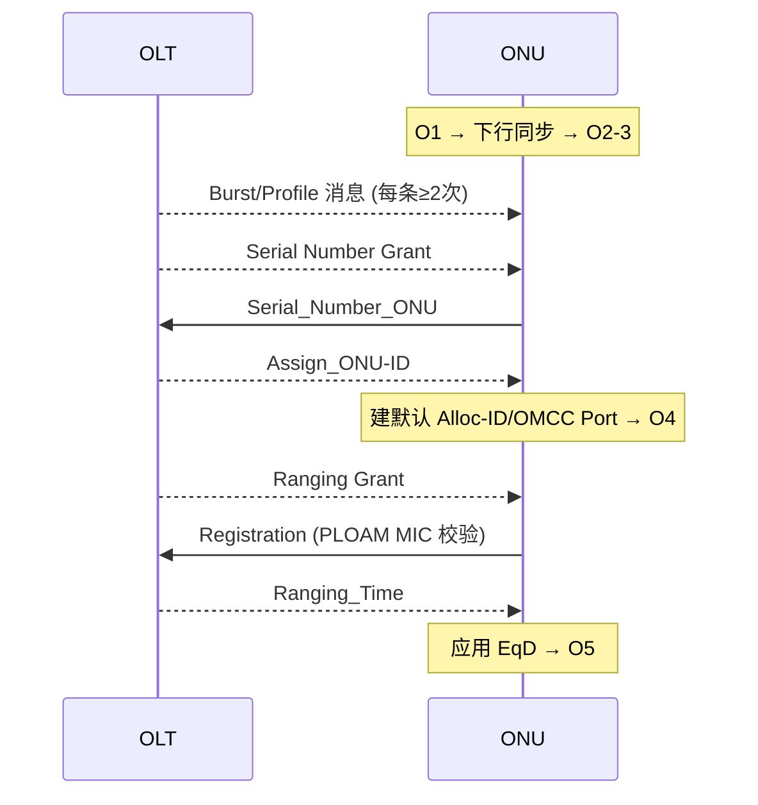

# 互通测试要点（TR-309 / TP-255）

> PON 设备来自不同厂商，OLT 与 ONU 必须**互通**。BBF（宽带论坛）的 **TR-309（PON TC Layer Interoperability Test Plan）** 把激活、PLOAM、加密、省电、DBA、漂移等关键流程拆成标准化用例。本篇梳理测试方法论与高频用例，帮助从「协议」走向「可验证的工程」。

> 这把前面各章的协议知识「落地成测试」：[激活状态机](../01-protocol-stack/gpon-g984/activation-state-machine.md) / [PLOAM](../01-protocol-stack/xgspon-g9807/ploam-messages.md) / [安全](../04-security/key-management-encryption.md) / [省电](../05-operations/power-management.md) / [测距](../01-protocol-stack/gpon-g984/ranging-activation.md) 都有对应用例。

## 1. 测试用例的统一结构

TR-309 每个用例都用同一套模板描述，便于自动化与判定：

| 段落 | 内容 |
|------|------|
| **Test Status** | 必测 / 可选 |
| **Reference Documents** | 对应标准条款（G.987.3 / G.9807.1 / G.9804.2 / 25GS-PON …） |
| **Test Objective** | 验证目标（一句话） |
| **Test Setup** | 物理连接（见规范第 5 节） |
| **Pretest Conditions** | 前置状态（如「ONU 已测距激活，ONU-ID=1」） |
| **Test Configuration** | 参数（profile、PLOAM 字段取值…） |
| **Test Procedure & message timeline** | 逐步报文时序 |
| **Pass/Fail Criteria** | 判定条件（如「OLT 收到的序列号正确」「MIC 校验通过」） |
| **Remarks** | 备注 |

> 多技术并列：同一用例常同时引用 **XG-PON / XGS-PON / 25/50G-PON（G.9804.x）/ 25GS-PON** 的对应条款——因为它们 TC 层同源（见 [XG-PON vs XGS-PON](../01-protocol-stack/xgpon-g987/delta-vs-xgspon.md)）。

## 2. 高频用例分组

### 2.1 发现与激活（TR-309 §7）

| 用例 | 验证点 | 报文时序要点 |
|------|--------|-------------|
| ONU Discovery（§7.1.1） | OLT 学到 ONU 序列号 | O1→O2-3（下行同步）→ OLT 发 profile（每条≥2 次）→ SN grant → `Serial_Number_ONU` |
| ONU Activation 单 ONU（§7.1.2） | 测距激活到 O5 | `Assign_ONU-ID`→O4→ ranging grant → `Registration` → `Ranging_Time` → O5 |
| 多 ONU 激活 | 在线 ONU 不受扰 | 首 ONU 在 O5，其余在 O2-3，逐个 Assign/Ranging |
| 显式 Alloc-ID 激活（§7.1.9） | 指定 Alloc-ID 的测距 | 跟随「显式 Alloc-ID 发现」用例 |

典型激活时序（单 ONU）：

### 2.2 PLOAM 处理

- **Request Registration / Registration（O5）**（引用 G.9807.1 C.11.3.3.6 / C.11.3.4.2）：验证 OLT 能生成、ONU 能正确处理；**PLOAM MIC 用默认 PLOAM integrity key 计算**（密钥协商前）。

### 2.3 加密与密钥交换（§8.1.x）

- **Automatic Encryption Key Exchange during Traffic**（G.9807.1 C.15.4 / C.15.5.3）：
  - ONU 经 **KN3 → 发 Key Report → KN4**；OLT 经 **KL4** 校验密钥片段（key name）。
  - 之后下行 XGEM 帧用该密钥**加密**，发往默认 XGEM Port-ID（=1）。
  - 判据：上行 OMCI/XGEM 解密正确，MIC 通过。详见 [安全](../04-security/key-management-encryption.md)。

### 2.4 省电（Watchful Sleep）

- 验证 ONU 能进入 **watchful sleep**、OLT 能用 **FWI** 唤醒（引用 G.9807.1 C.16.1 / C.11.3.3.9 / C.11.3.4.5）。
  - 参数：`Sleep_Allow`（SeqNo=unicast，Sleep Allow=1=on）、`Sleep_Request`。详见 [省电](../05-operations/power-management.md)。

### 2.5 传输漂移（DOWi）

- 注入不同漂移量（按速率分档），验证 OLT 识别 **DOWi（Drift of Window）** 事件并发 `Ranging_Time` 校正、ONU 调整 EqD。
- HSP（高速 PON）分档示例（TR-309）：

  | 速率 | Early PHY burst | Late PHY burst |
  |------|-----------------|----------------|
  | 50G | −129 ~ −255 bits | 127 ~ 255 bits |
  | 25G | −63 ~ −127 bits | 63 ~ 127 bits |
  | 12.5G | −33 ~ −63 bits | 33 ~ 63 bits |

  详见 [测距与激活](../01-protocol-stack/gpon-g984/ranging-activation.md) 的 Drift 控制。

## 3. OMCI 互通

- **OMCC 建立 / OMCI channel establishment**：测距成功后用默认密钥建立 OMCC，验证上下行 OMCI 报文与 **OMCI MIC** 正确（光纤断开重连后至少成功一次）。
- 上行 XGEM 头参数示例：PLI=48、Key index=1、Port-ID=1、Last fragment=1。
- 与 [MIB Upload 与同步](../02-omci/mib-upload-sync.md) 衔接：建链后做 MIB Reset / Upload。

## 4. 工程价值

- **回归基线**：把协议条款变成**可重放的报文时序 + 判据**，是新版本固件、新芯片选型的回归基线。
- **抓包对照**：现场抓 PLOAM/OMCI 时，用例的「message timeline」是比对「应该发生什么」的权威参照。
- **多厂商混插**：OLT 与 ONU 异厂商组合时，TR-309 是定位「谁不符合标准」的共同语言。

## 来源

- **公有标准 / 测试规范**：
  - BBF **TR-309 Issue 3**（PON TC Layer Interoperability Test Plan）：用例模板（Status/Reference/Objective/Setup/Pretest/Config/Procedure/Pass-Fail/Remarks）、§7.1.1 ONU Discovery、§7.1.2 ONU Activation、§7.1.9 显式 Alloc-ID 激活、多 ONU 激活、§8.1.6 Automatic Encryption Key Exchange、Watchful Sleep、Registration（O5）、DOWi 漂移分档（25/50G HSP）。
  - 引用标准：ITU-T G.987.3、G.9807.1（C.11/C.15/C.16）、G.9804.2（25/50G-PON）、25GS-PON。
- 说明：用例分组与时序图为基于 TR-309 的归纳；逐用例完整参数以 TR-309 原文为准。TP-255 为对应的测试计划/认证体系，本篇以 TR-309 为主线。
